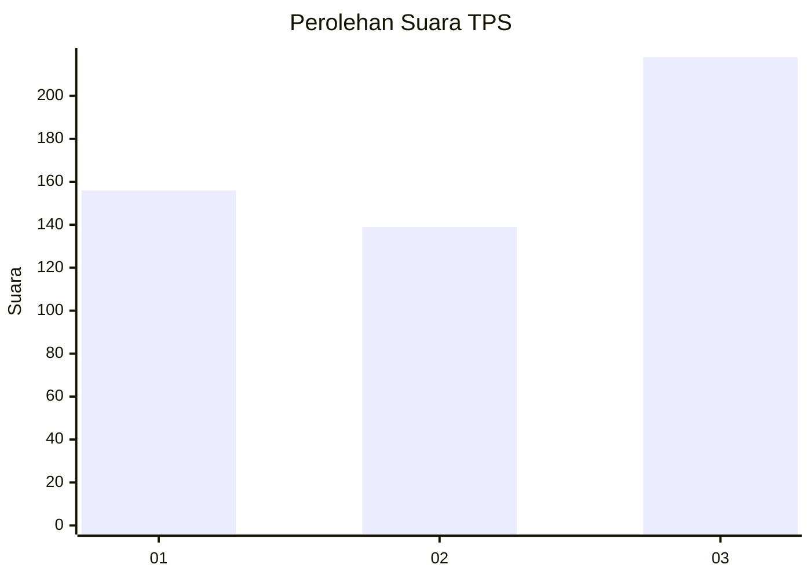
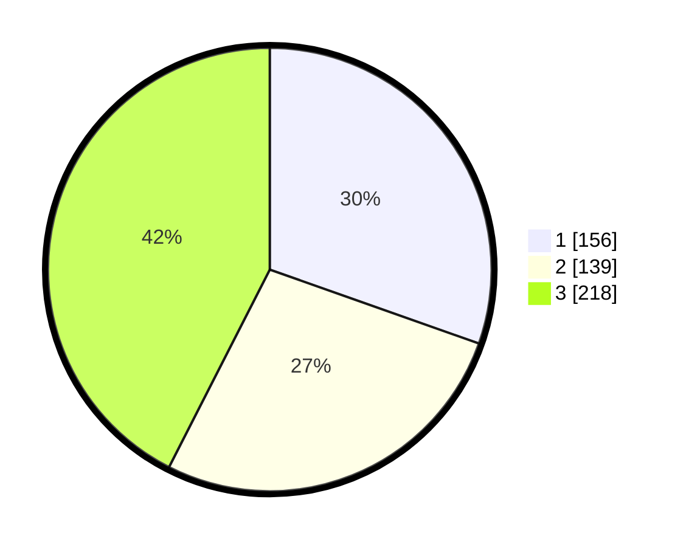

# Hasil

## Grafik

## Tabel

| No. | Nama Paslon    | Suara | Suara (raw) | Persentase |
|:--- |:-------------- | -----:| -----------:| ----------:|
| 1   | ANIES MUHAIMIN | 156   | [156][p-1]  | 30,41      |
| 2   | PRABOWO GIBRAN | 139   | [139][p-2]  | 27,10      |
| 3   | GANJAR MAHFUD  | 218   | [218][p-3]  | 42,50      |

[p-1]: https://github.com/gigit-pemilu/pemilu-2024-99-luar-negeri/blob/main/pilpres/hitung-suara/sub/99-luar-negeri/sub/41-frankfurt-jerman/sub/01-frankfurt-jerman/sub/0001-frankfurt-jerman/sub/002-tps-001/sub/paslon-1.txt
[p-2]: https://github.com/gigit-pemilu/pemilu-2024-99-luar-negeri/blob/main/pilpres/hitung-suara/sub/99-luar-negeri/sub/41-frankfurt-jerman/sub/01-frankfurt-jerman/sub/0001-frankfurt-jerman/sub/002-tps-001/sub/paslon-2.txt
[p-3]: https://github.com/gigit-pemilu/pemilu-2024-99-luar-negeri/blob/main/pilpres/hitung-suara/sub/99-luar-negeri/sub/41-frankfurt-jerman/sub/01-frankfurt-jerman/sub/0001-frankfurt-jerman/sub/002-tps-001/sub/paslon-3.txt

## Foto C Plano

https://sirekap-obj-formc.kpu.go.id/6a7d/pemilu/ppwp/99/41/01/00/01/9941010001002-20240217-205550--16f6225f-ceb5-4624-b00e-75b6f7cef380.jpg

https://sirekap-obj-formc.kpu.go.id/6a7d/pemilu/ppwp/99/41/01/00/01/9941010001002-20240217-205552--9a60cb7a-1138-4a0e-86b3-da3f655595a5.jpg

https://sirekap-obj-formc.kpu.go.id/6a7d/pemilu/ppwp/99/41/01/00/01/9941010001002-20240217-205551--2a4cd6e7-3b64-45b7-a7e1-c88ddd220bfe.jpg

## Metadata

| Key        | Value               |
| ---------- | ------------------- |
| Time Stamp | 2024-02-19 06:16:00 |

## DATA PEMILIH TETAP

Jumlah pemilih dalam DPT: **858**.
 * L: **380**.
 * P: **478**.

## DATA PENGGUNA HAK PILIH

Jumlah pengguna hak pilih dalam DPT: **417**.
 * L: **206**.
 * P: **211**.

Jumlah pengguna hak pilih dalam DPTb: **75**.
 * L: **26**.
 * P: **49**.

Jumlah pengguna hak pilih dalam DPK: **24**.
 * L: **11**.
 * P: **13**.

Jumlah pengguna hak pilih: **516**.
 * L: **243**.
 * P: **273**.

## JUMLAH SUARA SAH DAN TIDAK SAH

JUMLAH SELURUH SUARA SAH: **513**.

JUMLAH SUARA TIDAK SAH: **3**.

JUMLAH SELURUH SUARA SAH DAN SUARA TIDAK SAH: **516**.

