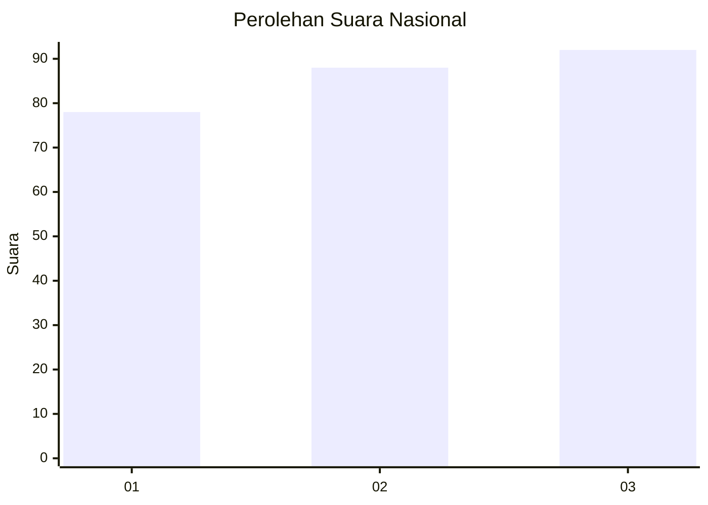
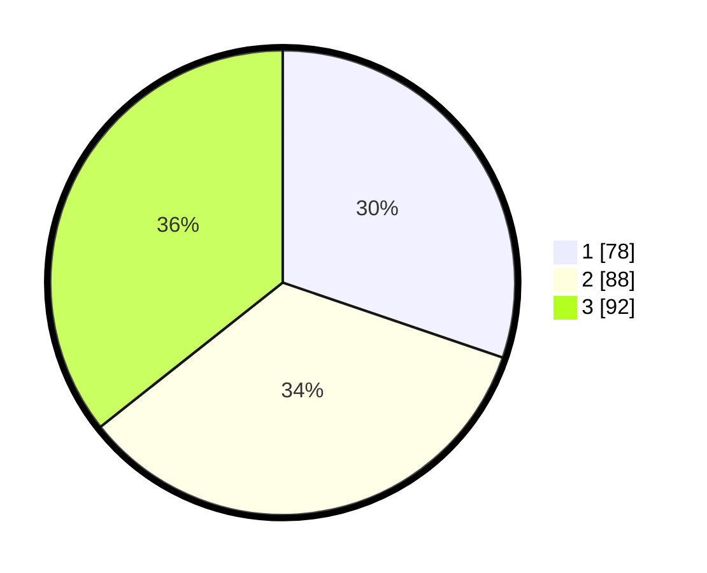

# Hasil

## Grafik

## Tabel

| No. | Nama Paslon    | Suara | Suara (raw) | Persentase |
|:--- |:-------------- | -----:| -----------:| ----------:|
| 1   | ANIES MUHAIMIN | 78    | [78][p-1]   | 30,23      |
| 2   | PRABOWO GIBRAN | 88    | [88][p-2]   | 34,11      |
| 3   | GANJAR MAHFUD  | 92    | [92][p-3]   | 35,66      |

[p-1]: https://github.com/gigit-pemilu/pemilu-2024/blob/main/pilpres/hitung-suara/sub/99-luar-negeri/sub/41-frankfurt-jerman/sub/01-frankfurt-jerman/sub/0001-frankfurt-jerman/sub/003-tps-002/sub/paslon-1.txt
[p-2]: https://github.com/gigit-pemilu/pemilu-2024/blob/main/pilpres/hitung-suara/sub/99-luar-negeri/sub/41-frankfurt-jerman/sub/01-frankfurt-jerman/sub/0001-frankfurt-jerman/sub/003-tps-002/sub/paslon-2.txt
[p-3]: https://github.com/gigit-pemilu/pemilu-2024/blob/main/pilpres/hitung-suara/sub/99-luar-negeri/sub/41-frankfurt-jerman/sub/01-frankfurt-jerman/sub/0001-frankfurt-jerman/sub/003-tps-002/sub/paslon-3.txt

## Foto C Plano

https://sirekap-obj-formc.kpu.go.id/ee83/pemilu/ppwp/99/41/01/00/01/9941010001003-20240219-205047--b3e4ec0b-9674-4d0f-b911-34b445e4b2cd.jpg

https://sirekap-obj-formc.kpu.go.id/ee83/pemilu/ppwp/99/41/01/00/01/9941010001003-20240219-205616--a2a83384-e0ba-452c-95f0-0c0d8de5ca7e.jpg

https://sirekap-obj-formc.kpu.go.id/ee83/pemilu/ppwp/99/41/01/00/01/9941010001003-20240219-210115--5fe8e6e8-c6be-4af2-80c2-9d555a80f367.jpg

## Metadata

| Key        | Value               |
| ---------- | ------------------- |
| Time Stamp | 2024-02-19 22:00:00 |

## DATA PEMILIH TETAP

Jumlah pemilih dalam DPT: **858**.
 * L: **384**.
 * P: **474**.

## DATA PENGGUNA HAK PILIH

Jumlah pengguna hak pilih dalam DPT: **162**.
 * L: **64**.
 * P: **98**.

Jumlah pengguna hak pilih dalam DPTb: **72**.
 * L: **34**.
 * P: **38**.

Jumlah pengguna hak pilih dalam DPK: **29**.
 * L: **13**.
 * P: **16**.

Jumlah pengguna hak pilih: **263**.
 * L: **111**.
 * P: **152**.

## JUMLAH SUARA SAH DAN TIDAK SAH

JUMLAH SELURUH SUARA SAH: **258**.

JUMLAH SUARA TIDAK SAH: **5**.

JUMLAH SELURUH SUARA SAH DAN SUARA TIDAK SAH: **263**.

