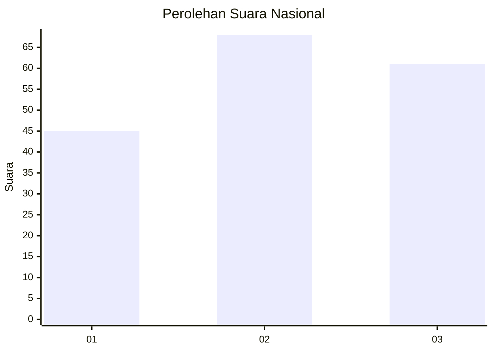
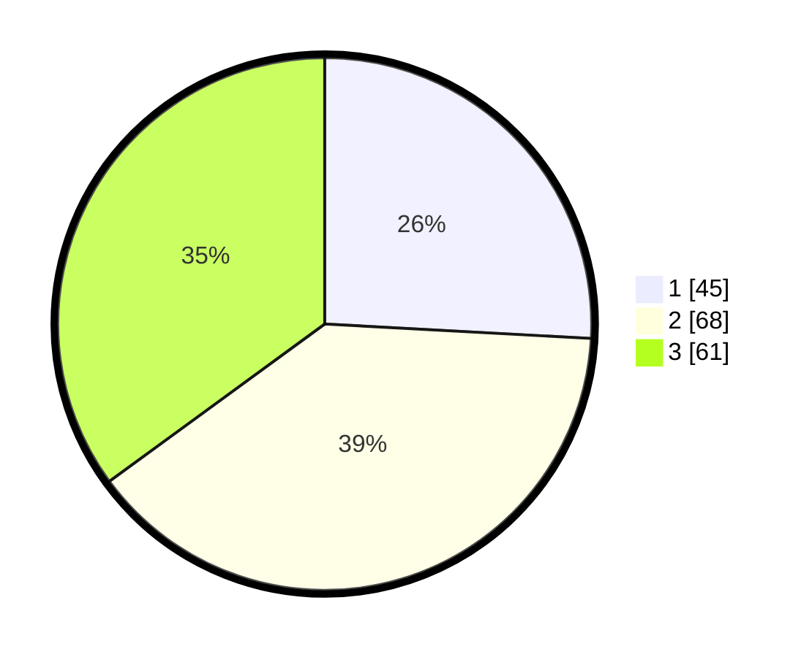

# Hasil

## Grafik

## Tabel

| No. | Nama Paslon    | Suara | Suara (raw) | Persentase |
|:--- |:-------------- | -----:| -----------:| ----------:|
| 1   | ANIES MUHAIMIN | 45    | [45][p-1]   | 25,86      |
| 2   | PRABOWO GIBRAN | 68    | [68][p-2]   | 39,08      |
| 3   | GANJAR MAHFUD  | 61    | [61][p-3]   | 35,06      |

[p-1]: https://github.com/gigit-pemilu/pemilu-2024/blob/main/pilpres/hitung-suara/sub/99-luar-negeri/sub/41-frankfurt-jerman/sub/01-frankfurt-jerman/sub/0001-frankfurt-jerman/sub/004-tps-003/sub/paslon-1.txt
[p-2]: https://github.com/gigit-pemilu/pemilu-2024/blob/main/pilpres/hitung-suara/sub/99-luar-negeri/sub/41-frankfurt-jerman/sub/01-frankfurt-jerman/sub/0001-frankfurt-jerman/sub/004-tps-003/sub/paslon-2.txt
[p-3]: https://github.com/gigit-pemilu/pemilu-2024/blob/main/pilpres/hitung-suara/sub/99-luar-negeri/sub/41-frankfurt-jerman/sub/01-frankfurt-jerman/sub/0001-frankfurt-jerman/sub/004-tps-003/sub/paslon-3.txt

## Foto C Plano

https://sirekap-obj-formc.kpu.go.id/bf50/pemilu/ppwp/99/41/01/00/01/9941010001004-20240217-222259--b5c8f640-1d27-4d40-a818-69a5a2102c0f.jpg

https://sirekap-obj-formc.kpu.go.id/bf50/pemilu/ppwp/99/41/01/00/01/9941010001004-20240217-221959--3f3c87a4-69c4-42f1-af76-4b179e0e0b1e.jpg

https://sirekap-obj-formc.kpu.go.id/bf50/pemilu/ppwp/99/41/01/00/01/9941010001004-20240217-222718--e687509f-e46e-4cb0-9c8e-00f0fd54f86d.jpg

## Metadata

| Key        | Value               |
| ---------- | ------------------- |
| Time Stamp | 2024-02-19 06:16:00 |

## DATA PEMILIH TETAP

Jumlah pemilih dalam DPT: **858**.
 * L: **364**.
 * P: **494**.

## DATA PENGGUNA HAK PILIH

Jumlah pengguna hak pilih dalam DPT: **49**.
 * L: **16**.
 * P: **33**.

Jumlah pengguna hak pilih dalam DPTb: **96**.
 * L: **42**.
 * P: **54**.

Jumlah pengguna hak pilih dalam DPK: **40**.
 * L: **12**.
 * P: **28**.

Jumlah pengguna hak pilih: **185**.
 * L: **70**.
 * P: **115**.

## JUMLAH SUARA SAH DAN TIDAK SAH

JUMLAH SELURUH SUARA SAH: **174**.

JUMLAH SUARA TIDAK SAH: **11**.

JUMLAH SELURUH SUARA SAH DAN SUARA TIDAK SAH: **185**.

