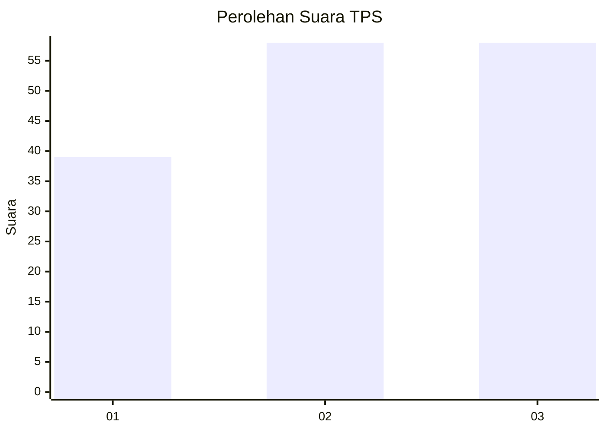
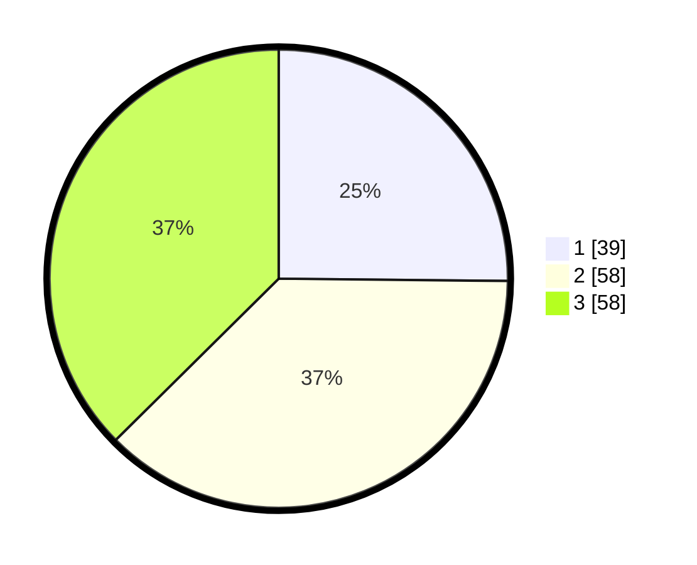

# Hasil

## Grafik

## Tabel

| No. | Nama Paslon    | Suara | Suara (raw) | Persentase |
|:--- |:-------------- | -----:| -----------:| ----------:|
| 1   | ANIES MUHAIMIN | 39    | [39][p-1]   | 25,16      |
| 2   | PRABOWO GIBRAN | 58    | [58][p-2]   | 37,42      |
| 3   | GANJAR MAHFUD  | 58    | [58][p-3]   | 37,42      |

[p-1]: https://github.com/gigit-pemilu/pemilu-2024-99-luar-negeri/blob/main/pilpres/hitung-suara/sub/99-luar-negeri/sub/41-frankfurt-jerman/sub/01-frankfurt-jerman/sub/0001-frankfurt-jerman/sub/005-tps-004/sub/paslon-1.txt
[p-2]: https://github.com/gigit-pemilu/pemilu-2024-99-luar-negeri/blob/main/pilpres/hitung-suara/sub/99-luar-negeri/sub/41-frankfurt-jerman/sub/01-frankfurt-jerman/sub/0001-frankfurt-jerman/sub/005-tps-004/sub/paslon-2.txt
[p-3]: https://github.com/gigit-pemilu/pemilu-2024-99-luar-negeri/blob/main/pilpres/hitung-suara/sub/99-luar-negeri/sub/41-frankfurt-jerman/sub/01-frankfurt-jerman/sub/0001-frankfurt-jerman/sub/005-tps-004/sub/paslon-3.txt

## Foto C Plano

https://sirekap-obj-formc.kpu.go.id/7cfe/pemilu/ppwp/99/41/01/00/01/9941010001005-20240218-002004--ebfebd42-ae2c-4f3f-8db7-f84a9d4dc02d.jpg

https://sirekap-obj-formc.kpu.go.id/7cfe/pemilu/ppwp/99/41/01/00/01/9941010001005-20240218-001950--82f0ea67-5157-4bad-92ec-ef3a66ecf34c.jpg

https://sirekap-obj-formc.kpu.go.id/7cfe/pemilu/ppwp/99/41/01/00/01/9941010001005-20240218-002007--93dba10f-5d74-4449-8652-13f481cecd76.jpg

## Metadata

| Key        | Value               |
| ---------- | ------------------- |
| Time Stamp | 2024-02-19 06:16:00 |

## DATA PEMILIH TETAP

Jumlah pemilih dalam DPT: **858**.
 * L: **397**.
 * P: **461**.

## DATA PENGGUNA HAK PILIH

Jumlah pengguna hak pilih dalam DPT: **49**.
 * L: **21**.
 * P: **28**.

Jumlah pengguna hak pilih dalam DPTb: **76**.
 * L: **34**.
 * P: **42**.

Jumlah pengguna hak pilih dalam DPK: **31**.
 * L: **12**.
 * P: **19**.

Jumlah pengguna hak pilih: **156**.
 * L: **67**.
 * P: **89**.

## JUMLAH SUARA SAH DAN TIDAK SAH

JUMLAH SELURUH SUARA SAH: **155**.

JUMLAH SUARA TIDAK SAH: **1**.

JUMLAH SELURUH SUARA SAH DAN SUARA TIDAK SAH: **156**.

