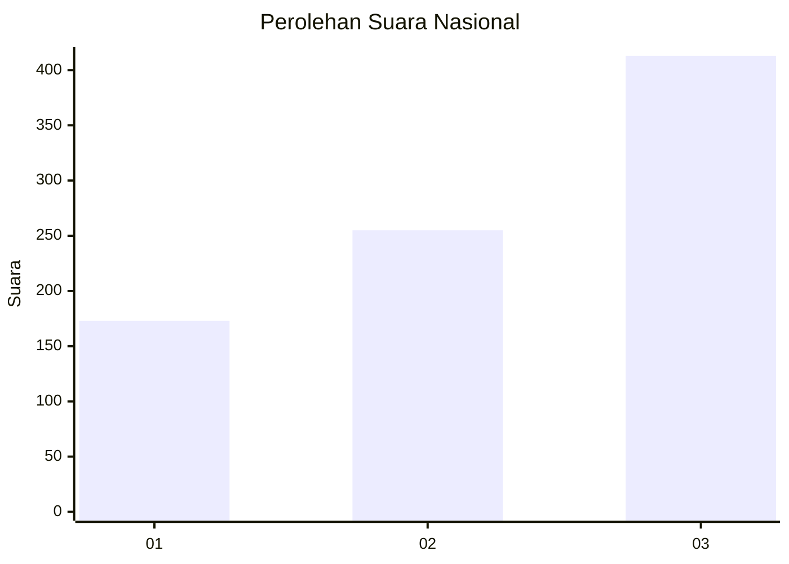
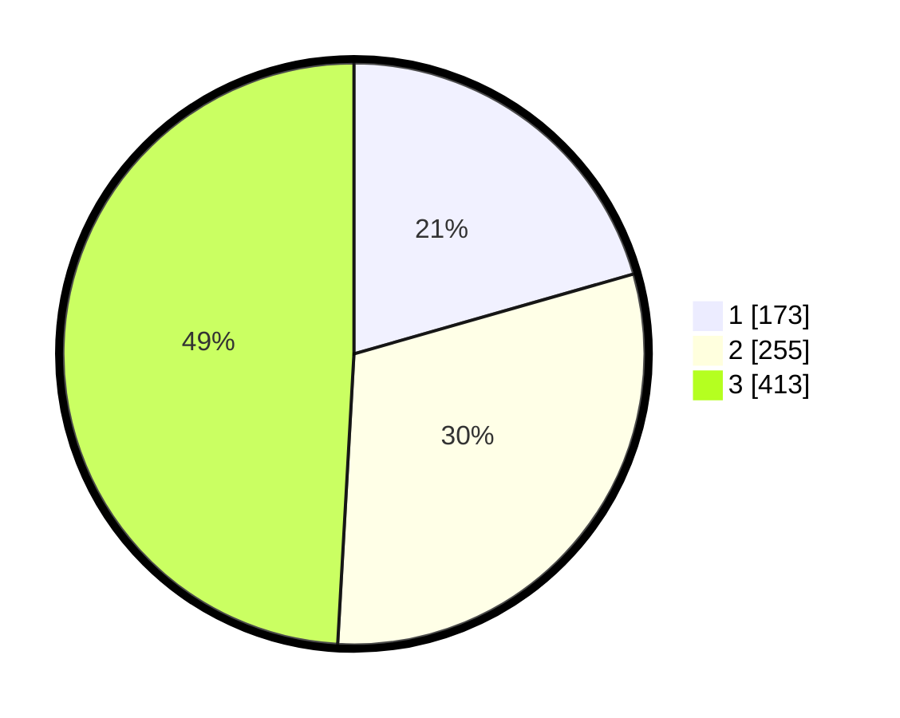

# Hasil

## Grafik

## Tabel

| No. | Nama Paslon    | Suara | Suara (raw) | Persentase |
|:--- |:-------------- | -----:| -----------:| ----------:|
| 1   | ANIES MUHAIMIN | 173   | [173][p-1]  | 20,57      |
| 2   | PRABOWO GIBRAN | 255   | [255][p-2]  | 30,32      |
| 3   | GANJAR MAHFUD  | 413   | [413][p-3]  | 49,11      |

[p-1]: https://github.com/gigit-pemilu/pemilu-2024/blob/main/pilpres/hitung-suara/sub/99-luar-negeri/sub/41-frankfurt-jerman/sub/01-frankfurt-jerman/sub/0001-frankfurt-jerman/sub/007-pos-002/sub/paslon-1.txt
[p-2]: https://github.com/gigit-pemilu/pemilu-2024/blob/main/pilpres/hitung-suara/sub/99-luar-negeri/sub/41-frankfurt-jerman/sub/01-frankfurt-jerman/sub/0001-frankfurt-jerman/sub/007-pos-002/sub/paslon-2.txt
[p-3]: https://github.com/gigit-pemilu/pemilu-2024/blob/main/pilpres/hitung-suara/sub/99-luar-negeri/sub/41-frankfurt-jerman/sub/01-frankfurt-jerman/sub/0001-frankfurt-jerman/sub/007-pos-002/sub/paslon-3.txt

## Foto C Plano

https://sirekap-obj-formc.kpu.go.id/201a/pemilu/ppwp/99/41/01/00/01/9941010001007-20240218-001244--42cf9b02-199b-4c5a-8e6e-82df33ff3895.jpg

https://sirekap-obj-formc.kpu.go.id/201a/pemilu/ppwp/99/41/01/00/01/9941010001007-20240218-000958--9d36a8b6-3fd9-4c08-b2a9-6e50c4f510c9.jpg

https://sirekap-obj-formc.kpu.go.id/201a/pemilu/ppwp/99/41/01/00/01/9941010001007-20240218-001054--8c4cd67e-b12e-40a1-b2e9-b52a7f9c530e.jpg

## Metadata

| Key        | Value               |
| ---------- | ------------------- |
| Time Stamp | 2024-02-19 06:16:00 |

## DATA PEMILIH TETAP

Jumlah pemilih dalam DPT: **1430**.
 * L: **539**.
 * P: **891**.

## DATA PENGGUNA HAK PILIH

Jumlah pengguna hak pilih dalam DPT: **862**.
 * L: **326**.
 * P: **536**.

Jumlah pengguna hak pilih dalam DPTb: **12**.
 * L: **2**.
 * P: **10**.

Jumlah pengguna hak pilih dalam DPK: **0**.
 * L: **0**.
 * P: **0**.

Jumlah pengguna hak pilih: **874**.
 * L: **328**.
 * P: **546**.

## JUMLAH SUARA SAH DAN TIDAK SAH

JUMLAH SELURUH SUARA SAH: **841**.

JUMLAH SUARA TIDAK SAH: **33**.

JUMLAH SELURUH SUARA SAH DAN SUARA TIDAK SAH: **874**.

