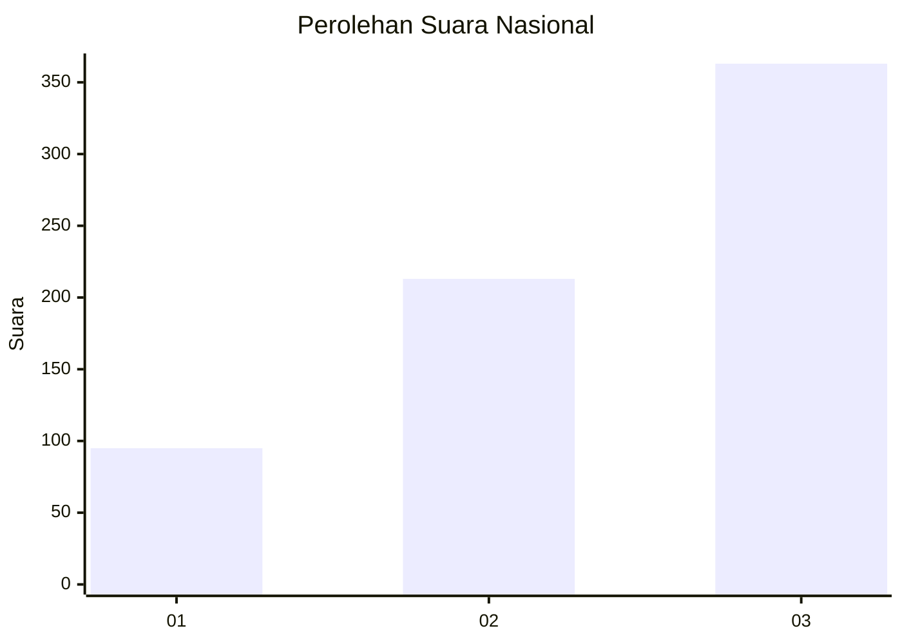
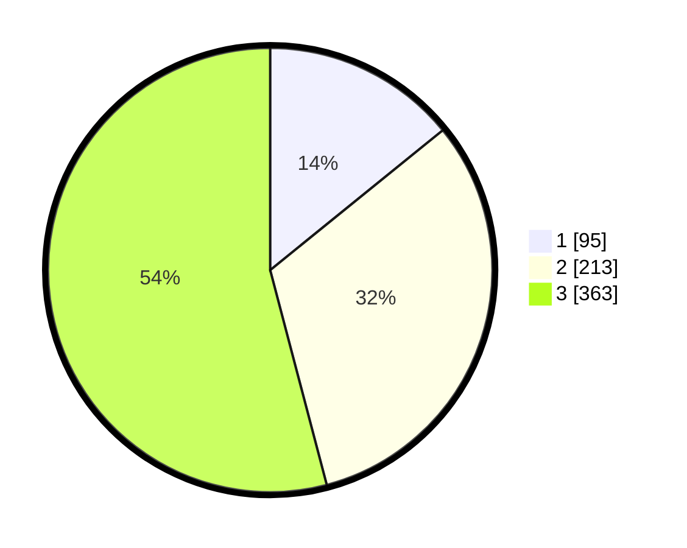

# Hasil

## Grafik

## Tabel

| No. | Nama Paslon    | Suara | Suara (raw) | Persentase |
|:--- |:-------------- | -----:| -----------:| ----------:|
| 1   | ANIES MUHAIMIN | 95    | [95][p-1]   | 14,16      |
| 2   | PRABOWO GIBRAN | 213   | [213][p-2]  | 31,74      |
| 3   | GANJAR MAHFUD  | 363   | [363][p-3]  | 54,10      |

[p-1]: https://github.com/gigit-pemilu/pemilu-2024/blob/main/pilpres/hitung-suara/sub/99-luar-negeri/sub/41-frankfurt-jerman/sub/01-frankfurt-jerman/sub/0001-frankfurt-jerman/sub/008-pos-003/sub/paslon-1.txt
[p-2]: https://github.com/gigit-pemilu/pemilu-2024/blob/main/pilpres/hitung-suara/sub/99-luar-negeri/sub/41-frankfurt-jerman/sub/01-frankfurt-jerman/sub/0001-frankfurt-jerman/sub/008-pos-003/sub/paslon-2.txt
[p-3]: https://github.com/gigit-pemilu/pemilu-2024/blob/main/pilpres/hitung-suara/sub/99-luar-negeri/sub/41-frankfurt-jerman/sub/01-frankfurt-jerman/sub/0001-frankfurt-jerman/sub/008-pos-003/sub/paslon-3.txt

## Foto C Plano

https://sirekap-obj-formc.kpu.go.id/f5fc/pemilu/ppwp/99/41/01/00/01/9941010001008-20240217-213129--4de1f43b-228d-4d34-b05b-6d4ac1489462.jpg

https://sirekap-obj-formc.kpu.go.id/f5fc/pemilu/ppwp/99/41/01/00/01/9941010001008-20240217-213228--614bcdd7-f938-4ce4-a194-306fe991fe66.jpg

https://sirekap-obj-formc.kpu.go.id/f5fc/pemilu/ppwp/99/41/01/00/01/9941010001008-20240217-213257--70813a03-f2df-4f1b-954e-443b5c09d5bd.jpg

## Metadata

| Key        | Value               |
| ---------- | ------------------- |
| Time Stamp | 2024-02-19 06:16:00 |

## DATA PEMILIH TETAP

Jumlah pemilih dalam DPT: **1429**.
 * L: **548**.
 * P: **881**.

## DATA PENGGUNA HAK PILIH

Jumlah pengguna hak pilih dalam DPT: **709**.
 * L: **259**.
 * P: **450**.

Jumlah pengguna hak pilih dalam DPTb: **14**.
 * L: **5**.
 * P: **9**.

Jumlah pengguna hak pilih dalam DPK: **0**.
 * L: **0**.
 * P: **0**.

Jumlah pengguna hak pilih: **723**.
 * L: **264**.
 * P: **459**.

## JUMLAH SUARA SAH DAN TIDAK SAH

JUMLAH SELURUH SUARA SAH: **671**.

JUMLAH SUARA TIDAK SAH: **52**.

JUMLAH SELURUH SUARA SAH DAN SUARA TIDAK SAH: **723**.

