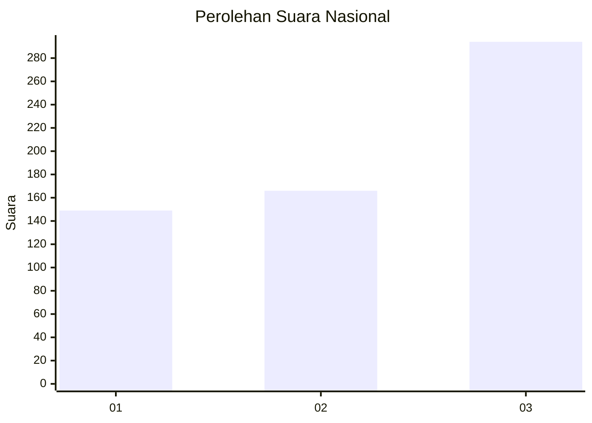
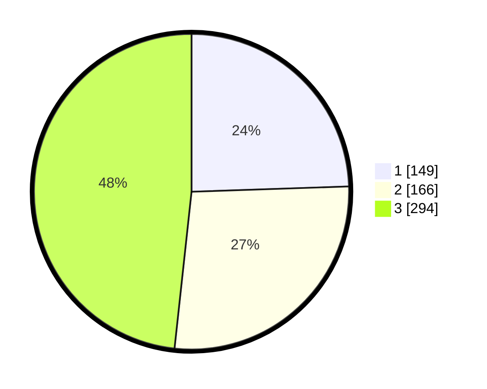

# Hasil

## Grafik

## Tabel

| No. | Nama Paslon    | Suara | Suara (raw) | Persentase |
|:--- |:-------------- | -----:| -----------:| ----------:|
| 1   | ANIES MUHAIMIN | 149   | [149][p-1]  | 24,47      |
| 2   | PRABOWO GIBRAN | 166   | [166][p-2]  | 27,26      |
| 3   | GANJAR MAHFUD  | 294   | [294][p-3]  | 48,28      |

[p-1]: https://github.com/gigit-pemilu/pemilu-2024/blob/main/pilpres/hitung-suara/sub/99-luar-negeri/sub/41-frankfurt-jerman/sub/01-frankfurt-jerman/sub/0001-frankfurt-jerman/sub/009-pos-004/sub/paslon-1.txt
[p-2]: https://github.com/gigit-pemilu/pemilu-2024/blob/main/pilpres/hitung-suara/sub/99-luar-negeri/sub/41-frankfurt-jerman/sub/01-frankfurt-jerman/sub/0001-frankfurt-jerman/sub/009-pos-004/sub/paslon-2.txt
[p-3]: https://github.com/gigit-pemilu/pemilu-2024/blob/main/pilpres/hitung-suara/sub/99-luar-negeri/sub/41-frankfurt-jerman/sub/01-frankfurt-jerman/sub/0001-frankfurt-jerman/sub/009-pos-004/sub/paslon-3.txt

## Foto C Plano

https://sirekap-obj-formc.kpu.go.id/c1c0/pemilu/ppwp/99/41/01/00/01/9941010001009-20240219-225148--b9f11858-bc79-4d45-a7d0-548f9700f226.jpg

https://sirekap-obj-formc.kpu.go.id/c1c0/pemilu/ppwp/99/41/01/00/01/9941010001009-20240219-223604--0496209b-42a3-4ebd-8654-b5ba4c163bf9.jpg

https://sirekap-obj-formc.kpu.go.id/c1c0/pemilu/ppwp/99/41/01/00/01/9941010001009-20240219-230054--9d881ebd-11bb-459a-9b75-d9422613841f.jpg

## Metadata

| Key        | Value               |
| ---------- | ------------------- |
| Time Stamp | 2024-02-20 00:00:00 |

## DATA PEMILIH TETAP

Jumlah pemilih dalam DPT: **1430**.
 * L: **482**.
 * P: **948**.

## DATA PENGGUNA HAK PILIH

Jumlah pengguna hak pilih dalam DPT: **666**.
 * L: **209**.
 * P: **457**.

Jumlah pengguna hak pilih dalam DPTb: **11**.
 * L: **3**.
 * P: **8**.

Jumlah pengguna hak pilih dalam DPK: **0**.
 * L: **0**.
 * P: **0**.

Jumlah pengguna hak pilih: **677**.
 * L: **212**.
 * P: **465**.

## JUMLAH SUARA SAH DAN TIDAK SAH

JUMLAH SELURUH SUARA SAH: **609**.

JUMLAH SUARA TIDAK SAH: **68**.

JUMLAH SELURUH SUARA SAH DAN SUARA TIDAK SAH: **677**.

