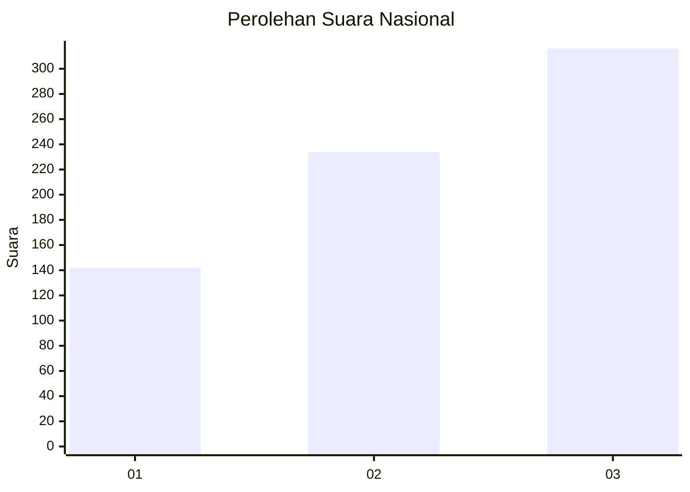
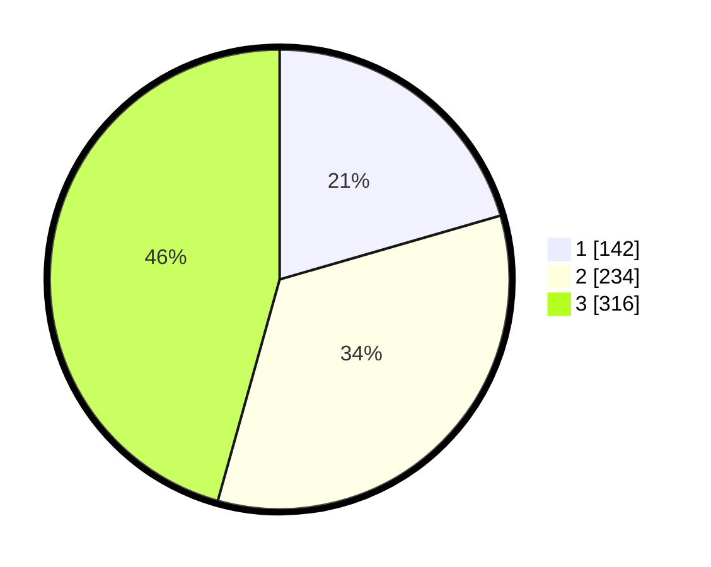

# Hasil

## Grafik

## Tabel

| No. | Nama Paslon    | Suara | Suara (raw) | Persentase |
|:--- |:-------------- | -----:| -----------:| ----------:|
| 1   | ANIES MUHAIMIN | 142   | [142][p-1]  | 20,52      |
| 2   | PRABOWO GIBRAN | 234   | [234][p-2]  | 33,82      |
| 3   | GANJAR MAHFUD  | 316   | [316][p-3]  | 45,66      |

[p-1]: https://github.com/gigit-pemilu/pemilu-2024/blob/main/pilpres/hitung-suara/sub/99-luar-negeri/sub/41-frankfurt-jerman/sub/01-frankfurt-jerman/sub/0001-frankfurt-jerman/sub/010-pos-005/sub/paslon-1.txt
[p-2]: https://github.com/gigit-pemilu/pemilu-2024/blob/main/pilpres/hitung-suara/sub/99-luar-negeri/sub/41-frankfurt-jerman/sub/01-frankfurt-jerman/sub/0001-frankfurt-jerman/sub/010-pos-005/sub/paslon-2.txt
[p-3]: https://github.com/gigit-pemilu/pemilu-2024/blob/main/pilpres/hitung-suara/sub/99-luar-negeri/sub/41-frankfurt-jerman/sub/01-frankfurt-jerman/sub/0001-frankfurt-jerman/sub/010-pos-005/sub/paslon-3.txt

## Foto C Plano

https://sirekap-obj-formc.kpu.go.id/a574/pemilu/ppwp/99/41/01/00/01/9941010001010-20240219-185658--5dd03ee3-46e0-44fb-957c-4629fda9cd17.jpg

https://sirekap-obj-formc.kpu.go.id/a574/pemilu/ppwp/99/41/01/00/01/9941010001010-20240219-190740--ab73b972-9f27-4db5-8fa7-a2d96c3e960c.jpg

https://sirekap-obj-formc.kpu.go.id/a574/pemilu/ppwp/99/41/01/00/01/9941010001010-20240219-191628--7dfb0402-5ad9-4828-9a89-486dd5276f55.jpg

## Metadata

| Key        | Value               |
| ---------- | ------------------- |
| Time Stamp | 2024-02-20 00:00:00 |

## DATA PEMILIH TETAP

Jumlah pemilih dalam DPT: **1428**.
 * L: **456**.
 * P: **972**.

## DATA PENGGUNA HAK PILIH

Jumlah pengguna hak pilih dalam DPT: **716**.
 * L: **177**.
 * P: **539**.

Jumlah pengguna hak pilih dalam DPTb: **10**.
 * L: **3**.
 * P: **7**.

Jumlah pengguna hak pilih dalam DPK: **0**.
 * L: **0**.
 * P: **0**.

Jumlah pengguna hak pilih: **726**.
 * L: **180**.
 * P: **546**.

## JUMLAH SUARA SAH DAN TIDAK SAH

JUMLAH SELURUH SUARA SAH: **692**.

JUMLAH SUARA TIDAK SAH: **34**.

JUMLAH SELURUH SUARA SAH DAN SUARA TIDAK SAH: **726**.

