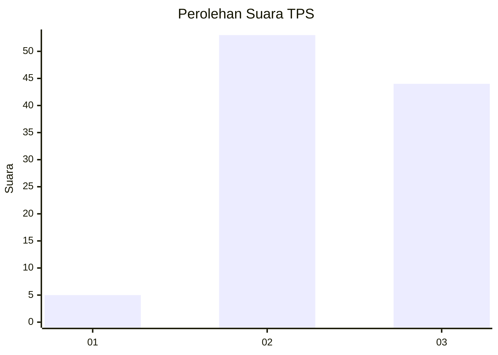
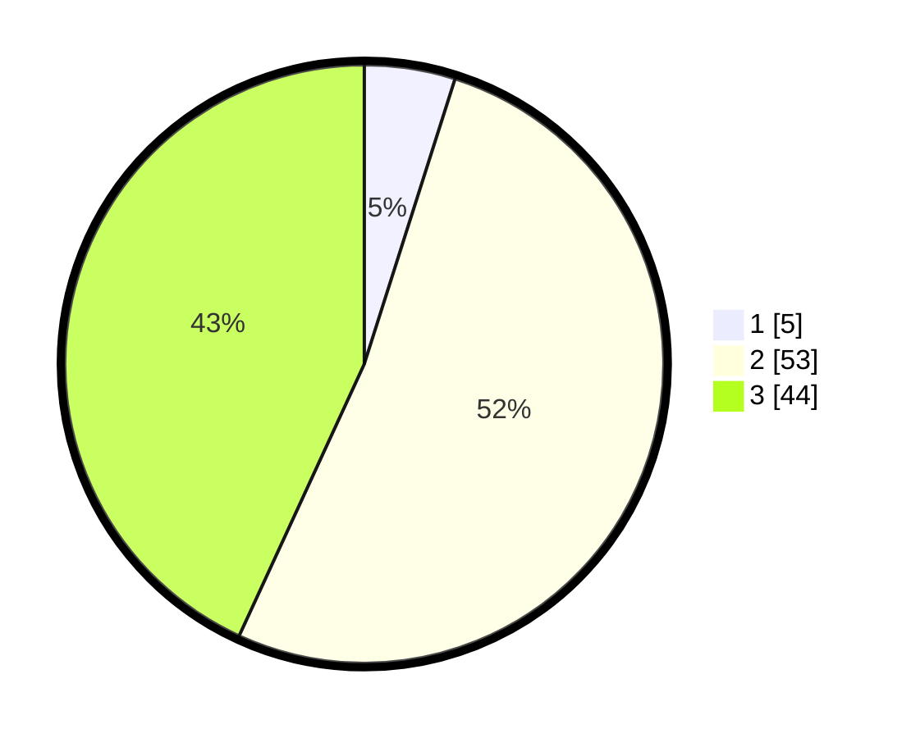

# Hasil

## Grafik

## Tabel

| No. | Nama Paslon    | Suara | Suara (raw) | Persentase |
|:--- |:-------------- | -----:| -----------:| ----------:|
| 1   | ANIES MUHAIMIN | 5     | [5][p-1]    | 4,90       |
| 2   | PRABOWO GIBRAN | 53    | [53][p-2]   | 51,96      |
| 3   | GANJAR MAHFUD  | 44    | [44][p-3]   | 43,14      |

[p-1]: https://github.com/gigit-pemilu/pemilu-2024-99-luar-negeri/blob/main/pilpres/hitung-suara/sub/99-luar-negeri/sub/42-guangzhou-tiongkok/sub/01-guangzhou-tiongkok/sub/0001-guangzhou-tiongkok/sub/001-pos-001/sub/paslon-1.txt
[p-2]: https://github.com/gigit-pemilu/pemilu-2024-99-luar-negeri/blob/main/pilpres/hitung-suara/sub/99-luar-negeri/sub/42-guangzhou-tiongkok/sub/01-guangzhou-tiongkok/sub/0001-guangzhou-tiongkok/sub/001-pos-001/sub/paslon-2.txt
[p-3]: https://github.com/gigit-pemilu/pemilu-2024-99-luar-negeri/blob/main/pilpres/hitung-suara/sub/99-luar-negeri/sub/42-guangzhou-tiongkok/sub/01-guangzhou-tiongkok/sub/0001-guangzhou-tiongkok/sub/001-pos-001/sub/paslon-3.txt

## Foto C Plano

https://sirekap-obj-formc.kpu.go.id/4dac/pemilu/ppwp/99/42/01/00/01/9942010001001-20240216-142946--fb3d61e3-e7ef-4346-9981-967555ad6d20.jpg

https://sirekap-obj-formc.kpu.go.id/4dac/pemilu/ppwp/99/42/01/00/01/9942010001001-20240216-142947--353b5883-c7c0-41f5-87b0-5520fdf3f4a2.jpg

https://sirekap-obj-formc.kpu.go.id/4dac/pemilu/ppwp/99/42/01/00/01/9942010001001-20240216-142946--4576d94a-17bb-4fe3-bd8a-d496f341dfcc.jpg

## Metadata

| Key        | Value               |
| ---------- | ------------------- |
| Time Stamp | 2024-02-19 06:16:00 |

## DATA PEMILIH TETAP

Jumlah pemilih dalam DPT: **227**.
 * L: **94**.
 * P: **133**.

## DATA PENGGUNA HAK PILIH

Jumlah pengguna hak pilih dalam DPT: **215**.
 * L: **89**.
 * P: **126**.

Jumlah pengguna hak pilih dalam DPTb: **3**.
 * L: **3**.
 * P: **0**.

Jumlah pengguna hak pilih dalam DPK: **17**.
 * L: **6**.
 * P: **11**.

Jumlah pengguna hak pilih: **235**.
 * L: **98**.
 * P: **137**.

## JUMLAH SUARA SAH DAN TIDAK SAH

JUMLAH SELURUH SUARA SAH: **102**.

JUMLAH SUARA TIDAK SAH: **10**.

JUMLAH SELURUH SUARA SAH DAN SUARA TIDAK SAH: **112**.

