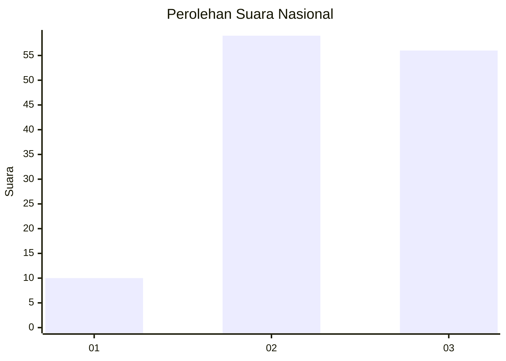
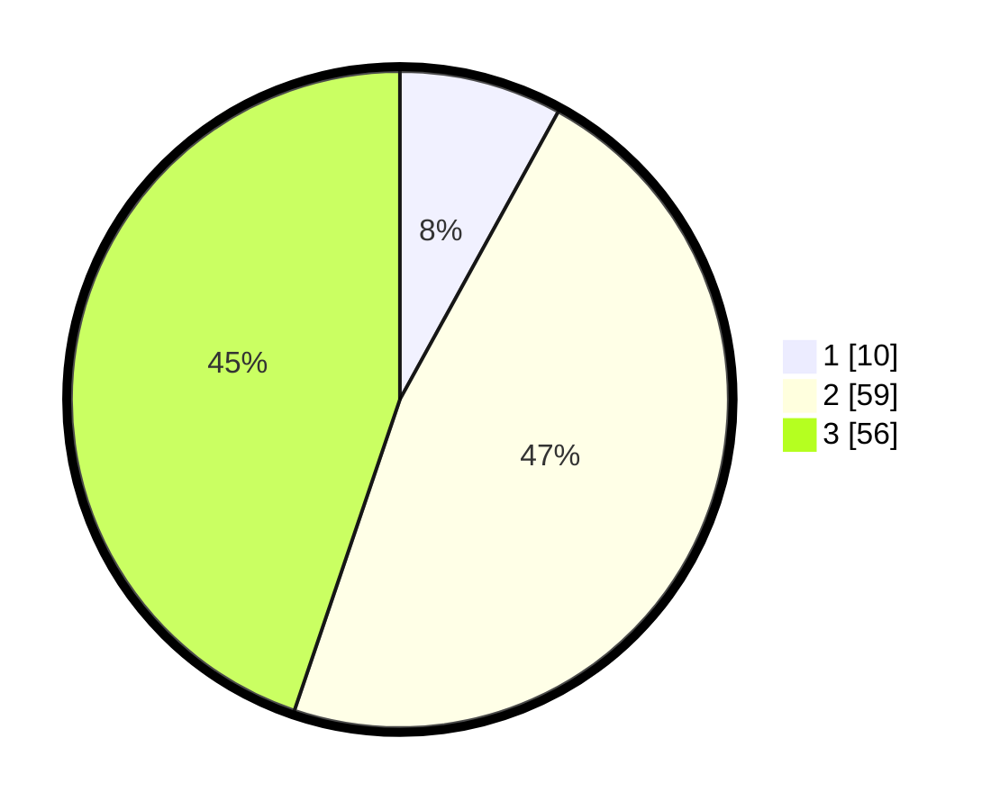

# Hasil

## Grafik

## Tabel

| No. | Nama Paslon    | Suara | Suara (raw) | Persentase |
|:--- |:-------------- | -----:| -----------:| ----------:|
| 1   | ANIES MUHAIMIN | 10    | [10][p-1]   | 8,00       |
| 2   | PRABOWO GIBRAN | 59    | [59][p-2]   | 47,20      |
| 3   | GANJAR MAHFUD  | 56    | [56][p-3]   | 44,80      |

[p-1]: https://github.com/gigit-pemilu/pemilu-2024/blob/main/pilpres/hitung-suara/sub/99-luar-negeri/sub/42-guangzhou-tiongkok/sub/01-guangzhou-tiongkok/sub/0001-guangzhou-tiongkok/sub/002-tps-001/sub/paslon-1.txt
[p-2]: https://github.com/gigit-pemilu/pemilu-2024/blob/main/pilpres/hitung-suara/sub/99-luar-negeri/sub/42-guangzhou-tiongkok/sub/01-guangzhou-tiongkok/sub/0001-guangzhou-tiongkok/sub/002-tps-001/sub/paslon-2.txt
[p-3]: https://github.com/gigit-pemilu/pemilu-2024/blob/main/pilpres/hitung-suara/sub/99-luar-negeri/sub/42-guangzhou-tiongkok/sub/01-guangzhou-tiongkok/sub/0001-guangzhou-tiongkok/sub/002-tps-001/sub/paslon-3.txt

## Foto C Plano

https://sirekap-obj-formc.kpu.go.id/e61a/pemilu/ppwp/99/42/01/00/01/9942010001002-20240216-105601--42b7208d-2c34-442f-9093-ef13b5b55db8.jpg

https://sirekap-obj-formc.kpu.go.id/e61a/pemilu/ppwp/99/42/01/00/01/9942010001002-20240218-152812--06a8b4ca-852d-45e2-92dd-fb8aee923216.jpg

https://sirekap-obj-formc.kpu.go.id/e61a/pemilu/ppwp/99/42/01/00/01/9942010001002-20240218-152811--28c2a255-2ae1-44eb-a012-026dc71d6463.jpg

## Metadata

| Key        | Value               |
| ---------- | ------------------- |
| Time Stamp | 2024-02-19 22:00:00 |

## DATA PEMILIH TETAP

Jumlah pemilih dalam DPT: **394**.
 * L: **177**.
 * P: **217**.

## DATA PENGGUNA HAK PILIH

Jumlah pengguna hak pilih dalam DPT: **46**.
 * L: **21**.
 * P: **25**.

Jumlah pengguna hak pilih dalam DPTb: **23**.
 * L: **7**.
 * P: **16**.

Jumlah pengguna hak pilih dalam DPK: **56**.
 * L: **24**.
 * P: **32**.

Jumlah pengguna hak pilih: **125**.
 * L: **52**.
 * P: **73**.

## JUMLAH SUARA SAH DAN TIDAK SAH

JUMLAH SELURUH SUARA SAH: **125**.

JUMLAH SUARA TIDAK SAH: **0**.

JUMLAH SELURUH SUARA SAH DAN SUARA TIDAK SAH: **125**.

