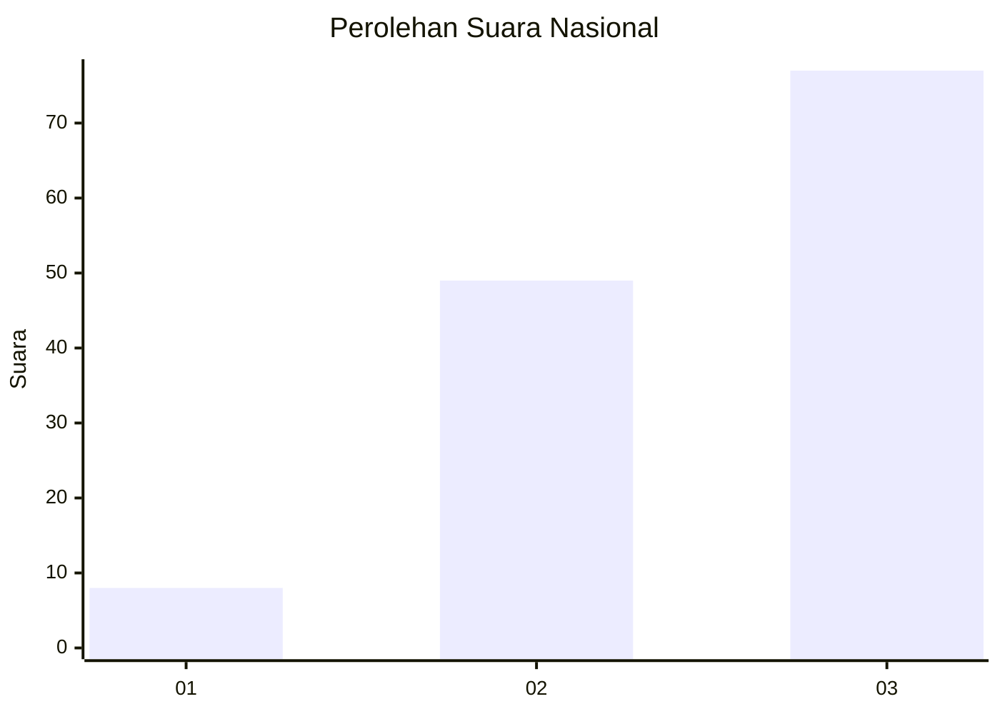
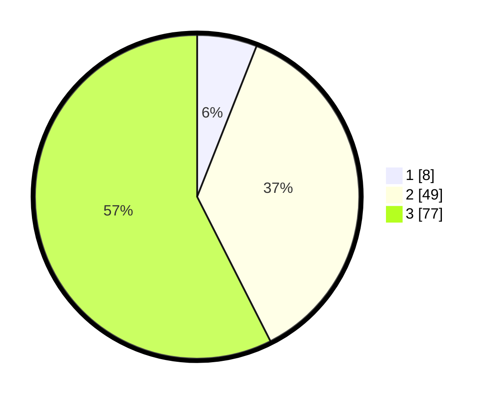

# Hasil

## Grafik

## Tabel

| No. | Nama Paslon    | Suara | Suara (raw) | Persentase |
|:--- |:-------------- | -----:| -----------:| ----------:|
| 1   | ANIES MUHAIMIN | 8     | [8][p-1]    | 5,97       |
| 2   | PRABOWO GIBRAN | 49    | [49][p-2]   | 36,57      |
| 3   | GANJAR MAHFUD  | 77    | [77][p-3]   | 57,46      |

[p-1]: https://github.com/gigit-pemilu/pemilu-2024/blob/main/pilpres/hitung-suara/sub/99-luar-negeri/sub/42-guangzhou-tiongkok/sub/01-guangzhou-tiongkok/sub/0001-guangzhou-tiongkok/sub/003-tps-002/sub/paslon-1.txt
[p-2]: https://github.com/gigit-pemilu/pemilu-2024/blob/main/pilpres/hitung-suara/sub/99-luar-negeri/sub/42-guangzhou-tiongkok/sub/01-guangzhou-tiongkok/sub/0001-guangzhou-tiongkok/sub/003-tps-002/sub/paslon-2.txt
[p-3]: https://github.com/gigit-pemilu/pemilu-2024/blob/main/pilpres/hitung-suara/sub/99-luar-negeri/sub/42-guangzhou-tiongkok/sub/01-guangzhou-tiongkok/sub/0001-guangzhou-tiongkok/sub/003-tps-002/sub/paslon-3.txt

## Foto C Plano

https://sirekap-obj-formc.kpu.go.id/3706/pemilu/ppwp/99/42/01/00/01/9942010001003-20240216-140855--b652162d-d862-4b68-9fbc-a6eceb5b4299.jpg

https://sirekap-obj-formc.kpu.go.id/3706/pemilu/ppwp/99/42/01/00/01/9942010001003-20240216-140857--03e0f523-e427-47d1-9227-111cbd5c4fa8.jpg

https://sirekap-obj-formc.kpu.go.id/3706/pemilu/ppwp/99/42/01/00/01/9942010001003-20240216-140856--f41a7068-5dd5-4bb3-b4cb-d51c214cb132.jpg

## Metadata

| Key        | Value               |
| ---------- | ------------------- |
| Time Stamp | 2024-02-19 06:16:00 |

## DATA PEMILIH TETAP

Jumlah pemilih dalam DPT: **381**.
 * L: **150**.
 * P: **231**.

## DATA PENGGUNA HAK PILIH

Jumlah pengguna hak pilih dalam DPT: **49**.
 * L: **24**.
 * P: **25**.

Jumlah pengguna hak pilih dalam DPTb: **22**.
 * L: **10**.
 * P: **12**.

Jumlah pengguna hak pilih dalam DPK: **64**.
 * L: **31**.
 * P: **33**.

Jumlah pengguna hak pilih: **135**.
 * L: **65**.
 * P: **70**.

## JUMLAH SUARA SAH DAN TIDAK SAH

JUMLAH SELURUH SUARA SAH: **134**.

JUMLAH SUARA TIDAK SAH: **1**.

JUMLAH SELURUH SUARA SAH DAN SUARA TIDAK SAH: **135**.

