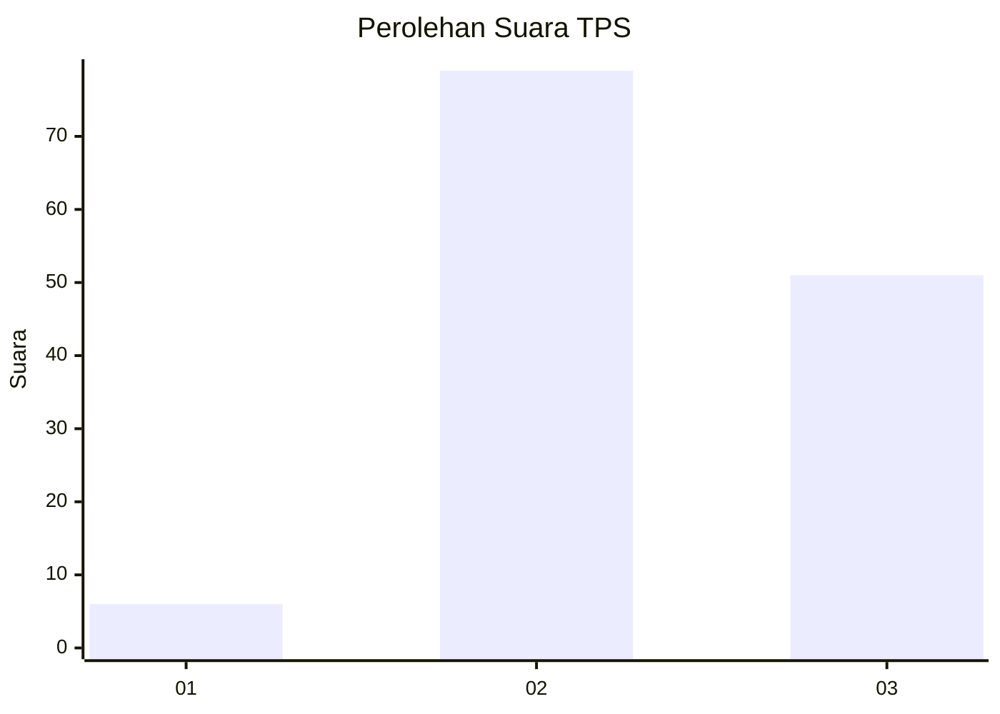
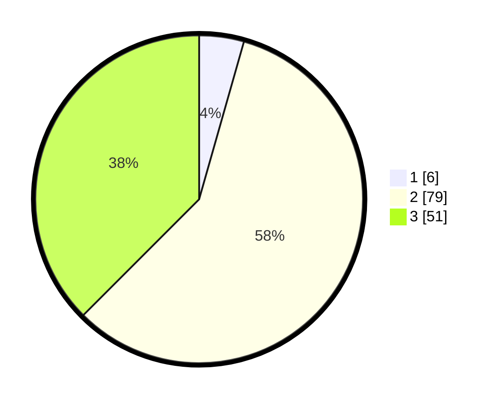

# Hasil

## Grafik

## Tabel

| No. | Nama Paslon    | Suara | Suara (raw) | Persentase |
|:--- |:-------------- | -----:| -----------:| ----------:|
| 1   | ANIES MUHAIMIN | 6     | [6][p-1]    | 4,41       |
| 2   | PRABOWO GIBRAN | 79    | [79][p-2]   | 58,09      |
| 3   | GANJAR MAHFUD  | 51    | [51][p-3]   | 37,50      |

[p-1]: https://github.com/gigit-pemilu/pemilu-2024-99-luar-negeri/blob/main/pilpres/hitung-suara/sub/99-luar-negeri/sub/42-guangzhou-tiongkok/sub/01-guangzhou-tiongkok/sub/0001-guangzhou-tiongkok/sub/004-ksk-001/sub/paslon-1.txt
[p-2]: https://github.com/gigit-pemilu/pemilu-2024-99-luar-negeri/blob/main/pilpres/hitung-suara/sub/99-luar-negeri/sub/42-guangzhou-tiongkok/sub/01-guangzhou-tiongkok/sub/0001-guangzhou-tiongkok/sub/004-ksk-001/sub/paslon-2.txt
[p-3]: https://github.com/gigit-pemilu/pemilu-2024-99-luar-negeri/blob/main/pilpres/hitung-suara/sub/99-luar-negeri/sub/42-guangzhou-tiongkok/sub/01-guangzhou-tiongkok/sub/0001-guangzhou-tiongkok/sub/004-ksk-001/sub/paslon-3.txt

## Foto C Plano

https://sirekap-obj-formc.kpu.go.id/8d88/pemilu/ppwp/99/42/01/00/01/9942010001004-20240216-140017--65c24338-3e59-4450-998e-6c6bec6698cc.jpg

https://sirekap-obj-formc.kpu.go.id/8d88/pemilu/ppwp/99/42/01/00/01/9942010001004-20240216-140018--eec33a68-8e0f-4fa2-aa45-4d0aace8633c.jpg

https://sirekap-obj-formc.kpu.go.id/8d88/pemilu/ppwp/99/42/01/00/01/9942010001004-20240216-140018--03d2161e-e1d0-4017-86da-17b015ad5661.jpg

## Metadata

| Key        | Value               |
| ---------- | ------------------- |
| Time Stamp | 2024-02-19 06:16:00 |

## DATA PEMILIH TETAP

Jumlah pemilih dalam DPT: **138**.
 * L: **50**.
 * P: **88**.

## DATA PENGGUNA HAK PILIH

Jumlah pengguna hak pilih dalam DPT: **9**.
 * L: **3**.
 * P: **6**.

Jumlah pengguna hak pilih dalam DPTb: **124**.
 * L: **45**.
 * P: **79**.

Jumlah pengguna hak pilih dalam DPK: **4**.
 * L: **1**.
 * P: **3**.

Jumlah pengguna hak pilih: **137**.
 * L: **49**.
 * P: **88**.

## JUMLAH SUARA SAH DAN TIDAK SAH

JUMLAH SELURUH SUARA SAH: **136**.

JUMLAH SUARA TIDAK SAH: **1**.

JUMLAH SELURUH SUARA SAH DAN SUARA TIDAK SAH: **137**.

