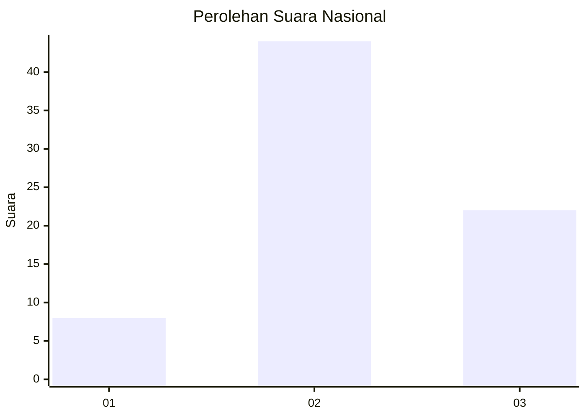
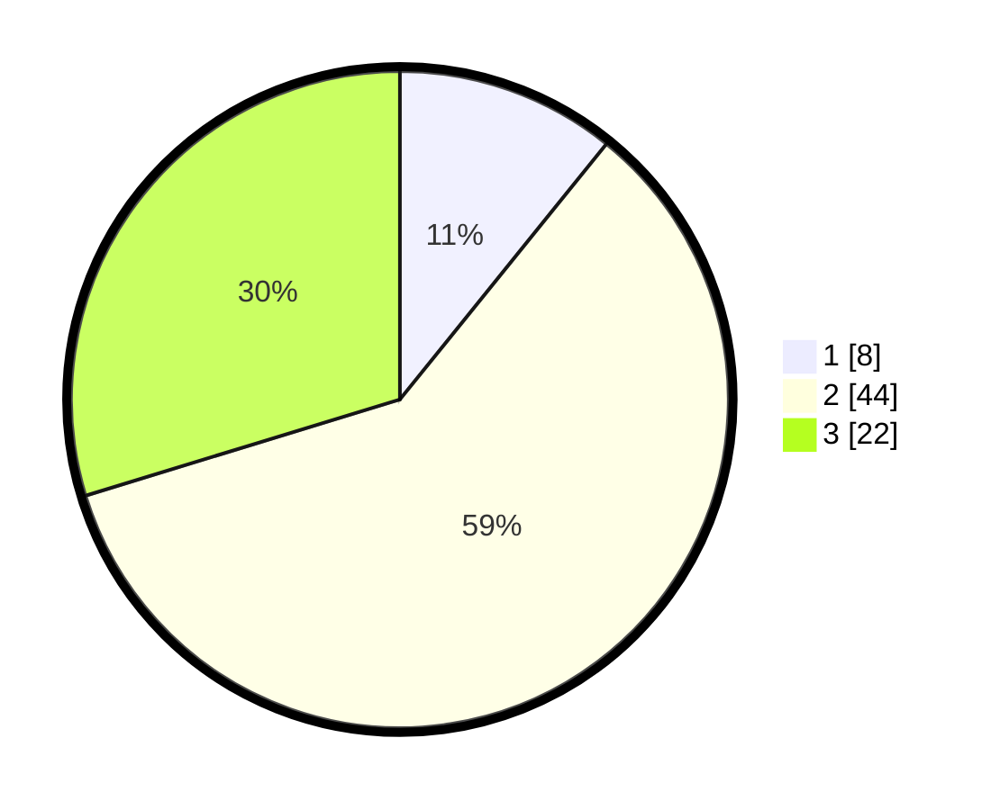

# Hasil

## Grafik

## Tabel

| No. | Nama Paslon    | Suara | Suara (raw) | Persentase |
|:--- |:-------------- | -----:| -----------:| ----------:|
| 1   | ANIES MUHAIMIN | 8     | [8][p-1]    | 10,81      |
| 2   | PRABOWO GIBRAN | 44    | [44][p-2]   | 59,46      |
| 3   | GANJAR MAHFUD  | 22    | [22][p-3]   | 29,73      |

[p-1]: https://github.com/gigit-pemilu/pemilu-2024/blob/main/pilpres/hitung-suara/sub/99-luar-negeri/sub/42-guangzhou-tiongkok/sub/01-guangzhou-tiongkok/sub/0001-guangzhou-tiongkok/sub/005-ksk-002/sub/paslon-1.txt
[p-2]: https://github.com/gigit-pemilu/pemilu-2024/blob/main/pilpres/hitung-suara/sub/99-luar-negeri/sub/42-guangzhou-tiongkok/sub/01-guangzhou-tiongkok/sub/0001-guangzhou-tiongkok/sub/005-ksk-002/sub/paslon-2.txt
[p-3]: https://github.com/gigit-pemilu/pemilu-2024/blob/main/pilpres/hitung-suara/sub/99-luar-negeri/sub/42-guangzhou-tiongkok/sub/01-guangzhou-tiongkok/sub/0001-guangzhou-tiongkok/sub/005-ksk-002/sub/paslon-3.txt

## Foto C Plano

https://sirekap-obj-formc.kpu.go.id/5ab5/pemilu/ppwp/99/42/01/00/01/9942010001005-20240215-210546--61a139c6-b886-4ca5-9c74-20ad9f8c9442.jpg

https://sirekap-obj-formc.kpu.go.id/5ab5/pemilu/ppwp/99/42/01/00/01/9942010001005-20240215-210548--6ae68617-593a-4312-98d4-4dcc997d0870.jpg

https://sirekap-obj-formc.kpu.go.id/5ab5/pemilu/ppwp/99/42/01/00/01/9942010001005-20240215-210547--ab6772f6-10ef-4b7d-acc1-f9b1280f0754.jpg

## Metadata

| Key        | Value               |
| ---------- | ------------------- |
| Time Stamp | 2024-02-19 06:16:00 |

## DATA PEMILIH TETAP

Jumlah pemilih dalam DPT: **203**.
 * L: **85**.
 * P: **118**.

## DATA PENGGUNA HAK PILIH

Jumlah pengguna hak pilih dalam DPT: **12**.
 * L: **5**.
 * P: **7**.

Jumlah pengguna hak pilih dalam DPTb: **58**.
 * L: **24**.
 * P: **34**.

Jumlah pengguna hak pilih dalam DPK: **6**.
 * L: **3**.
 * P: **3**.

Jumlah pengguna hak pilih: **76**.
 * L: **32**.
 * P: **44**.

## JUMLAH SUARA SAH DAN TIDAK SAH

JUMLAH SELURUH SUARA SAH: **74**.

JUMLAH SUARA TIDAK SAH: **2**.

JUMLAH SELURUH SUARA SAH DAN SUARA TIDAK SAH: **76**.

