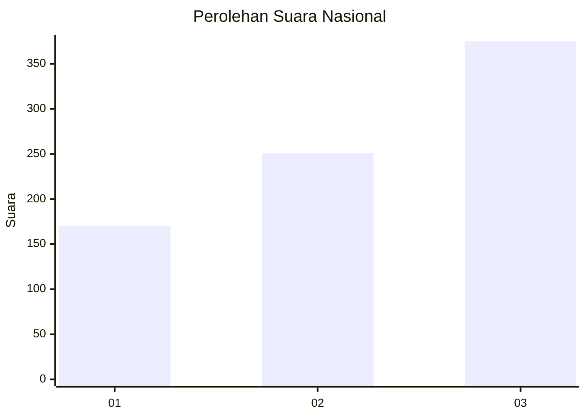
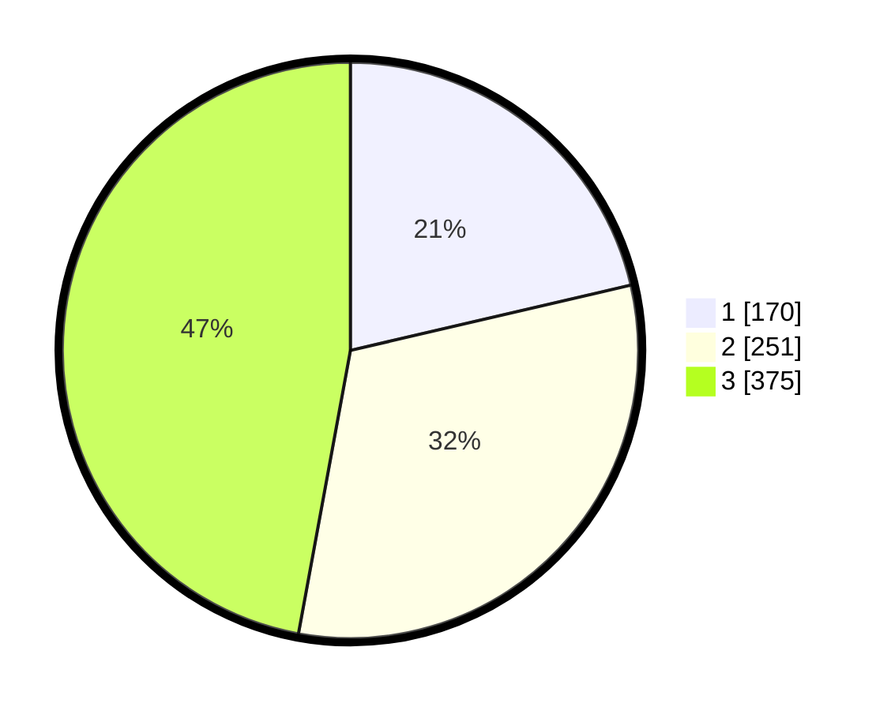

# Hasil

## Grafik

## Tabel

| No. | Nama Paslon    | Suara | Suara (raw) | Persentase |
|:--- |:-------------- | -----:| -----------:| ----------:|
| 1   | ANIES MUHAIMIN | 170   | [170][p-1]  | 21,36      |
| 2   | PRABOWO GIBRAN | 251   | [251][p-2]  | 31,53      |
| 3   | GANJAR MAHFUD  | 375   | [375][p-3]  | 47,11      |

[p-1]: https://github.com/gigit-pemilu/pemilu-2024/blob/main/pilpres/hitung-suara/sub/99-luar-negeri/sub/43-hamburg-jerman/sub/01-hamburg-jerman/sub/0001-hamburg-jerman/sub/001-pos-001/sub/paslon-1.txt
[p-2]: https://github.com/gigit-pemilu/pemilu-2024/blob/main/pilpres/hitung-suara/sub/99-luar-negeri/sub/43-hamburg-jerman/sub/01-hamburg-jerman/sub/0001-hamburg-jerman/sub/001-pos-001/sub/paslon-2.txt
[p-3]: https://github.com/gigit-pemilu/pemilu-2024/blob/main/pilpres/hitung-suara/sub/99-luar-negeri/sub/43-hamburg-jerman/sub/01-hamburg-jerman/sub/0001-hamburg-jerman/sub/001-pos-001/sub/paslon-3.txt

## Foto C Plano

https://sirekap-obj-formc.kpu.go.id/f3f9/pemilu/ppwp/99/43/01/00/01/9943010001001-20240216-072125--e7102ba5-3035-4889-a1f9-46da3718634a.jpg

https://sirekap-obj-formc.kpu.go.id/f3f9/pemilu/ppwp/99/43/01/00/01/9943010001001-20240216-072229--4242b22e-fc9d-4a92-8278-6e15ae1a7fcb.jpg

https://sirekap-obj-formc.kpu.go.id/f3f9/pemilu/ppwp/99/43/01/00/01/9943010001001-20240216-072337--c09a95a9-e35d-4e5d-afc7-1fa71ac8c8a5.jpg

## Metadata

| Key        | Value               |
| ---------- | ------------------- |
| Time Stamp | 2024-02-19 16:00:00 |

## DATA PEMILIH TETAP

Jumlah pemilih dalam DPT: **1647**.
 * L: **722**.
 * P: **925**.

## DATA PENGGUNA HAK PILIH

Jumlah pengguna hak pilih dalam DPT: **1632**.
 * L: **715**.
 * P: **917**.

Jumlah pengguna hak pilih dalam DPTb: **11**.
 * L: **3**.
 * P: **8**.

Jumlah pengguna hak pilih dalam DPK: **23**.
 * L: **6**.
 * P: **17**.

Jumlah pengguna hak pilih: **1666**.
 * L: **724**.
 * P: **942**.

## JUMLAH SUARA SAH DAN TIDAK SAH

JUMLAH SELURUH SUARA SAH: **796**.

JUMLAH SUARA TIDAK SAH: **28**.

JUMLAH SELURUH SUARA SAH DAN SUARA TIDAK SAH: **824**.

