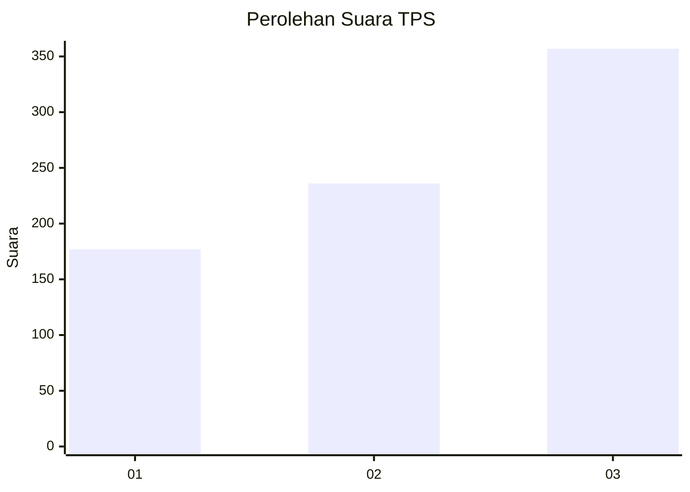
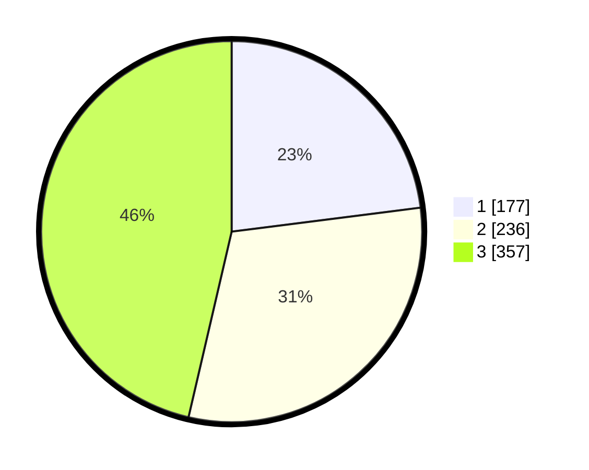

# Hasil

## Grafik

## Tabel

| No. | Nama Paslon    | Suara | Suara (raw) | Persentase |
|:--- |:-------------- | -----:| -----------:| ----------:|
| 1   | ANIES MUHAIMIN | 177   | [177][p-1]  | 22,99      |
| 2   | PRABOWO GIBRAN | 236   | [236][p-2]  | 30,65      |
| 3   | GANJAR MAHFUD  | 357   | [357][p-3]  | 46,36      |

[p-1]: https://github.com/gigit-pemilu/pemilu-2024-99-luar-negeri/blob/main/pilpres/hitung-suara/sub/99-luar-negeri/sub/43-hamburg-jerman/sub/01-hamburg-jerman/sub/0001-hamburg-jerman/sub/002-pos-002/sub/paslon-1.txt
[p-2]: https://github.com/gigit-pemilu/pemilu-2024-99-luar-negeri/blob/main/pilpres/hitung-suara/sub/99-luar-negeri/sub/43-hamburg-jerman/sub/01-hamburg-jerman/sub/0001-hamburg-jerman/sub/002-pos-002/sub/paslon-2.txt
[p-3]: https://github.com/gigit-pemilu/pemilu-2024-99-luar-negeri/blob/main/pilpres/hitung-suara/sub/99-luar-negeri/sub/43-hamburg-jerman/sub/01-hamburg-jerman/sub/0001-hamburg-jerman/sub/002-pos-002/sub/paslon-3.txt

## Foto C Plano

https://sirekap-obj-formc.kpu.go.id/544a/pemilu/ppwp/99/43/01/00/01/9943010001002-20240216-084311--3782c2cd-acbf-40c2-ad38-30416d51a07e.jpg

https://sirekap-obj-formc.kpu.go.id/544a/pemilu/ppwp/99/43/01/00/01/9943010001002-20240216-084103--e2bb051a-78a9-4d99-a6a1-2714998d7ebe.jpg

https://sirekap-obj-formc.kpu.go.id/544a/pemilu/ppwp/99/43/01/00/01/9943010001002-20240216-084144--1ca2166b-8dd1-4865-92af-d53f1f41dd7c.jpg

## Metadata

| Key        | Value               |
| ---------- | ------------------- |
| Time Stamp | 2024-02-16 09:00:28 |

## DATA PEMILIH TETAP

Jumlah pemilih dalam DPT: **1672**.
 * L: **623**.
 * P: **1049**.

## DATA PENGGUNA HAK PILIH

Jumlah pengguna hak pilih dalam DPT: **1657**.
 * L: **618**.
 * P: **1039**.

Jumlah pengguna hak pilih dalam DPTb: **1**.
 * L: **0**.
 * P: **1**.

Jumlah pengguna hak pilih dalam DPK: **0**.
 * L: **0**.
 * P: **0**.

Jumlah pengguna hak pilih: **1658**.
 * L: **618**.
 * P: **1040**.

## JUMLAH SUARA SAH DAN TIDAK SAH

JUMLAH SELURUH SUARA SAH: **770**.

JUMLAH SUARA TIDAK SAH: **78**.

JUMLAH SELURUH SUARA SAH DAN SUARA TIDAK SAH: **848**.

