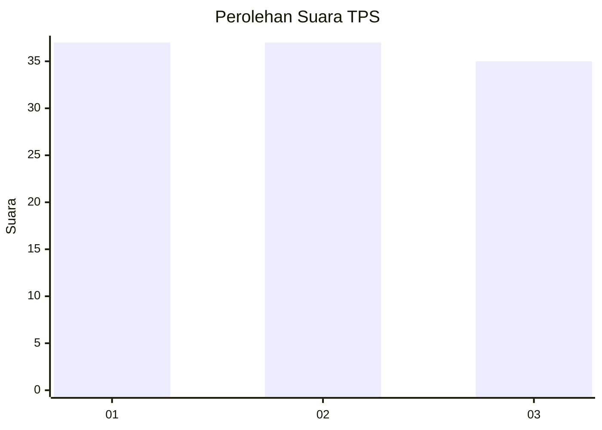
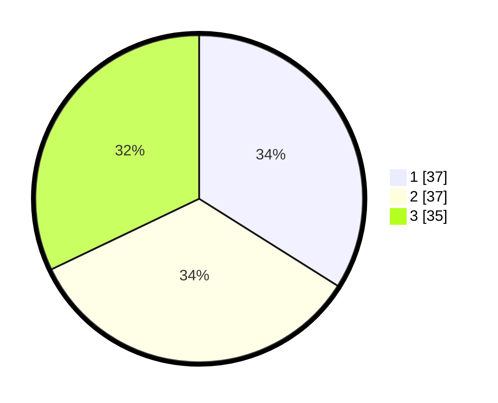

# Hasil

## Grafik

## Tabel

| No. | Nama Paslon    | Suara | Suara (raw) | Persentase |
|:--- |:-------------- | -----:| -----------:| ----------:|
| 1   | ANIES MUHAIMIN | 37    | [37][p-1]   | 33,94      |
| 2   | PRABOWO GIBRAN | 37    | [37][p-2]   | 33,94      |
| 3   | GANJAR MAHFUD  | 35    | [35][p-3]   | 32,11      |

[p-1]: https://github.com/gigit-pemilu/pemilu-2024-99-luar-negeri/blob/main/pilpres/hitung-suara/sub/99-luar-negeri/sub/43-hamburg-jerman/sub/01-hamburg-jerman/sub/0001-hamburg-jerman/sub/003-tps-001/sub/paslon-1.txt
[p-2]: https://github.com/gigit-pemilu/pemilu-2024-99-luar-negeri/blob/main/pilpres/hitung-suara/sub/99-luar-negeri/sub/43-hamburg-jerman/sub/01-hamburg-jerman/sub/0001-hamburg-jerman/sub/003-tps-001/sub/paslon-2.txt
[p-3]: https://github.com/gigit-pemilu/pemilu-2024-99-luar-negeri/blob/main/pilpres/hitung-suara/sub/99-luar-negeri/sub/43-hamburg-jerman/sub/01-hamburg-jerman/sub/0001-hamburg-jerman/sub/003-tps-001/sub/paslon-3.txt

## Foto C Plano

https://sirekap-obj-formc.kpu.go.id/48d0/pemilu/ppwp/99/43/01/00/01/9943010001003-20240217-163952--22b9e400-9be5-4995-aef3-761d8e5fec08.jpg

https://sirekap-obj-formc.kpu.go.id/48d0/pemilu/ppwp/99/43/01/00/01/9943010001003-20240217-163953--c6c52096-e027-4f84-b423-f530a6d5e313.jpg

https://sirekap-obj-formc.kpu.go.id/48d0/pemilu/ppwp/99/43/01/00/01/9943010001003-20240217-163952--6cf9fa14-14a6-450a-9b07-b98fcd253341.jpg

## Metadata

| Key        | Value               |
| ---------- | ------------------- |
| Time Stamp | 2024-02-24 22:31:28 |

## DATA PEMILIH TETAP

Jumlah pemilih dalam DPT: **435**.
 * L: **256**.
 * P: **179**.

## DATA PENGGUNA HAK PILIH

Jumlah pengguna hak pilih dalam DPT: **79**.
 * L: **38**.
 * P: **41**.

Jumlah pengguna hak pilih dalam DPTb: **20**.
 * L: **13**.
 * P: **7**.

Jumlah pengguna hak pilih dalam DPK: **14**.
 * L: **7**.
 * P: **7**.

Jumlah pengguna hak pilih: **113**.
 * L: **58**.
 * P: **55**.

## JUMLAH SUARA SAH DAN TIDAK SAH

JUMLAH SELURUH SUARA SAH: **0**.

JUMLAH SUARA TIDAK SAH: **0**.

JUMLAH SELURUH SUARA SAH DAN SUARA TIDAK SAH: **0**.

