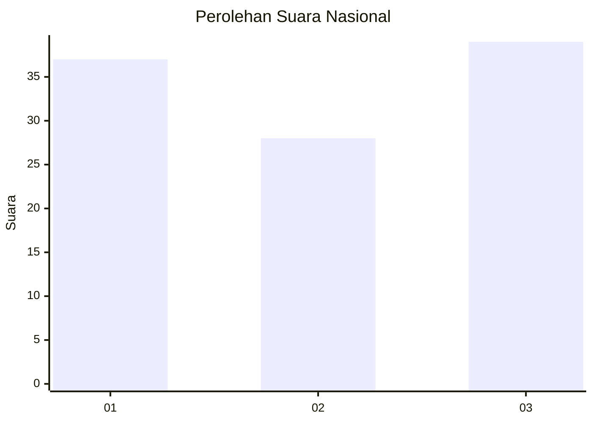
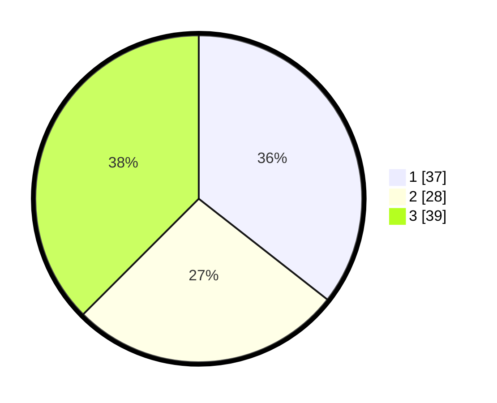

# Hasil

## Grafik

## Tabel

| No. | Nama Paslon    | Suara | Suara (raw) | Persentase |
|:--- |:-------------- | -----:| -----------:| ----------:|
| 1   | ANIES MUHAIMIN | 37    | [37][p-1]   | 35,58      |
| 2   | PRABOWO GIBRAN | 28    | [28][p-2]   | 26,92      |
| 3   | GANJAR MAHFUD  | 39    | [39][p-3]   | 37,50      |

[p-1]: https://github.com/gigit-pemilu/pemilu-2024/blob/main/pilpres/hitung-suara/sub/99-luar-negeri/sub/43-hamburg-jerman/sub/01-hamburg-jerman/sub/0001-hamburg-jerman/sub/004-tps-002/sub/paslon-1.txt
[p-2]: https://github.com/gigit-pemilu/pemilu-2024/blob/main/pilpres/hitung-suara/sub/99-luar-negeri/sub/43-hamburg-jerman/sub/01-hamburg-jerman/sub/0001-hamburg-jerman/sub/004-tps-002/sub/paslon-2.txt
[p-3]: https://github.com/gigit-pemilu/pemilu-2024/blob/main/pilpres/hitung-suara/sub/99-luar-negeri/sub/43-hamburg-jerman/sub/01-hamburg-jerman/sub/0001-hamburg-jerman/sub/004-tps-002/sub/paslon-3.txt

## Foto C Plano

https://sirekap-obj-formc.kpu.go.id/56d8/pemilu/ppwp/99/43/01/00/01/9943010001004-20240214-193838--3bf14cda-2a0c-40c4-af9e-7339bd86031c.jpg

https://sirekap-obj-formc.kpu.go.id/56d8/pemilu/ppwp/99/43/01/00/01/9943010001004-20240214-193841--732bc3ca-590d-4d45-a7e0-cb415fa644fc.jpg

https://sirekap-obj-formc.kpu.go.id/56d8/pemilu/ppwp/99/43/01/00/01/9943010001004-20240214-193844--9f37ee46-ccf0-460c-94d4-b34a37fded79.jpg

## Metadata

| Key        | Value               |
| ---------- | ------------------- |
| Time Stamp | 2024-02-19 16:00:00 |

## DATA PEMILIH TETAP

Jumlah pemilih dalam DPT: **404**.
 * L: **200**.
 * P: **204**.

## DATA PENGGUNA HAK PILIH

Jumlah pengguna hak pilih dalam DPT: **64**.
 * L: **28**.
 * P: **36**.

Jumlah pengguna hak pilih dalam DPTb: **27**.
 * L: **9**.
 * P: **18**.

Jumlah pengguna hak pilih dalam DPK: **16**.
 * L: **4**.
 * P: **12**.

Jumlah pengguna hak pilih: **107**.
 * L: **41**.
 * P: **66**.

## JUMLAH SUARA SAH DAN TIDAK SAH

JUMLAH SELURUH SUARA SAH: **104**.

JUMLAH SUARA TIDAK SAH: **3**.

JUMLAH SELURUH SUARA SAH DAN SUARA TIDAK SAH: **107**.

