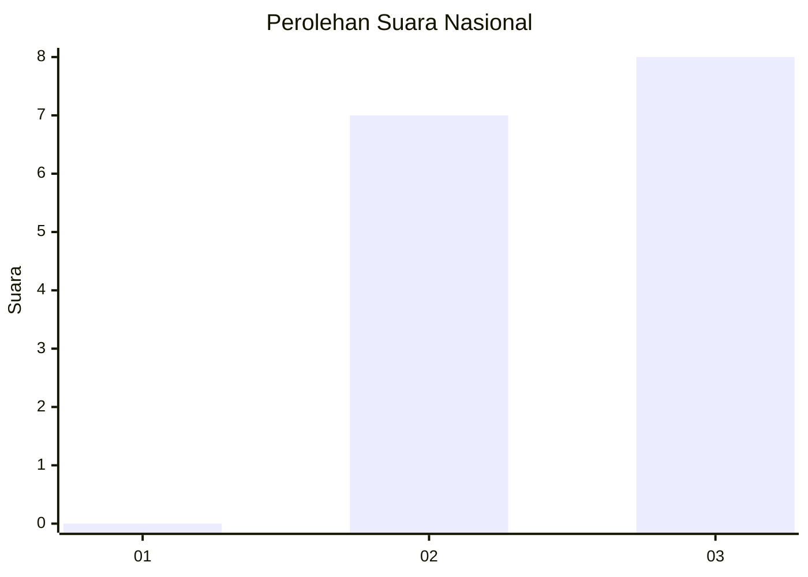
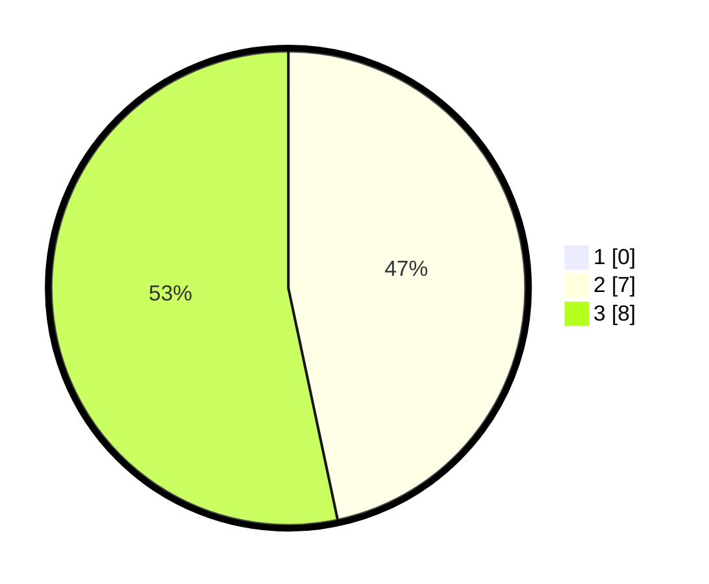

# Hasil

## Grafik

## Tabel

| No. | Nama Paslon    | Suara | Suara (raw) | Persentase |
|:--- |:-------------- | -----:| -----------:| ----------:|
| 1   | ANIES MUHAIMIN | 0     | [0][p-1]    | 0,00       |
| 2   | PRABOWO GIBRAN | 7     | [7][p-2]    | 46,67      |
| 3   | GANJAR MAHFUD  | 8     | [8][p-3]    | 53,33      |

[p-1]: https://github.com/gigit-pemilu/pemilu-2024/blob/main/pilpres/hitung-suara/sub/99-luar-negeri/sub/44-hanoi-vietnam/sub/01-hanoi-vietnam/sub/0001-hanoi-vietnam/sub/001-pos-001/sub/paslon-1.txt
[p-2]: https://github.com/gigit-pemilu/pemilu-2024/blob/main/pilpres/hitung-suara/sub/99-luar-negeri/sub/44-hanoi-vietnam/sub/01-hanoi-vietnam/sub/0001-hanoi-vietnam/sub/001-pos-001/sub/paslon-2.txt
[p-3]: https://github.com/gigit-pemilu/pemilu-2024/blob/main/pilpres/hitung-suara/sub/99-luar-negeri/sub/44-hanoi-vietnam/sub/01-hanoi-vietnam/sub/0001-hanoi-vietnam/sub/001-pos-001/sub/paslon-3.txt

## Foto C Plano

https://sirekap-obj-formc.kpu.go.id/5ebe/pemilu/ppwp/99/44/01/00/01/9944010001001-20240220-184522--4cd4767e-a7a2-4ae7-9850-743dc7210c73.jpg

https://sirekap-obj-formc.kpu.go.id/5ebe/pemilu/ppwp/99/44/01/00/01/9944010001001-20240220-184816--c763df90-590f-4f1b-94a8-b0b808e8727d.jpg

https://sirekap-obj-formc.kpu.go.id/5ebe/pemilu/ppwp/99/44/01/00/01/9944010001001-20240220-184727--988eda8e-6ed8-4af7-b046-b7ae2705166e.jpg

## Metadata

| Key        | Value               |
| ---------- | ------------------- |
| Time Stamp | 2024-02-20 21:00:00 |

## DATA PEMILIH TETAP

Jumlah pemilih dalam DPT: **25**.
 * L: **18**.
 * P: **7**.

## DATA PENGGUNA HAK PILIH

Jumlah pengguna hak pilih dalam DPT: **15**.
 * L: **11**.
 * P: **4**.

Jumlah pengguna hak pilih dalam DPTb: **0**.
 * L: **0**.
 * P: **0**.

Jumlah pengguna hak pilih dalam DPK: **0**.
 * L: **0**.
 * P: **0**.

Jumlah pengguna hak pilih: **15**.
 * L: **11**.
 * P: **4**.

## JUMLAH SUARA SAH DAN TIDAK SAH

JUMLAH SELURUH SUARA SAH: **15**.

JUMLAH SUARA TIDAK SAH: **0**.

JUMLAH SELURUH SUARA SAH DAN SUARA TIDAK SAH: **15**.

