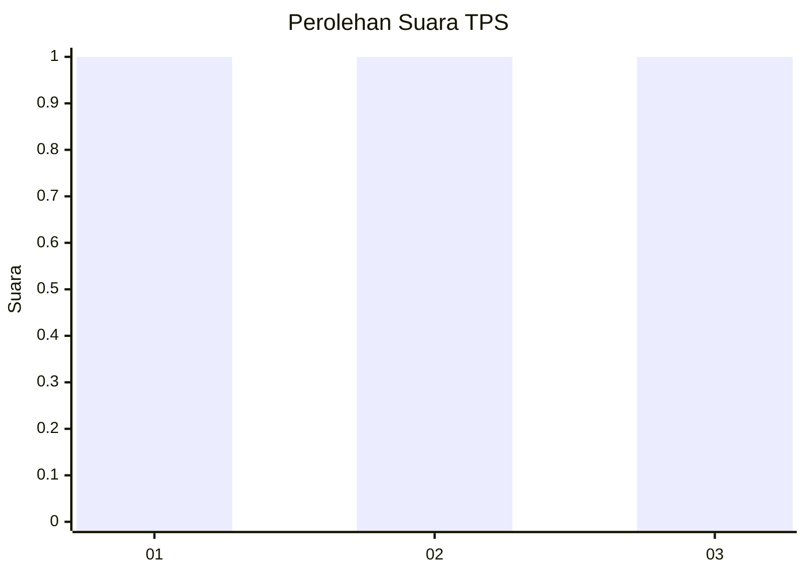
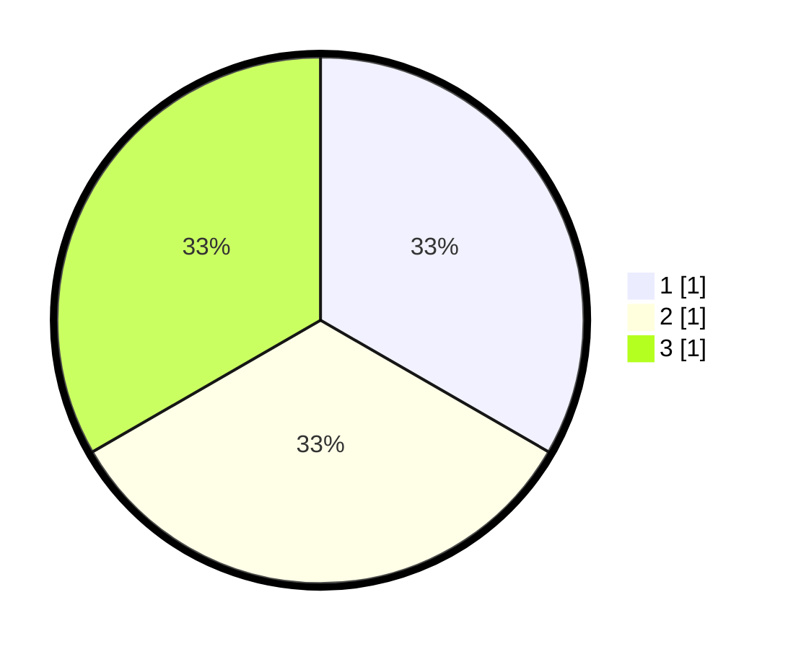

# Hasil

## Grafik

## Tabel

| No. | Nama Paslon    | Suara | Suara (raw) | Persentase |
|:--- |:-------------- | -----:| -----------:| ----------:|
| 1   | ANIES MUHAIMIN | 1     | [1][p-1]    | 33,33      |
| 2   | PRABOWO GIBRAN | 1     | [1][p-2]    | 33,33      |
| 3   | GANJAR MAHFUD  | 1     | [1][p-3]    | 33,33      |

[p-1]: https://github.com/gigit-pemilu/pemilu-2024-99-luar-negeri/blob/main/pilpres/hitung-suara/sub/99-luar-negeri/sub/44-hanoi-vietnam/sub/01-hanoi-vietnam/sub/0001-hanoi-vietnam/sub/003-ksk-001/sub/paslon-1.txt
[p-2]: https://github.com/gigit-pemilu/pemilu-2024-99-luar-negeri/blob/main/pilpres/hitung-suara/sub/99-luar-negeri/sub/44-hanoi-vietnam/sub/01-hanoi-vietnam/sub/0001-hanoi-vietnam/sub/003-ksk-001/sub/paslon-2.txt
[p-3]: https://github.com/gigit-pemilu/pemilu-2024-99-luar-negeri/blob/main/pilpres/hitung-suara/sub/99-luar-negeri/sub/44-hanoi-vietnam/sub/01-hanoi-vietnam/sub/0001-hanoi-vietnam/sub/003-ksk-001/sub/paslon-3.txt

## Foto C Plano

https://sirekap-obj-formc.kpu.go.id/5fb9/pemilu/ppwp/99/44/01/00/01/9944010001003-20240214-193922--8b3c4f78-eef6-4f8d-8d30-1966b505b48f.jpg

https://sirekap-obj-formc.kpu.go.id/5fb9/pemilu/ppwp/99/44/01/00/01/9944010001003-20240214-200200--2a8bd808-d9a7-4dde-bf25-ca39a7c6ebfd.jpg

https://sirekap-obj-formc.kpu.go.id/5fb9/pemilu/ppwp/99/44/01/00/01/9944010001003-20240214-200306--828444d5-56ec-4d4b-9cf1-986432e12527.jpg

## Metadata

| Key        | Value               |
| ---------- | ------------------- |
| Time Stamp | 2024-02-14 21:46:01 |

## DATA PEMILIH TETAP

Jumlah pemilih dalam DPT: **3**.
 * L: **1**.
 * P: **2**.

## DATA PENGGUNA HAK PILIH

Jumlah pengguna hak pilih dalam DPT: **3**.
 * L: **1**.
 * P: **2**.

Jumlah pengguna hak pilih dalam DPTb: **0**.
 * L: **0**.
 * P: **0**.

Jumlah pengguna hak pilih dalam DPK: **0**.
 * L: **0**.
 * P: **0**.

Jumlah pengguna hak pilih: **3**.
 * L: **1**.
 * P: **2**.

## JUMLAH SUARA SAH DAN TIDAK SAH

JUMLAH SELURUH SUARA SAH: **3**.

JUMLAH SUARA TIDAK SAH: **0**.

JUMLAH SELURUH SUARA SAH DAN SUARA TIDAK SAH: **3**.

