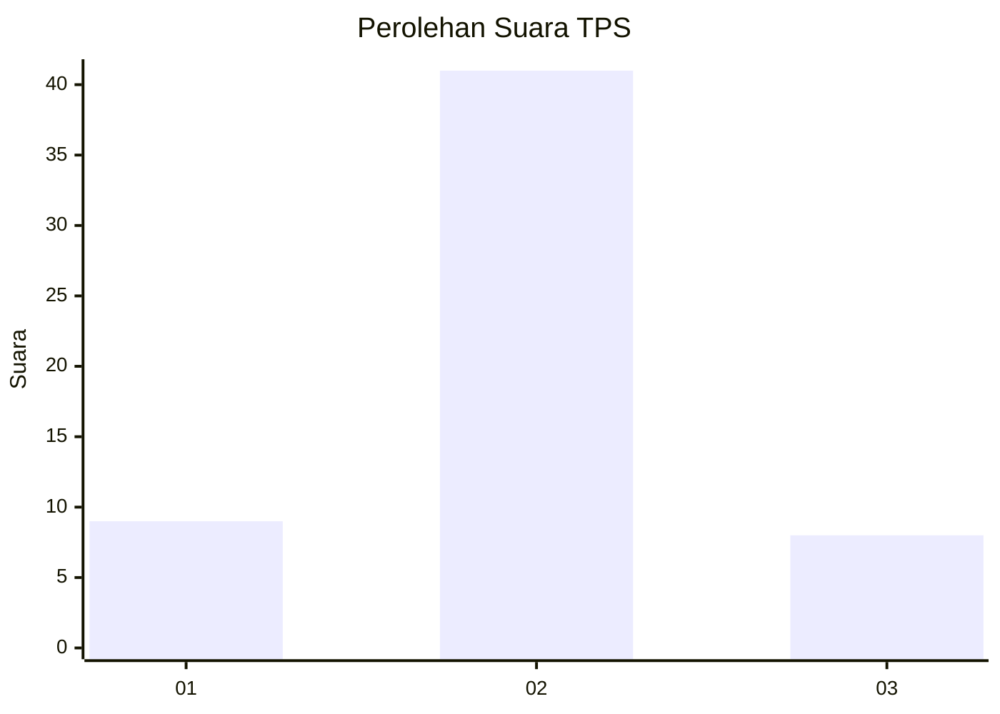
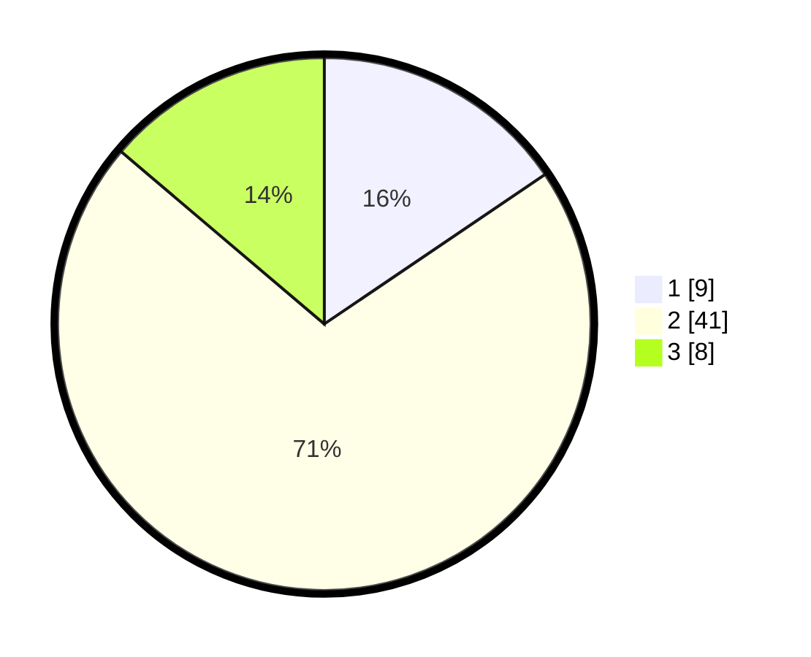

# Hasil

## Grafik

## Tabel

| No. | Nama Paslon    | Suara | Suara (raw) | Persentase |
|:--- |:-------------- | -----:| -----------:| ----------:|
| 1   | ANIES MUHAIMIN | 9     | [9][p-1]    | 15,52      |
| 2   | PRABOWO GIBRAN | 41    | [41][p-2]   | 70,69      |
| 3   | GANJAR MAHFUD  | 8     | [8][p-3]    | 13,79      |

[p-1]: https://github.com/gigit-pemilu/pemilu-2024-99-luar-negeri/blob/main/pilpres/hitung-suara/sub/99-luar-negeri/sub/45-harare-zimbabwe/sub/01-harare-zimbabwe/sub/0001-harare-zimbabwe/sub/001-tps/sub/paslon-1.txt
[p-2]: https://github.com/gigit-pemilu/pemilu-2024-99-luar-negeri/blob/main/pilpres/hitung-suara/sub/99-luar-negeri/sub/45-harare-zimbabwe/sub/01-harare-zimbabwe/sub/0001-harare-zimbabwe/sub/001-tps/sub/paslon-2.txt
[p-3]: https://github.com/gigit-pemilu/pemilu-2024-99-luar-negeri/blob/main/pilpres/hitung-suara/sub/99-luar-negeri/sub/45-harare-zimbabwe/sub/01-harare-zimbabwe/sub/0001-harare-zimbabwe/sub/001-tps/sub/paslon-3.txt

## Foto C Plano

https://sirekap-obj-formc.kpu.go.id/f1e3/pemilu/ppwp/99/45/01/00/01/9945010001001-20240216-144658--3dfdf3a3-03fe-41ee-9db9-0566c6ce1fae.jpg

https://sirekap-obj-formc.kpu.go.id/f1e3/pemilu/ppwp/99/45/01/00/01/9945010001001-20240216-144659--1f259d44-bb88-4cd8-a68c-f32c84bd7591.jpg

https://sirekap-obj-formc.kpu.go.id/f1e3/pemilu/ppwp/99/45/01/00/01/9945010001001-20240216-144658--591e8ce4-7eba-4630-b7c0-5f9ecb34b0ee.jpg

## Metadata

| Key        | Value               |
| ---------- | ------------------- |
| Time Stamp | 2024-02-17 16:00:02 |

## DATA PEMILIH TETAP

Jumlah pemilih dalam DPT: **56**.
 * L: **56**.
 * P: **0**.

## DATA PENGGUNA HAK PILIH

Jumlah pengguna hak pilih dalam DPT: **34**.
 * L: **34**.
 * P: **0**.

Jumlah pengguna hak pilih dalam DPTb: **24**.
 * L: **24**.
 * P: **0**.

Jumlah pengguna hak pilih dalam DPK: **0**.
 * L: **0**.
 * P: **0**.

Jumlah pengguna hak pilih: **58**.
 * L: **58**.
 * P: **0**.

## JUMLAH SUARA SAH DAN TIDAK SAH

JUMLAH SELURUH SUARA SAH: **58**.

JUMLAH SUARA TIDAK SAH: **0**.

JUMLAH SELURUH SUARA SAH DAN SUARA TIDAK SAH: **58**.

