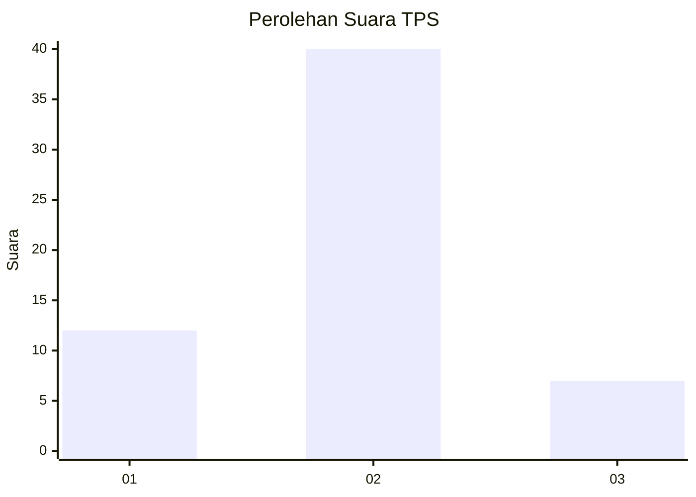
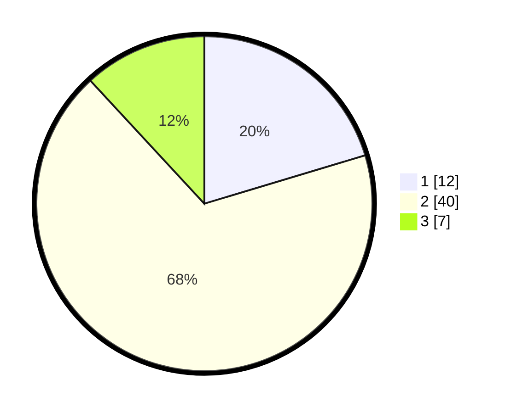

# Hasil

## Grafik

## Tabel

| No. | Nama Paslon    | Suara | Suara (raw) | Persentase |
|:--- |:-------------- | -----:| -----------:| ----------:|
| 1   | ANIES MUHAIMIN | 12    | [12][p-1]   | 20,34      |
| 2   | PRABOWO GIBRAN | 40    | [40][p-2]   | 67,80      |
| 3   | GANJAR MAHFUD  | 7     | [7][p-3]    | 11,86      |

[p-1]: https://github.com/gigit-pemilu/pemilu-2024-99-luar-negeri/blob/main/pilpres/hitung-suara/sub/99-luar-negeri/sub/45-harare-zimbabwe/sub/01-harare-zimbabwe/sub/0001-harare-zimbabwe/sub/002-tps/sub/paslon-1.txt
[p-2]: https://github.com/gigit-pemilu/pemilu-2024-99-luar-negeri/blob/main/pilpres/hitung-suara/sub/99-luar-negeri/sub/45-harare-zimbabwe/sub/01-harare-zimbabwe/sub/0001-harare-zimbabwe/sub/002-tps/sub/paslon-2.txt
[p-3]: https://github.com/gigit-pemilu/pemilu-2024-99-luar-negeri/blob/main/pilpres/hitung-suara/sub/99-luar-negeri/sub/45-harare-zimbabwe/sub/01-harare-zimbabwe/sub/0001-harare-zimbabwe/sub/002-tps/sub/paslon-3.txt

## Foto C Plano

https://sirekap-obj-formc.kpu.go.id/3fb0/pemilu/ppwp/99/45/01/00/01/9945010001002-20240216-134903--78ecd424-7d6b-44a2-a0ae-08ff5bac7201.jpg

https://sirekap-obj-formc.kpu.go.id/3fb0/pemilu/ppwp/99/45/01/00/01/9945010001002-20240216-152939--ba786825-9ec8-462f-811c-cbd9b6f6b59d.jpg

https://sirekap-obj-formc.kpu.go.id/3fb0/pemilu/ppwp/99/45/01/00/01/9945010001002-20240216-134903--c7c0bf04-4f91-4af6-9cfa-208e0d9ae5b8.jpg

## Metadata

| Key        | Value               |
| ---------- | ------------------- |
| Time Stamp | 2024-02-21 19:00:00 |

## DATA PEMILIH TETAP

Jumlah pemilih dalam DPT: **56**.
 * L: **56**.
 * P: **0**.

## DATA PENGGUNA HAK PILIH

Jumlah pengguna hak pilih dalam DPT: **34**.
 * L: **34**.
 * P: **0**.

Jumlah pengguna hak pilih dalam DPTb: **24**.
 * L: **24**.
 * P: **0**.

Jumlah pengguna hak pilih dalam DPK: **0**.
 * L: **0**.
 * P: **0**.

Jumlah pengguna hak pilih: **58**.
 * L: **58**.
 * P: **0**.

## JUMLAH SUARA SAH DAN TIDAK SAH

JUMLAH SELURUH SUARA SAH: **58**.

JUMLAH SUARA TIDAK SAH: **0**.

JUMLAH SELURUH SUARA SAH DAN SUARA TIDAK SAH: **58**.

