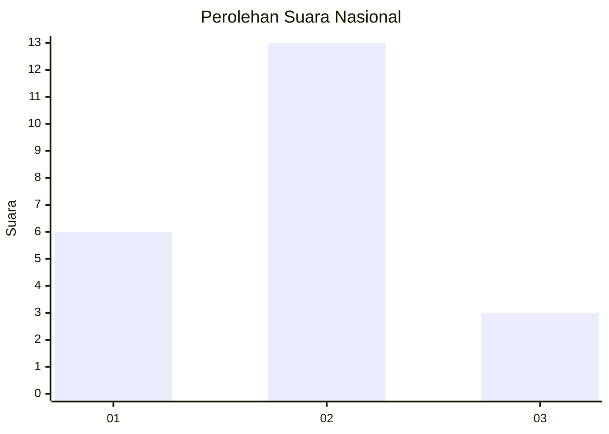
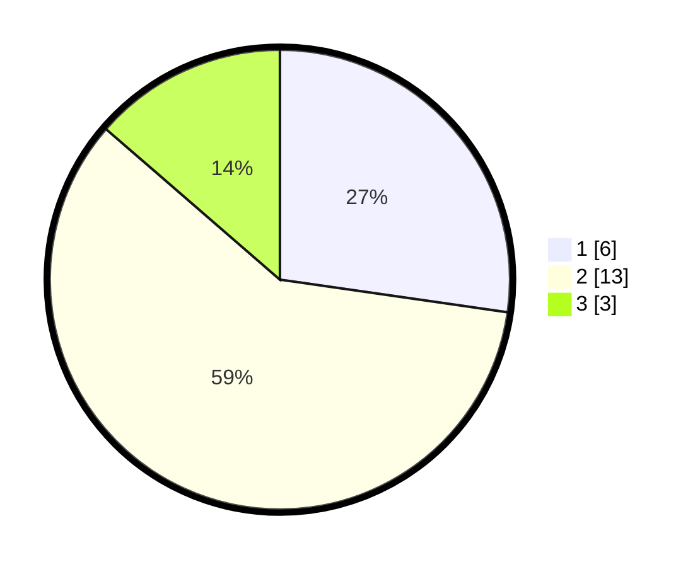

# Hasil

## Grafik

## Tabel

| No. | Nama Paslon    | Suara | Suara (raw) | Persentase |
|:--- |:-------------- | -----:| -----------:| ----------:|
| 1   | ANIES MUHAIMIN | 6     | [6][p-1]    | 27,27      |
| 2   | PRABOWO GIBRAN | 13    | [13][p-2]   | 59,09      |
| 3   | GANJAR MAHFUD  | 3     | [3][p-3]    | 13,64      |

[p-1]: https://github.com/gigit-pemilu/pemilu-2024/blob/main/pilpres/hitung-suara/sub/99-luar-negeri/sub/45-harare-zimbabwe/sub/01-harare-zimbabwe/sub/0001-harare-zimbabwe/sub/003-tps/sub/paslon-1.txt
[p-2]: https://github.com/gigit-pemilu/pemilu-2024/blob/main/pilpres/hitung-suara/sub/99-luar-negeri/sub/45-harare-zimbabwe/sub/01-harare-zimbabwe/sub/0001-harare-zimbabwe/sub/003-tps/sub/paslon-2.txt
[p-3]: https://github.com/gigit-pemilu/pemilu-2024/blob/main/pilpres/hitung-suara/sub/99-luar-negeri/sub/45-harare-zimbabwe/sub/01-harare-zimbabwe/sub/0001-harare-zimbabwe/sub/003-tps/sub/paslon-3.txt

## Foto C Plano

https://sirekap-obj-formc.kpu.go.id/ac9e/pemilu/ppwp/99/45/01/00/01/9945010001003-20240216-145041--7539d581-9c88-44f0-8be7-30ed7886e0e7.jpg

https://sirekap-obj-formc.kpu.go.id/ac9e/pemilu/ppwp/99/45/01/00/01/9945010001003-20240214-223446--4006ee78-eecd-447d-9681-fe2d33705294.jpg

https://sirekap-obj-formc.kpu.go.id/ac9e/pemilu/ppwp/99/45/01/00/01/9945010001003-20240214-223615--87e97e9f-4e1f-4dc9-83cb-16a781c7cb4c.jpg

## Metadata

| Key        | Value               |
| ---------- | ------------------- |
| Time Stamp | 2024-02-16 16:25:10 |

## DATA PEMILIH TETAP

Jumlah pemilih dalam DPT: **24**.
 * L: **14**.
 * P: **10**.

## DATA PENGGUNA HAK PILIH

Jumlah pengguna hak pilih dalam DPT: **14**.
 * L: **9**.
 * P: **5**.

Jumlah pengguna hak pilih dalam DPTb: **6**.
 * L: **3**.
 * P: **3**.

Jumlah pengguna hak pilih dalam DPK: **2**.
 * L: **1**.
 * P: **1**.

Jumlah pengguna hak pilih: **22**.
 * L: **13**.
 * P: **9**.

## JUMLAH SUARA SAH DAN TIDAK SAH

JUMLAH SELURUH SUARA SAH: **22**.

JUMLAH SUARA TIDAK SAH: **0**.

JUMLAH SELURUH SUARA SAH DAN SUARA TIDAK SAH: **22**.

