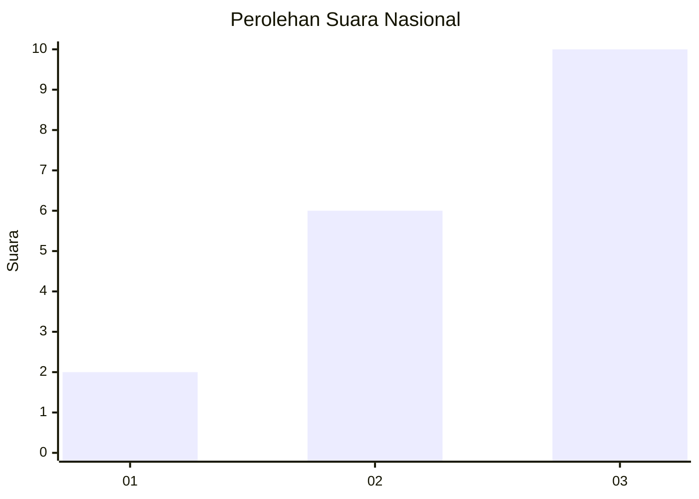
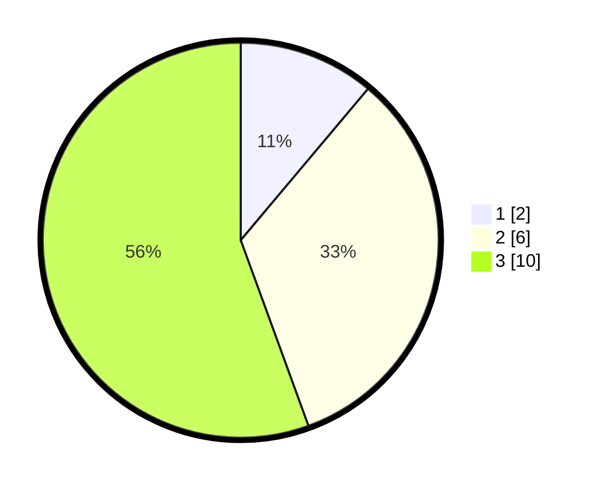

# Hasil

## Grafik

## Tabel

| No. | Nama Paslon    | Suara | Suara (raw) | Persentase |
|:--- |:-------------- | -----:| -----------:| ----------:|
| 1   | ANIES MUHAIMIN | 2     | [2][p-1]    | 11,11      |
| 2   | PRABOWO GIBRAN | 6     | [6][p-2]    | 33,33      |
| 3   | GANJAR MAHFUD  | 10    | [10][p-3]   | 55,56      |

[p-1]: https://github.com/gigit-pemilu/pemilu-2024/blob/main/pilpres/hitung-suara/sub/99-luar-negeri/sub/45-harare-zimbabwe/sub/01-harare-zimbabwe/sub/0001-harare-zimbabwe/sub/004-ksk-001/sub/paslon-1.txt
[p-2]: https://github.com/gigit-pemilu/pemilu-2024/blob/main/pilpres/hitung-suara/sub/99-luar-negeri/sub/45-harare-zimbabwe/sub/01-harare-zimbabwe/sub/0001-harare-zimbabwe/sub/004-ksk-001/sub/paslon-2.txt
[p-3]: https://github.com/gigit-pemilu/pemilu-2024/blob/main/pilpres/hitung-suara/sub/99-luar-negeri/sub/45-harare-zimbabwe/sub/01-harare-zimbabwe/sub/0001-harare-zimbabwe/sub/004-ksk-001/sub/paslon-3.txt

## Foto C Plano

https://sirekap-obj-formc.kpu.go.id/0b04/pemilu/ppwp/99/45/01/00/01/9945010001004-20240214-224035--045c2d59-58cd-44bf-bb3d-b8790df13f88.jpg

https://sirekap-obj-formc.kpu.go.id/0b04/pemilu/ppwp/99/45/01/00/01/9945010001004-20240214-221531--75996b6e-76fd-4cb8-8473-aae57e117740.jpg

https://sirekap-obj-formc.kpu.go.id/0b04/pemilu/ppwp/99/45/01/00/01/9945010001004-20240214-221735--1e815530-b7ae-45dc-af47-28c6bfa436be.jpg

## Metadata

| Key        | Value               |
| ---------- | ------------------- |
| Time Stamp | 2024-02-15 15:00:29 |

## DATA PEMILIH TETAP

Jumlah pemilih dalam DPT: **17**.
 * L: **13**.
 * P: **4**.

## DATA PENGGUNA HAK PILIH

Jumlah pengguna hak pilih dalam DPT: **15**.
 * L: **11**.
 * P: **4**.

Jumlah pengguna hak pilih dalam DPTb: **2**.
 * L: **2**.
 * P: **0**.

Jumlah pengguna hak pilih dalam DPK: **1**.
 * L: **0**.
 * P: **1**.

Jumlah pengguna hak pilih: **18**.
 * L: **13**.
 * P: **5**.

## JUMLAH SUARA SAH DAN TIDAK SAH

JUMLAH SELURUH SUARA SAH: **18**.

JUMLAH SUARA TIDAK SAH: **0**.

JUMLAH SELURUH SUARA SAH DAN SUARA TIDAK SAH: **18**.

