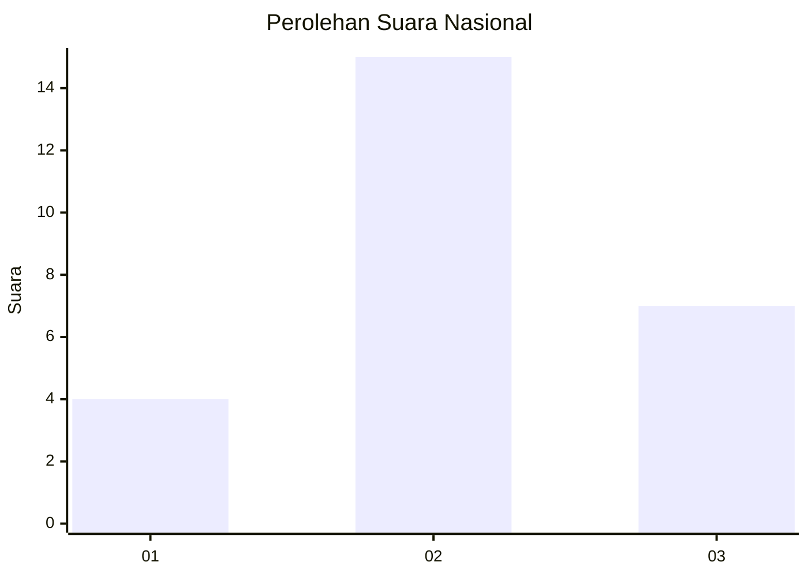
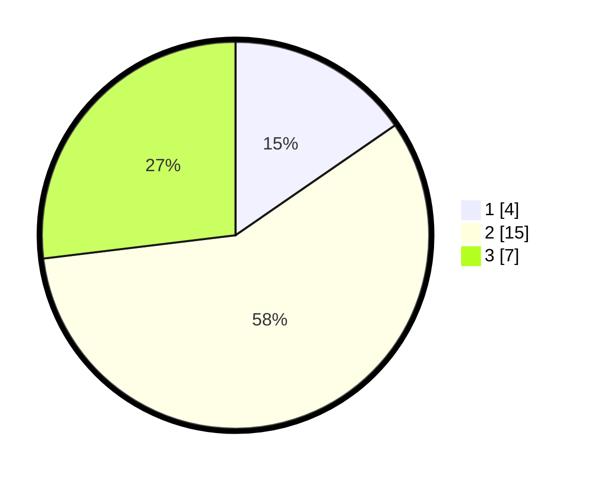

# Hasil

## Grafik

## Tabel

| No. | Nama Paslon    | Suara | Suara (raw) | Persentase |
|:--- |:-------------- | -----:| -----------:| ----------:|
| 1   | ANIES MUHAIMIN | 4     | [4][p-1]    | 15,38      |
| 2   | PRABOWO GIBRAN | 15    | [15][p-2]   | 57,69      |
| 3   | GANJAR MAHFUD  | 7     | [7][p-3]    | 26,92      |

[p-1]: https://github.com/gigit-pemilu/pemilu-2024/blob/main/pilpres/hitung-suara/sub/99-luar-negeri/sub/46-havana-kuba/sub/01-havana-kuba/sub/0001-havana-kuba/sub/001-tps/sub/paslon-1.txt
[p-2]: https://github.com/gigit-pemilu/pemilu-2024/blob/main/pilpres/hitung-suara/sub/99-luar-negeri/sub/46-havana-kuba/sub/01-havana-kuba/sub/0001-havana-kuba/sub/001-tps/sub/paslon-2.txt
[p-3]: https://github.com/gigit-pemilu/pemilu-2024/blob/main/pilpres/hitung-suara/sub/99-luar-negeri/sub/46-havana-kuba/sub/01-havana-kuba/sub/0001-havana-kuba/sub/001-tps/sub/paslon-3.txt

## Foto C Plano

https://sirekap-obj-formc.kpu.go.id/e177/pemilu/ppwp/99/46/01/00/01/9946010001001-20240216-141852--fbfb0b02-c305-4bf0-a73c-e4fefe6cb3d4.jpg

https://sirekap-obj-formc.kpu.go.id/e177/pemilu/ppwp/99/46/01/00/01/9946010001001-20240216-141854--2d04559f-4382-49bc-ad4d-cf3e8a9db55c.jpg

https://sirekap-obj-formc.kpu.go.id/e177/pemilu/ppwp/99/46/01/00/01/9946010001001-20240216-141853--13e8a28f-70dd-4953-bafd-7e5014e4daf8.jpg

## Metadata

| Key        | Value               |
| ---------- | ------------------- |
| Time Stamp | 2024-02-20 22:00:00 |

## DATA PEMILIH TETAP

Jumlah pemilih dalam DPT: **26**.
 * L: **12**.
 * P: **14**.

## DATA PENGGUNA HAK PILIH

Jumlah pengguna hak pilih dalam DPT: **17**.
 * L: **7**.
 * P: **10**.

Jumlah pengguna hak pilih dalam DPTb: **6**.
 * L: **4**.
 * P: **2**.

Jumlah pengguna hak pilih dalam DPK: **3**.
 * L: **1**.
 * P: **2**.

Jumlah pengguna hak pilih: **26**.
 * L: **12**.
 * P: **14**.

## JUMLAH SUARA SAH DAN TIDAK SAH

JUMLAH SELURUH SUARA SAH: **26**.

JUMLAH SUARA TIDAK SAH: **0**.

JUMLAH SELURUH SUARA SAH DAN SUARA TIDAK SAH: **26**.

