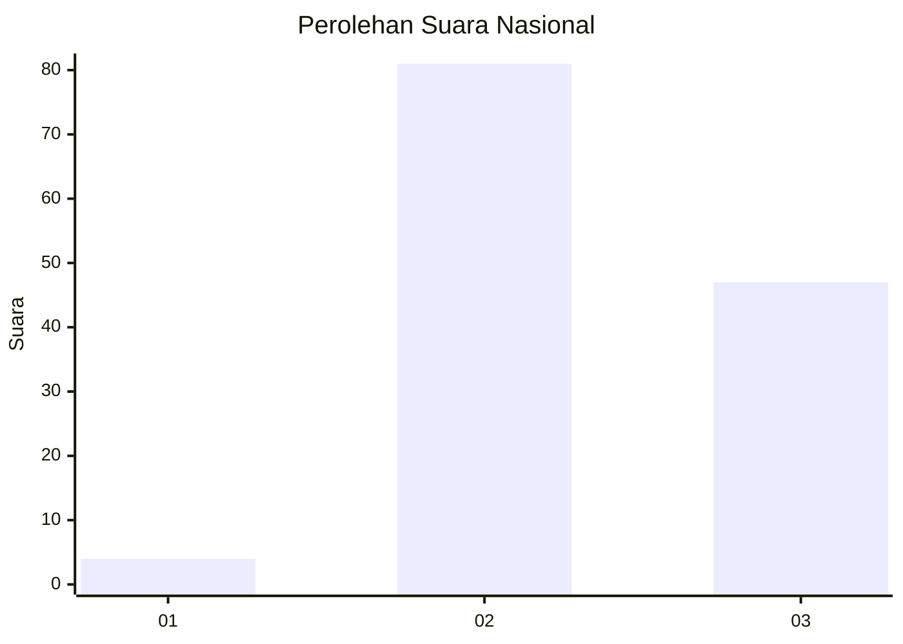
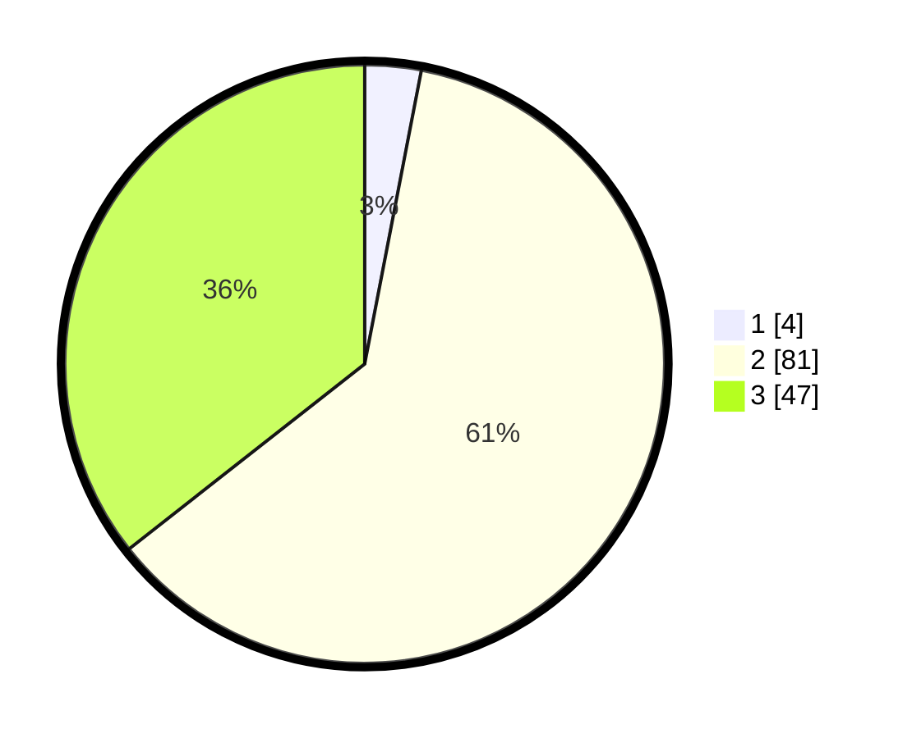

# Hasil

## Grafik

## Tabel

| No. | Nama Paslon    | Suara | Suara (raw) | Persentase |
|:--- |:-------------- | -----:| -----------:| ----------:|
| 1   | ANIES MUHAIMIN | 4     | [4][p-1]    | 3,03       |
| 2   | PRABOWO GIBRAN | 81    | [81][p-2]   | 61,36      |
| 3   | GANJAR MAHFUD  | 47    | [47][p-3]   | 35,61      |

[p-1]: https://github.com/gigit-pemilu/pemilu-2024/blob/main/pilpres/hitung-suara/sub/99-luar-negeri/sub/46-havana-kuba/sub/01-havana-kuba/sub/0001-havana-kuba/sub/002-ksk-001/sub/paslon-1.txt
[p-2]: https://github.com/gigit-pemilu/pemilu-2024/blob/main/pilpres/hitung-suara/sub/99-luar-negeri/sub/46-havana-kuba/sub/01-havana-kuba/sub/0001-havana-kuba/sub/002-ksk-001/sub/paslon-2.txt
[p-3]: https://github.com/gigit-pemilu/pemilu-2024/blob/main/pilpres/hitung-suara/sub/99-luar-negeri/sub/46-havana-kuba/sub/01-havana-kuba/sub/0001-havana-kuba/sub/002-ksk-001/sub/paslon-3.txt

## Foto C Plano

https://sirekap-obj-formc.kpu.go.id/58a5/pemilu/ppwp/99/46/01/00/01/9946010001002-20240216-142209--ad92c25e-876d-481a-8e60-136ac95bf03e.jpg

https://sirekap-obj-formc.kpu.go.id/58a5/pemilu/ppwp/99/46/01/00/01/9946010001002-20240216-142211--2f50089b-4c1d-4b3e-9e24-c4f5c876e9fd.jpg

https://sirekap-obj-formc.kpu.go.id/58a5/pemilu/ppwp/99/46/01/00/01/9946010001002-20240216-142210--7d516e89-bbc0-41e2-bc36-ba020aedc5fc.jpg

## Metadata

| Key        | Value               |
| ---------- | ------------------- |
| Time Stamp | 2024-02-20 22:00:00 |

## DATA PEMILIH TETAP

Jumlah pemilih dalam DPT: **149**.
 * L: **132**.
 * P: **17**.

## DATA PENGGUNA HAK PILIH

Jumlah pengguna hak pilih dalam DPT: **91**.
 * L: **80**.
 * P: **11**.

Jumlah pengguna hak pilih dalam DPTb: **8**.
 * L: **7**.
 * P: **1**.

Jumlah pengguna hak pilih dalam DPK: **36**.
 * L: **31**.
 * P: **5**.

Jumlah pengguna hak pilih: **135**.
 * L: **118**.
 * P: **17**.

## JUMLAH SUARA SAH DAN TIDAK SAH

JUMLAH SELURUH SUARA SAH: **132**.

JUMLAH SUARA TIDAK SAH: **2**.

JUMLAH SELURUH SUARA SAH DAN SUARA TIDAK SAH: **134**.

