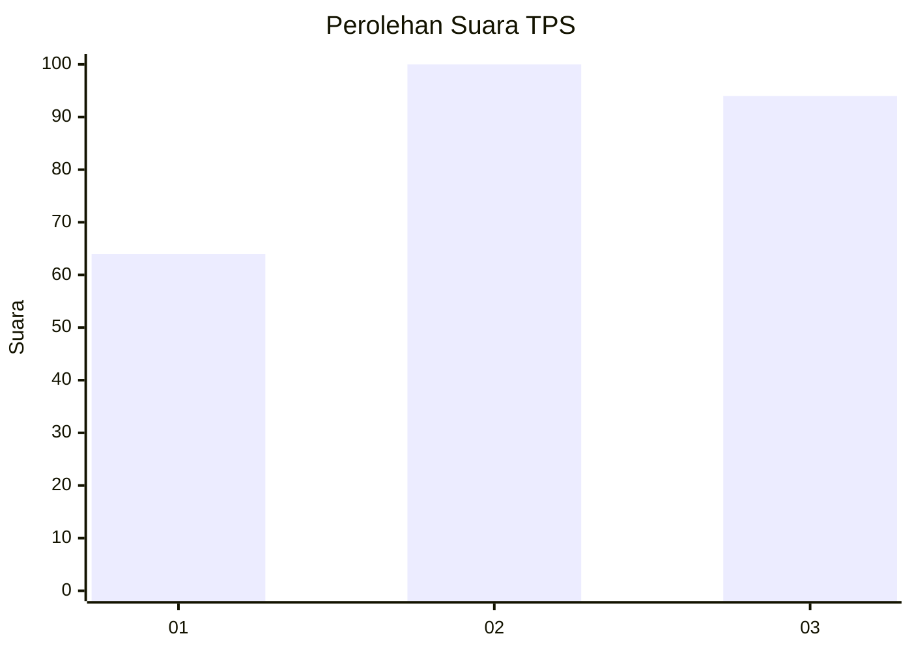
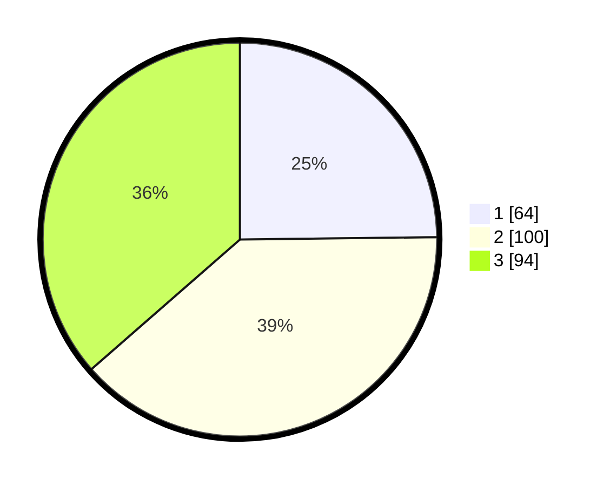

# Hasil

## Grafik

## Tabel

| No. | Nama Paslon    | Suara | Suara (raw) | Persentase |
|:--- |:-------------- | -----:| -----------:| ----------:|
| 1   | ANIES MUHAIMIN | 64    | [64][p-1]   | 24,81      |
| 2   | PRABOWO GIBRAN | 100   | [100][p-2]  | 38,76      |
| 3   | GANJAR MAHFUD  | 94    | [94][p-3]   | 36,43      |

[p-1]: https://github.com/gigit-pemilu/pemilu-2024-99-luar-negeri/blob/main/pilpres/hitung-suara/sub/99-luar-negeri/sub/47-helsinki-finlandia/sub/01-helsinki-finlandia/sub/0001-helsinki-finlandia/sub/002-tps-001/sub/paslon-1.txt
[p-2]: https://github.com/gigit-pemilu/pemilu-2024-99-luar-negeri/blob/main/pilpres/hitung-suara/sub/99-luar-negeri/sub/47-helsinki-finlandia/sub/01-helsinki-finlandia/sub/0001-helsinki-finlandia/sub/002-tps-001/sub/paslon-2.txt
[p-3]: https://github.com/gigit-pemilu/pemilu-2024-99-luar-negeri/blob/main/pilpres/hitung-suara/sub/99-luar-negeri/sub/47-helsinki-finlandia/sub/01-helsinki-finlandia/sub/0001-helsinki-finlandia/sub/002-tps-001/sub/paslon-3.txt

## Foto C Plano

https://sirekap-obj-formc.kpu.go.id/0eff/pemilu/ppwp/99/47/01/00/01/9947010001002-20240214-194644--106707a0-c712-4102-84fc-bfa32fa7a8c2.jpg

https://sirekap-obj-formc.kpu.go.id/0eff/pemilu/ppwp/99/47/01/00/01/9947010001002-20240214-193344--b4fe1aab-c9d3-4583-a1da-52b77e436965.jpg

https://sirekap-obj-formc.kpu.go.id/0eff/pemilu/ppwp/99/47/01/00/01/9947010001002-20240214-195913--6a72da10-7133-47fb-9494-2f3e57a02e33.jpg

## Metadata

| Key        | Value               |
| ---------- | ------------------- |
| Time Stamp | 2024-02-14 21:46:01 |

## DATA PEMILIH TETAP

Jumlah pemilih dalam DPT: **351**.
 * L: **167**.
 * P: **184**.

## DATA PENGGUNA HAK PILIH

Jumlah pengguna hak pilih dalam DPT: **212**.
 * L: **100**.
 * P: **112**.

Jumlah pengguna hak pilih dalam DPTb: **41**.
 * L: **17**.
 * P: **24**.

Jumlah pengguna hak pilih dalam DPK: **7**.
 * L: **4**.
 * P: **3**.

Jumlah pengguna hak pilih: **260**.
 * L: **121**.
 * P: **139**.

## JUMLAH SUARA SAH DAN TIDAK SAH

JUMLAH SELURUH SUARA SAH: **258**.

JUMLAH SUARA TIDAK SAH: **2**.

JUMLAH SELURUH SUARA SAH DAN SUARA TIDAK SAH: **260**.

