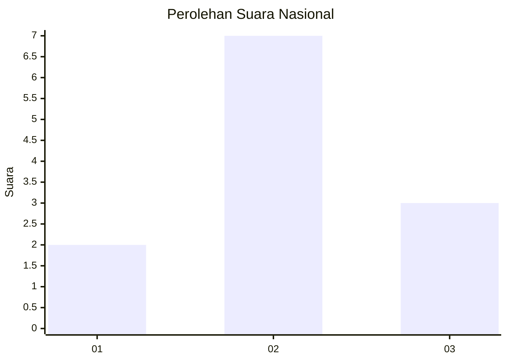
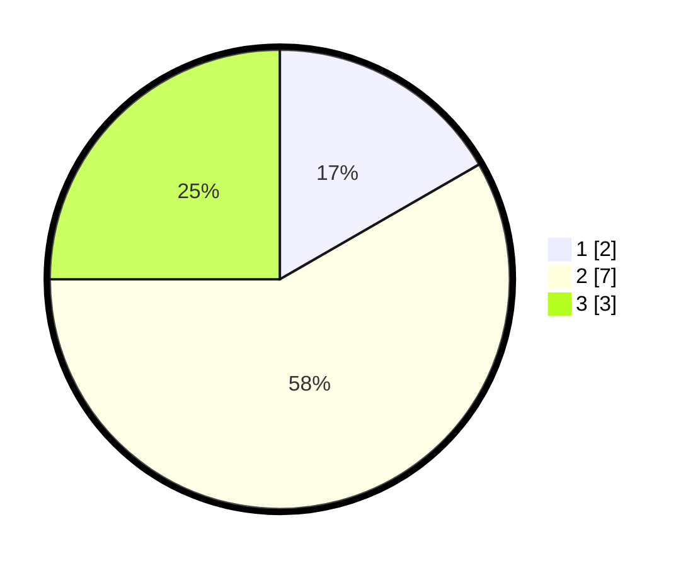

# Hasil

## Grafik

## Tabel

| No. | Nama Paslon    | Suara | Suara (raw) | Persentase |
|:--- |:-------------- | -----:| -----------:| ----------:|
| 1   | ANIES MUHAIMIN | 2     | [2][p-1]    | 16,67      |
| 2   | PRABOWO GIBRAN | 7     | [7][p-2]    | 58,33      |
| 3   | GANJAR MAHFUD  | 3     | [3][p-3]    | 25,00      |

[p-1]: https://github.com/gigit-pemilu/pemilu-2024/blob/main/pilpres/hitung-suara/sub/99-luar-negeri/sub/48-ho-chi-minh-city-vietnam/sub/01-ho-chi-minh-city-vietnam/sub/0001-ho-chi-minh-city-vietnam/sub/001-pos-001/sub/paslon-1.txt
[p-2]: https://github.com/gigit-pemilu/pemilu-2024/blob/main/pilpres/hitung-suara/sub/99-luar-negeri/sub/48-ho-chi-minh-city-vietnam/sub/01-ho-chi-minh-city-vietnam/sub/0001-ho-chi-minh-city-vietnam/sub/001-pos-001/sub/paslon-2.txt
[p-3]: https://github.com/gigit-pemilu/pemilu-2024/blob/main/pilpres/hitung-suara/sub/99-luar-negeri/sub/48-ho-chi-minh-city-vietnam/sub/01-ho-chi-minh-city-vietnam/sub/0001-ho-chi-minh-city-vietnam/sub/001-pos-001/sub/paslon-3.txt

## Foto C Plano

https://sirekap-obj-formc.kpu.go.id/afe9/pemilu/ppwp/99/48/01/00/01/9948010001001-20240216-140818--4ef317f9-0a75-4df2-8886-f3907303b313.jpg

https://sirekap-obj-formc.kpu.go.id/afe9/pemilu/ppwp/99/48/01/00/01/9948010001001-20240216-135518--1d7d7ff8-eaed-4ff3-b642-7be9689b6523.jpg

https://sirekap-obj-formc.kpu.go.id/afe9/pemilu/ppwp/99/48/01/00/01/9948010001001-20240216-140653--6cfe0afb-4de8-4ba5-805e-0a05cfd6a589.jpg

## Metadata

| Key        | Value               |
| ---------- | ------------------- |
| Time Stamp | 2024-02-16 17:30:00 |

## DATA PEMILIH TETAP

Jumlah pemilih dalam DPT: **3**.
 * L: **3**.
 * P: **0**.

## DATA PENGGUNA HAK PILIH

Jumlah pengguna hak pilih dalam DPT: **2**.
 * L: **2**.
 * P: **0**.

Jumlah pengguna hak pilih dalam DPTb: **0**.
 * L: **0**.
 * P: **0**.

Jumlah pengguna hak pilih dalam DPK: **10**.
 * L: **3**.
 * P: **7**.

Jumlah pengguna hak pilih: **12**.
 * L: **5**.
 * P: **7**.

## JUMLAH SUARA SAH DAN TIDAK SAH

JUMLAH SELURUH SUARA SAH: **12**.

JUMLAH SUARA TIDAK SAH: **0**.

JUMLAH SELURUH SUARA SAH DAN SUARA TIDAK SAH: **12**.

