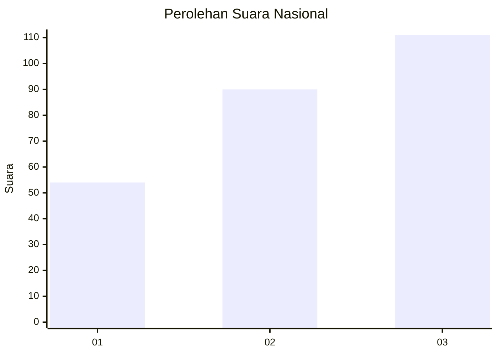
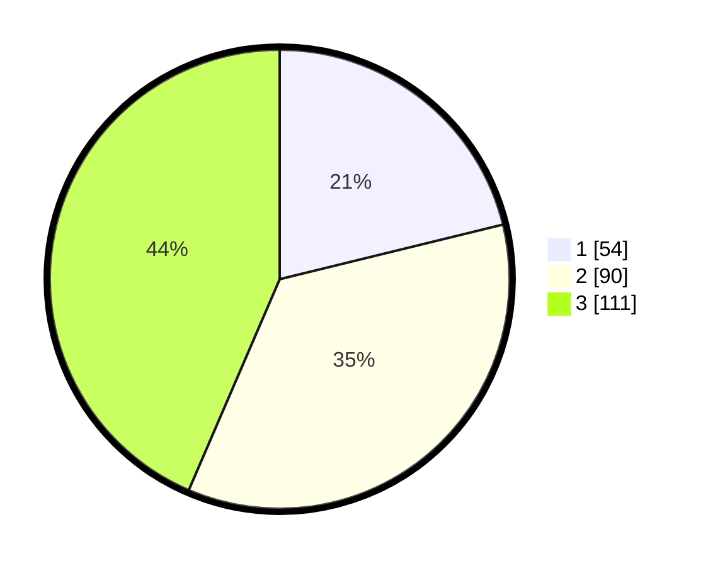

# Hasil

## Grafik

## Tabel

| No. | Nama Paslon    | Suara | Suara (raw) | Persentase |
|:--- |:-------------- | -----:| -----------:| ----------:|
| 1   | ANIES MUHAIMIN | 54    | [54][p-1]   | 21,18      |
| 2   | PRABOWO GIBRAN | 90    | [90][p-2]   | 35,29      |
| 3   | GANJAR MAHFUD  | 111   | [111][p-3]  | 43,53      |

[p-1]: https://github.com/gigit-pemilu/pemilu-2024/blob/main/pilpres/hitung-suara/sub/99-luar-negeri/sub/48-ho-chi-minh-city-vietnam/sub/01-ho-chi-minh-city-vietnam/sub/0001-ho-chi-minh-city-vietnam/sub/002-tps-001/sub/paslon-1.txt
[p-2]: https://github.com/gigit-pemilu/pemilu-2024/blob/main/pilpres/hitung-suara/sub/99-luar-negeri/sub/48-ho-chi-minh-city-vietnam/sub/01-ho-chi-minh-city-vietnam/sub/0001-ho-chi-minh-city-vietnam/sub/002-tps-001/sub/paslon-2.txt
[p-3]: https://github.com/gigit-pemilu/pemilu-2024/blob/main/pilpres/hitung-suara/sub/99-luar-negeri/sub/48-ho-chi-minh-city-vietnam/sub/01-ho-chi-minh-city-vietnam/sub/0001-ho-chi-minh-city-vietnam/sub/002-tps-001/sub/paslon-3.txt

## Foto C Plano

https://sirekap-obj-formc.kpu.go.id/a9e4/pemilu/ppwp/99/48/01/00/01/9948010001002-20240214-210755--a40cf523-f111-4ee1-ba3b-56301a20a13d.jpg

https://sirekap-obj-formc.kpu.go.id/a9e4/pemilu/ppwp/99/48/01/00/01/9948010001002-20240214-211006--63927677-1f2e-4b2a-843e-7bd72f034869.jpg

https://sirekap-obj-formc.kpu.go.id/a9e4/pemilu/ppwp/99/48/01/00/01/9948010001002-20240214-211155--c5ff0f4c-ab55-4fa5-87bc-807a3c7af76b.jpg

## Metadata

| Key        | Value               |
| ---------- | ------------------- |
| Time Stamp | 2024-02-15 00:41:44 |

## DATA PEMILIH TETAP

Jumlah pemilih dalam DPT: **453**.
 * L: **301**.
 * P: **152**.

## DATA PENGGUNA HAK PILIH

Jumlah pengguna hak pilih dalam DPT: **231**.
 * L: **158**.
 * P: **73**.

Jumlah pengguna hak pilih dalam DPTb: **20**.
 * L: **10**.
 * P: **10**.

Jumlah pengguna hak pilih dalam DPK: **8**.
 * L: **4**.
 * P: **4**.

Jumlah pengguna hak pilih: **259**.
 * L: **172**.
 * P: **87**.

## JUMLAH SUARA SAH DAN TIDAK SAH

JUMLAH SELURUH SUARA SAH: **255**.

JUMLAH SUARA TIDAK SAH: **4**.

JUMLAH SELURUH SUARA SAH DAN SUARA TIDAK SAH: **259**.

