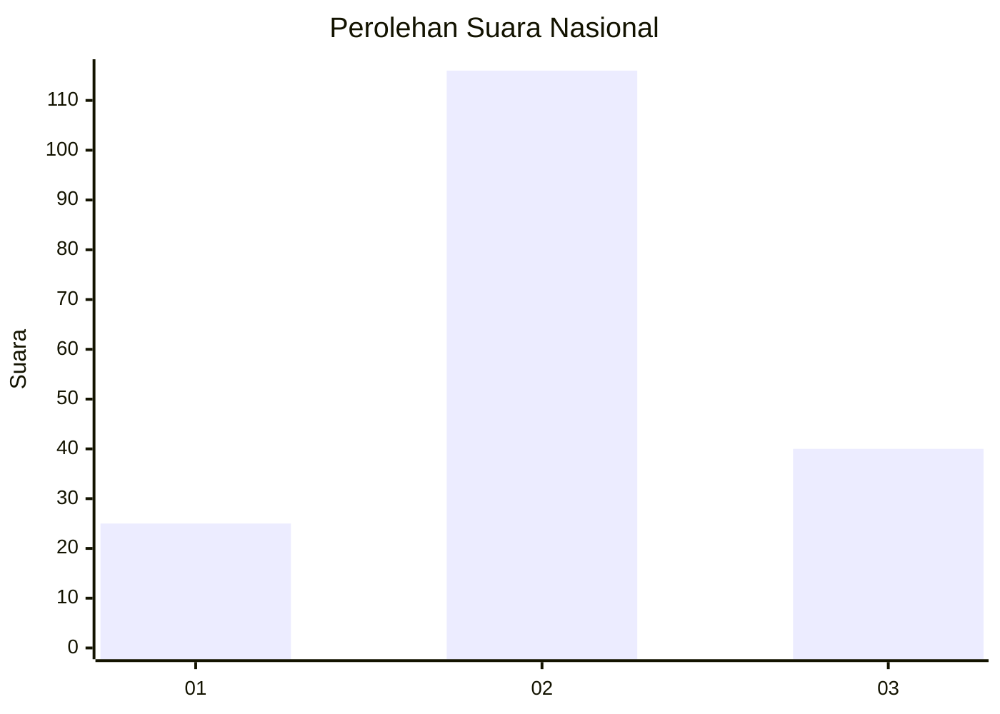
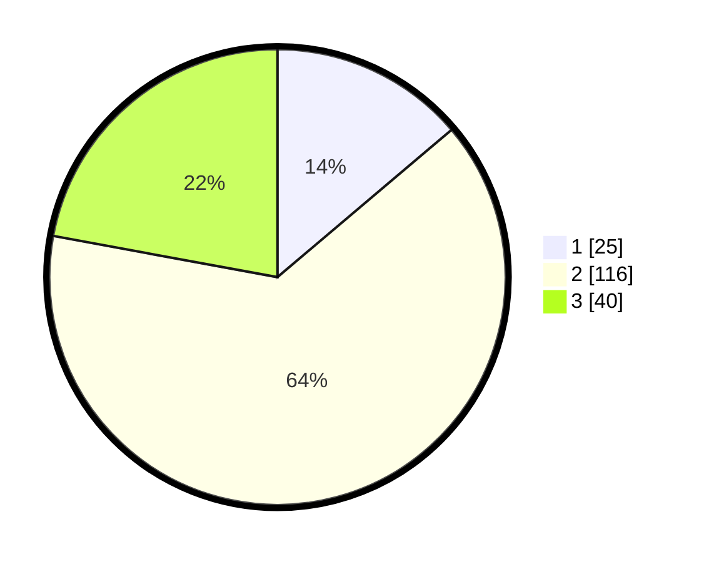

# Hasil

## Grafik

## Tabel

| No. | Nama Paslon    | Suara | Suara (raw) | Persentase |
|:--- |:-------------- | -----:| -----------:| ----------:|
| 1   | ANIES MUHAIMIN | 25    | [25][p-1]   | 13,81      |
| 2   | PRABOWO GIBRAN | 116   | [116][p-2]  | 64,09      |
| 3   | GANJAR MAHFUD  | 40    | [40][p-3]   | 22,10      |

[p-1]: https://github.com/gigit-pemilu/pemilu-2024/blob/main/pilpres/hitung-suara/sub/99-luar-negeri/sub/49-hong-kong-republik-rakyat-tiongkok/sub/01-hong-kong-republik-rakyat-tiongkok/sub/0001-hong-kong-republik-rakyat-tiongkok/sub/001-tps/sub/paslon-1.txt
[p-2]: https://github.com/gigit-pemilu/pemilu-2024/blob/main/pilpres/hitung-suara/sub/99-luar-negeri/sub/49-hong-kong-republik-rakyat-tiongkok/sub/01-hong-kong-republik-rakyat-tiongkok/sub/0001-hong-kong-republik-rakyat-tiongkok/sub/001-tps/sub/paslon-2.txt
[p-3]: https://github.com/gigit-pemilu/pemilu-2024/blob/main/pilpres/hitung-suara/sub/99-luar-negeri/sub/49-hong-kong-republik-rakyat-tiongkok/sub/01-hong-kong-republik-rakyat-tiongkok/sub/0001-hong-kong-republik-rakyat-tiongkok/sub/001-tps/sub/paslon-3.txt

## Foto C Plano

https://sirekap-obj-formc.kpu.go.id/6b4f/pemilu/ppwp/99/49/01/00/01/9949010001001-20240222-120807--e909fc93-47f2-495d-a713-350c9ca75a21.jpg

https://sirekap-obj-formc.kpu.go.id/6b4f/pemilu/ppwp/99/49/01/00/01/9949010001001-20240222-120855--fb1244d3-710c-4040-affa-04276c7ac300.jpg

https://sirekap-obj-formc.kpu.go.id/6b4f/pemilu/ppwp/99/49/01/00/01/9949010001001-20240222-120936--8cd8ea4c-1757-4700-aeda-468c738ac2e5.jpg

## Metadata

| Key        | Value               |
| ---------- | ------------------- |
| Time Stamp | 2024-02-24 22:31:28 |

## DATA PEMILIH TETAP

Jumlah pemilih dalam DPT: **598**.
 * L: **4**.
 * P: **594**.

## DATA PENGGUNA HAK PILIH

Jumlah pengguna hak pilih dalam DPT: **97**.
 * L: **0**.
 * P: **97**.

Jumlah pengguna hak pilih dalam DPTb: **31**.
 * L: **14**.
 * P: **17**.

Jumlah pengguna hak pilih dalam DPK: **53**.
 * L: **10**.
 * P: **43**.

Jumlah pengguna hak pilih: **181**.
 * L: **24**.
 * P: **157**.

## JUMLAH SUARA SAH DAN TIDAK SAH

JUMLAH SELURUH SUARA SAH: **181**.

JUMLAH SUARA TIDAK SAH: **0**.

JUMLAH SELURUH SUARA SAH DAN SUARA TIDAK SAH: **181**.

