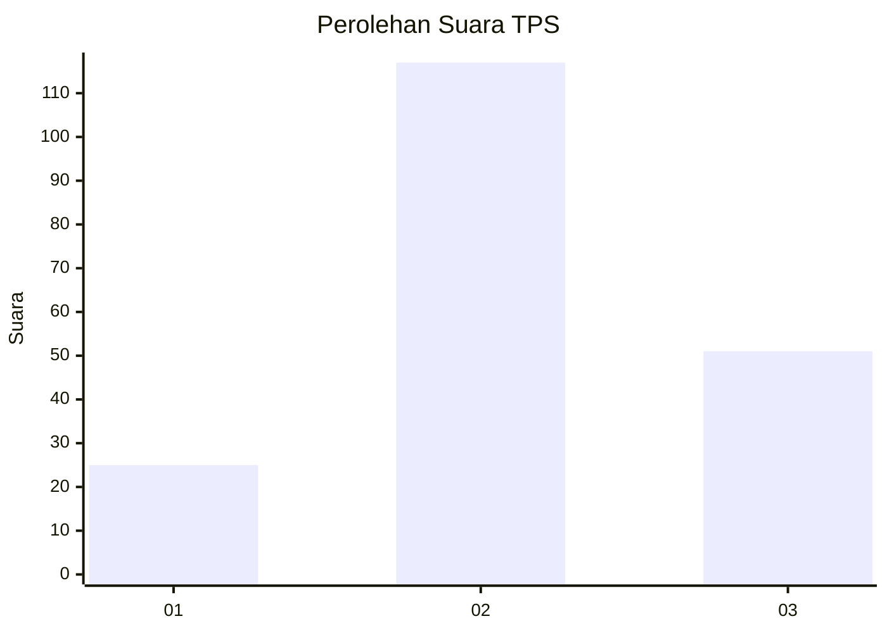
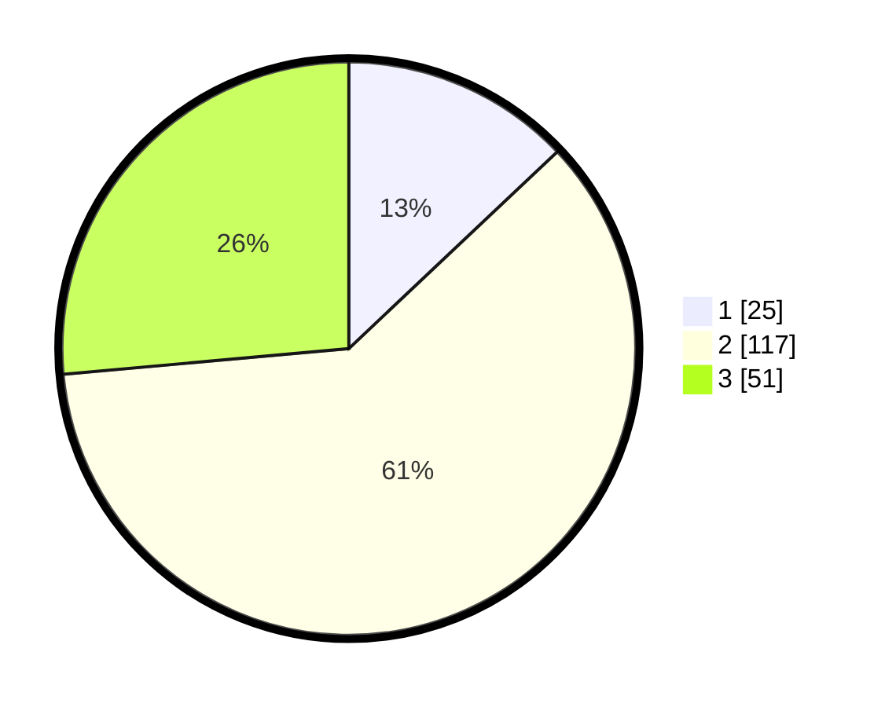

# Hasil

## Grafik

## Tabel

| No. | Nama Paslon    | Suara | Suara (raw) | Persentase |
|:--- |:-------------- | -----:| -----------:| ----------:|
| 1   | ANIES MUHAIMIN | 25    | [25][p-1]   | 12,95      |
| 2   | PRABOWO GIBRAN | 117   | [117][p-2]  | 60,62      |
| 3   | GANJAR MAHFUD  | 51    | [51][p-3]   | 26,42      |

[p-1]: https://github.com/gigit-pemilu/pemilu-2024-99-luar-negeri/blob/main/pilpres/hitung-suara/sub/99-luar-negeri/sub/49-hong-kong-republik-rakyat-tiongkok/sub/01-hong-kong-republik-rakyat-tiongkok/sub/0001-hong-kong-republik-rakyat-tiongkok/sub/002-tps/sub/paslon-1.txt
[p-2]: https://github.com/gigit-pemilu/pemilu-2024-99-luar-negeri/blob/main/pilpres/hitung-suara/sub/99-luar-negeri/sub/49-hong-kong-republik-rakyat-tiongkok/sub/01-hong-kong-republik-rakyat-tiongkok/sub/0001-hong-kong-republik-rakyat-tiongkok/sub/002-tps/sub/paslon-2.txt
[p-3]: https://github.com/gigit-pemilu/pemilu-2024-99-luar-negeri/blob/main/pilpres/hitung-suara/sub/99-luar-negeri/sub/49-hong-kong-republik-rakyat-tiongkok/sub/01-hong-kong-republik-rakyat-tiongkok/sub/0001-hong-kong-republik-rakyat-tiongkok/sub/002-tps/sub/paslon-3.txt

## Foto C Plano

https://sirekap-obj-formc.kpu.go.id/d2b3/pemilu/ppwp/99/49/01/00/01/9949010001002-20240221-185644--dc5d6b4b-988a-4a5f-8fd3-518149591f83.jpg

https://sirekap-obj-formc.kpu.go.id/d2b3/pemilu/ppwp/99/49/01/00/01/9949010001002-20240221-185856--3b4042ae-fa89-4da8-944e-5e7befe889a5.jpg

https://sirekap-obj-formc.kpu.go.id/d2b3/pemilu/ppwp/99/49/01/00/01/9949010001002-20240221-185949--3f64bfa1-ab71-4472-947a-1f5485ce0160.jpg

## Metadata

| Key        | Value               |
| ---------- | ------------------- |
| Time Stamp | 2024-02-24 22:31:28 |

## DATA PEMILIH TETAP

Jumlah pemilih dalam DPT: **598**.
 * L: **8**.
 * P: **590**.

## DATA PENGGUNA HAK PILIH

Jumlah pengguna hak pilih dalam DPT: **100**.
 * L: **1**.
 * P: **99**.

Jumlah pengguna hak pilih dalam DPTb: **14**.
 * L: **6**.
 * P: **8**.

Jumlah pengguna hak pilih dalam DPK: **81**.
 * L: **21**.
 * P: **60**.

Jumlah pengguna hak pilih: **195**.
 * L: **28**.
 * P: **167**.

## JUMLAH SUARA SAH DAN TIDAK SAH

JUMLAH SELURUH SUARA SAH: **193**.

JUMLAH SUARA TIDAK SAH: **2**.

JUMLAH SELURUH SUARA SAH DAN SUARA TIDAK SAH: **195**.

