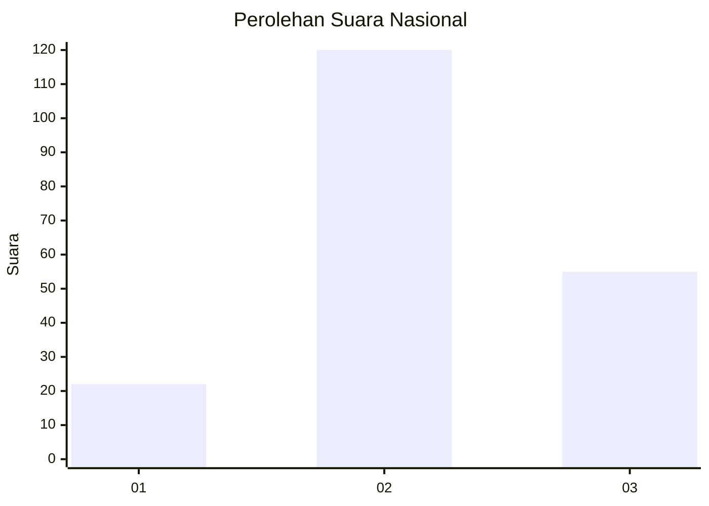
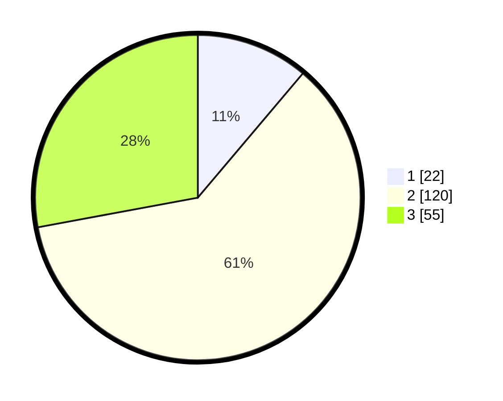

# Hasil

## Grafik

## Tabel

| No. | Nama Paslon    | Suara | Suara (raw) | Persentase |
|:--- |:-------------- | -----:| -----------:| ----------:|
| 1   | ANIES MUHAIMIN | 22    | [22][p-1]   | 11,17      |
| 2   | PRABOWO GIBRAN | 120   | [120][p-2]  | 60,91      |
| 3   | GANJAR MAHFUD  | 55    | [55][p-3]   | 27,92      |

[p-1]: https://github.com/gigit-pemilu/pemilu-2024/blob/main/pilpres/hitung-suara/sub/99-luar-negeri/sub/49-hong-kong-republik-rakyat-tiongkok/sub/01-hong-kong-republik-rakyat-tiongkok/sub/0001-hong-kong-republik-rakyat-tiongkok/sub/003-tps/sub/paslon-1.txt
[p-2]: https://github.com/gigit-pemilu/pemilu-2024/blob/main/pilpres/hitung-suara/sub/99-luar-negeri/sub/49-hong-kong-republik-rakyat-tiongkok/sub/01-hong-kong-republik-rakyat-tiongkok/sub/0001-hong-kong-republik-rakyat-tiongkok/sub/003-tps/sub/paslon-2.txt
[p-3]: https://github.com/gigit-pemilu/pemilu-2024/blob/main/pilpres/hitung-suara/sub/99-luar-negeri/sub/49-hong-kong-republik-rakyat-tiongkok/sub/01-hong-kong-republik-rakyat-tiongkok/sub/0001-hong-kong-republik-rakyat-tiongkok/sub/003-tps/sub/paslon-3.txt

## Foto C Plano

https://sirekap-obj-formc.kpu.go.id/69e9/pemilu/ppwp/99/49/01/00/01/9949010001003-20240221-192215--dfc25025-9151-4cde-8d0b-abf4059bafc7.jpg

https://sirekap-obj-formc.kpu.go.id/69e9/pemilu/ppwp/99/49/01/00/01/9949010001003-20240221-192318--f7e9b7b3-cf80-4d72-bc73-5d25e3d00164.jpg

https://sirekap-obj-formc.kpu.go.id/69e9/pemilu/ppwp/99/49/01/00/01/9949010001003-20240221-192446--b1aa278c-3356-41a0-9657-e90e6ad8b8a8.jpg

## Metadata

| Key        | Value               |
| ---------- | ------------------- |
| Time Stamp | 2024-02-25 22:00:00 |

## DATA PEMILIH TETAP

Jumlah pemilih dalam DPT: **598**.
 * L: **1**.
 * P: **597**.

## DATA PENGGUNA HAK PILIH

Jumlah pengguna hak pilih dalam DPT: **104**.
 * L: **0**.
 * P: **104**.

Jumlah pengguna hak pilih dalam DPTb: **19**.
 * L: **6**.
 * P: **13**.

Jumlah pengguna hak pilih dalam DPK: **74**.
 * L: **18**.
 * P: **56**.

Jumlah pengguna hak pilih: **197**.
 * L: **24**.
 * P: **173**.

## JUMLAH SUARA SAH DAN TIDAK SAH

JUMLAH SELURUH SUARA SAH: **197**.

JUMLAH SUARA TIDAK SAH: **0**.

JUMLAH SELURUH SUARA SAH DAN SUARA TIDAK SAH: **197**.

