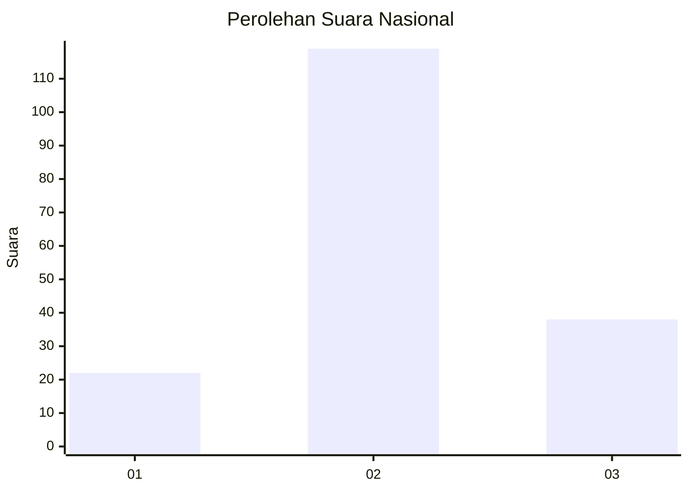
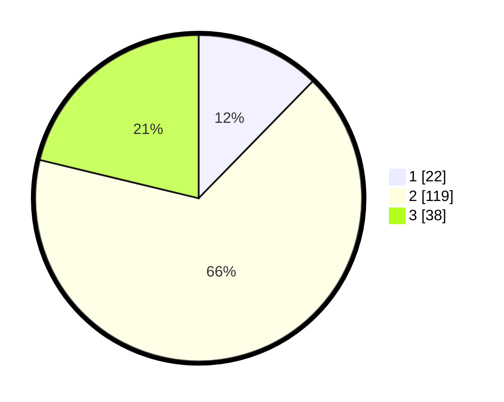

# Hasil

## Grafik

## Tabel

| No. | Nama Paslon    | Suara | Suara (raw) | Persentase |
|:--- |:-------------- | -----:| -----------:| ----------:|
| 1   | ANIES MUHAIMIN | 22    | [22][p-1]   | 12,29      |
| 2   | PRABOWO GIBRAN | 119   | [119][p-2]  | 66,48      |
| 3   | GANJAR MAHFUD  | 38    | [38][p-3]   | 21,23      |

[p-1]: https://github.com/gigit-pemilu/pemilu-2024/blob/main/pilpres/hitung-suara/sub/99-luar-negeri/sub/49-hong-kong-republik-rakyat-tiongkok/sub/01-hong-kong-republik-rakyat-tiongkok/sub/0001-hong-kong-republik-rakyat-tiongkok/sub/004-tps/sub/paslon-1.txt
[p-2]: https://github.com/gigit-pemilu/pemilu-2024/blob/main/pilpres/hitung-suara/sub/99-luar-negeri/sub/49-hong-kong-republik-rakyat-tiongkok/sub/01-hong-kong-republik-rakyat-tiongkok/sub/0001-hong-kong-republik-rakyat-tiongkok/sub/004-tps/sub/paslon-2.txt
[p-3]: https://github.com/gigit-pemilu/pemilu-2024/blob/main/pilpres/hitung-suara/sub/99-luar-negeri/sub/49-hong-kong-republik-rakyat-tiongkok/sub/01-hong-kong-republik-rakyat-tiongkok/sub/0001-hong-kong-republik-rakyat-tiongkok/sub/004-tps/sub/paslon-3.txt

## Foto C Plano

https://sirekap-obj-formc.kpu.go.id/19aa/pemilu/ppwp/99/49/01/00/01/9949010001004-20240222-135104--06db02ec-805b-4406-adce-94d5bcbdfb07.jpg

https://sirekap-obj-formc.kpu.go.id/19aa/pemilu/ppwp/99/49/01/00/01/9949010001004-20240222-135135--36d64012-2500-4b17-9bca-244c0def7e57.jpg

https://sirekap-obj-formc.kpu.go.id/19aa/pemilu/ppwp/99/49/01/00/01/9949010001004-20240222-135153--3982beaf-1c3a-4053-a577-74f72728c7f4.jpg

## Metadata

| Key        | Value               |
| ---------- | ------------------- |
| Time Stamp | 2024-02-24 22:31:28 |

## DATA PEMILIH TETAP

Jumlah pemilih dalam DPT: **596**.
 * L: **2**.
 * P: **594**.

## DATA PENGGUNA HAK PILIH

Jumlah pengguna hak pilih dalam DPT: **87**.
 * L: **0**.
 * P: **87**.

Jumlah pengguna hak pilih dalam DPTb: **30**.
 * L: **5**.
 * P: **25**.

Jumlah pengguna hak pilih dalam DPK: **63**.
 * L: **19**.
 * P: **44**.

Jumlah pengguna hak pilih: **180**.
 * L: **24**.
 * P: **156**.

## JUMLAH SUARA SAH DAN TIDAK SAH

JUMLAH SELURUH SUARA SAH: **179**.

JUMLAH SUARA TIDAK SAH: **1**.

JUMLAH SELURUH SUARA SAH DAN SUARA TIDAK SAH: **180**.

