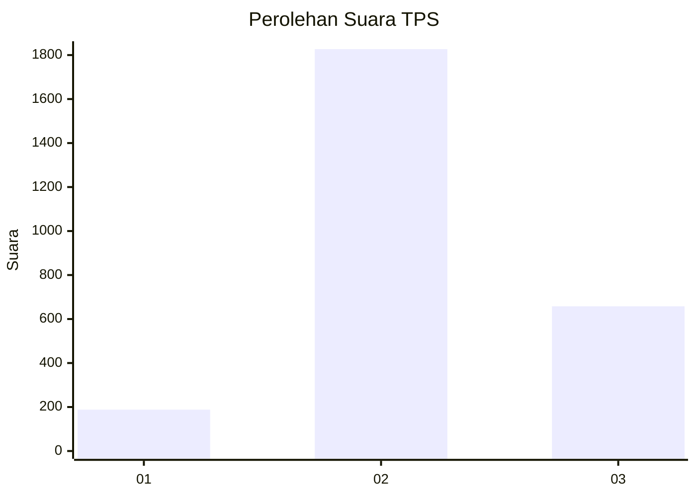
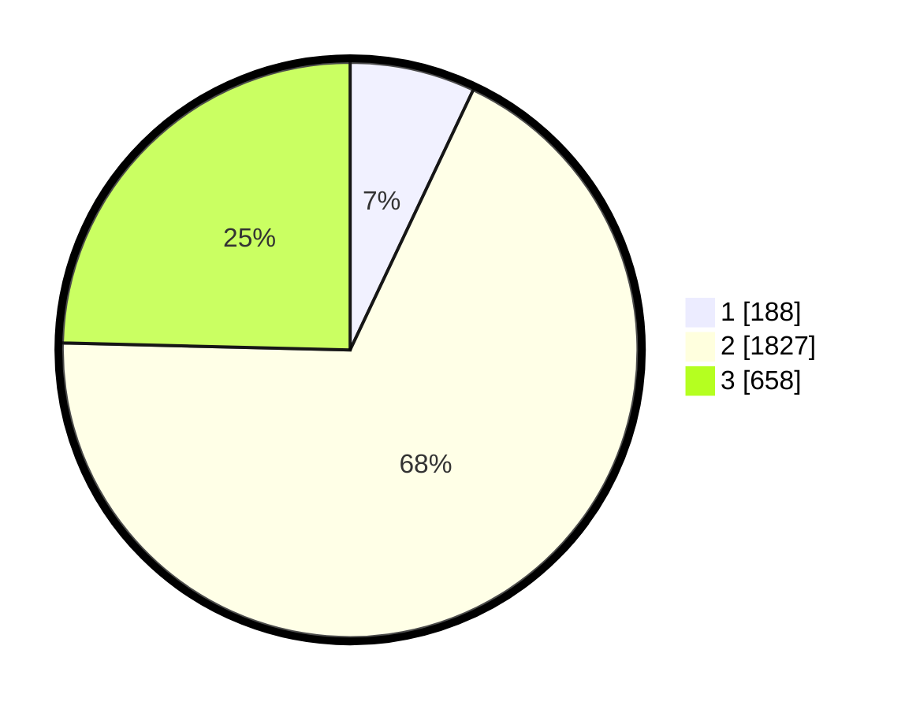

# Hasil

## Grafik

## Tabel

| No. | Nama Paslon    | Suara | Suara (raw) | Persentase |
|:--- |:-------------- | -----:| -----------:| ----------:|
| 1   | ANIES MUHAIMIN | 188   | [188][p-1]  | 7,03       |
| 2   | PRABOWO GIBRAN | 1.827 | [1827][p-2] | 68,35      |
| 3   | GANJAR MAHFUD  | 658   | [658][p-3]  | 24,62      |

[p-1]: https://github.com/gigit-pemilu/pemilu-2024-99-luar-negeri/blob/main/pilpres/hitung-suara/sub/99-luar-negeri/sub/49-hong-kong-republik-rakyat-tiongkok/sub/01-hong-kong-republik-rakyat-tiongkok/sub/0001-hong-kong-republik-rakyat-tiongkok/sub/005-pos-001/sub/paslon-1.txt
[p-2]: https://github.com/gigit-pemilu/pemilu-2024-99-luar-negeri/blob/main/pilpres/hitung-suara/sub/99-luar-negeri/sub/49-hong-kong-republik-rakyat-tiongkok/sub/01-hong-kong-republik-rakyat-tiongkok/sub/0001-hong-kong-republik-rakyat-tiongkok/sub/005-pos-001/sub/paslon-2.txt
[p-3]: https://github.com/gigit-pemilu/pemilu-2024-99-luar-negeri/blob/main/pilpres/hitung-suara/sub/99-luar-negeri/sub/49-hong-kong-republik-rakyat-tiongkok/sub/01-hong-kong-republik-rakyat-tiongkok/sub/0001-hong-kong-republik-rakyat-tiongkok/sub/005-pos-001/sub/paslon-3.txt

## Foto C Plano

https://sirekap-obj-formc.kpu.go.id/419b/pemilu/ppwp/99/49/01/00/01/9949010001005-20240219-191736--e3de9a61-dce1-4c9b-84ae-02983a2ccbb9.jpg

https://sirekap-obj-formc.kpu.go.id/419b/pemilu/ppwp/99/49/01/00/01/9949010001005-20240219-191902--4b5f2ad3-9557-47fe-bb06-5ef5e8fe9841.jpg

https://sirekap-obj-formc.kpu.go.id/419b/pemilu/ppwp/99/49/01/00/01/9949010001005-20240219-192013--8da3afa3-9580-43aa-94c8-fd30ce7d180f.jpg

## Metadata

| Key        | Value               |
| ---------- | ------------------- |
| Time Stamp | 2024-02-21 11:00:00 |

## DATA PEMILIH TETAP

Jumlah pemilih dalam DPT: **4511**.
 * L: **34**.
 * P: **4477**.

## DATA PENGGUNA HAK PILIH

Jumlah pengguna hak pilih dalam DPT: **2771**.
 * L: **4**.
 * P: **2767**.

Jumlah pengguna hak pilih dalam DPTb: **0**.
 * L: **0**.
 * P: **0**.

Jumlah pengguna hak pilih dalam DPK: **0**.
 * L: **0**.
 * P: **0**.

Jumlah pengguna hak pilih: **2771**.
 * L: **4**.
 * P: **2767**.

## JUMLAH SUARA SAH DAN TIDAK SAH

JUMLAH SELURUH SUARA SAH: **2673**.

JUMLAH SUARA TIDAK SAH: **98**.

JUMLAH SELURUH SUARA SAH DAN SUARA TIDAK SAH: **2771**.

