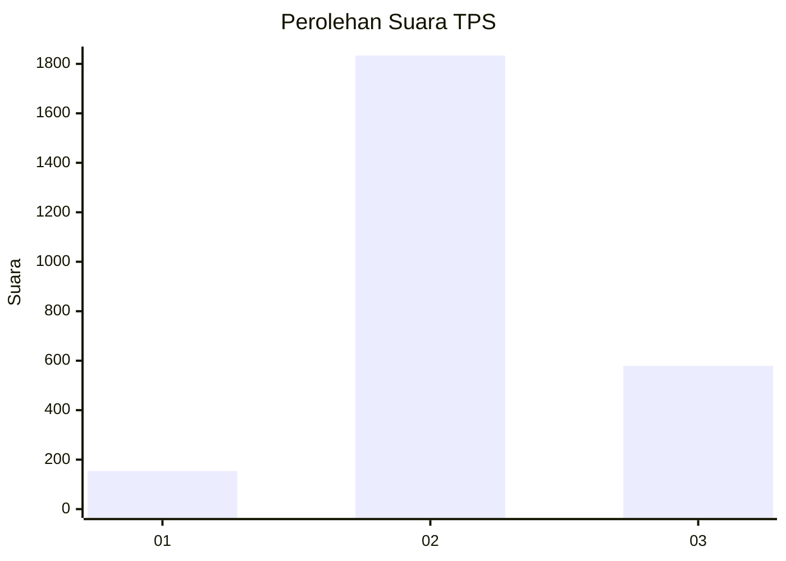
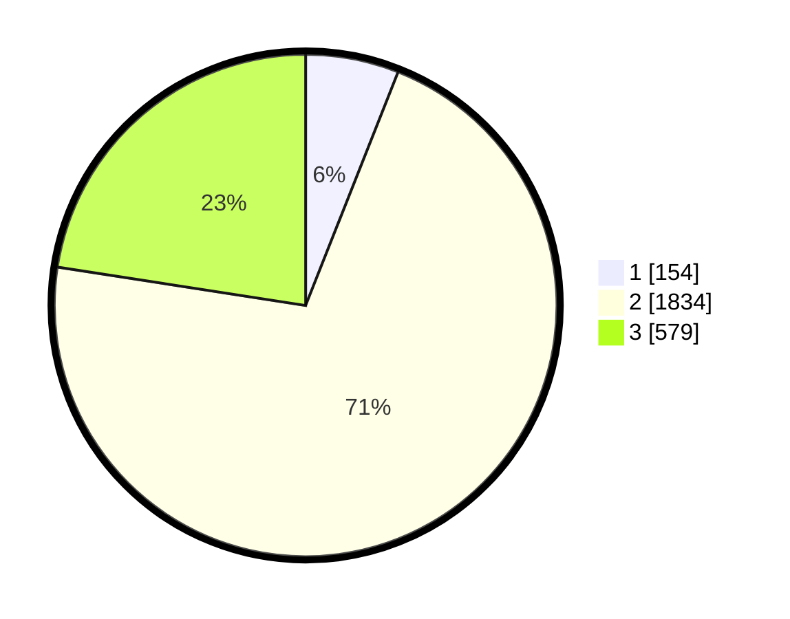

# Hasil

## Grafik

## Tabel

| No. | Nama Paslon    | Suara | Suara (raw) | Persentase |
|:--- |:-------------- | -----:| -----------:| ----------:|
| 1   | ANIES MUHAIMIN | 154   | [154][p-1]  | 6,00       |
| 2   | PRABOWO GIBRAN | 1.834 | [1834][p-2] | 71,45      |
| 3   | GANJAR MAHFUD  | 579   | [579][p-3]  | 22,56      |

[p-1]: https://github.com/gigit-pemilu/pemilu-2024-99-luar-negeri/blob/main/pilpres/hitung-suara/sub/99-luar-negeri/sub/49-hong-kong-republik-rakyat-tiongkok/sub/01-hong-kong-republik-rakyat-tiongkok/sub/0001-hong-kong-republik-rakyat-tiongkok/sub/006-pos-002/sub/paslon-1.txt
[p-2]: https://github.com/gigit-pemilu/pemilu-2024-99-luar-negeri/blob/main/pilpres/hitung-suara/sub/99-luar-negeri/sub/49-hong-kong-republik-rakyat-tiongkok/sub/01-hong-kong-republik-rakyat-tiongkok/sub/0001-hong-kong-republik-rakyat-tiongkok/sub/006-pos-002/sub/paslon-2.txt
[p-3]: https://github.com/gigit-pemilu/pemilu-2024-99-luar-negeri/blob/main/pilpres/hitung-suara/sub/99-luar-negeri/sub/49-hong-kong-republik-rakyat-tiongkok/sub/01-hong-kong-republik-rakyat-tiongkok/sub/0001-hong-kong-republik-rakyat-tiongkok/sub/006-pos-002/sub/paslon-3.txt

## Foto C Plano

https://sirekap-obj-formc.kpu.go.id/64b2/pemilu/ppwp/99/49/01/00/01/9949010001006-20240221-172006--6eee26e7-181e-4eff-a1e1-aad87a455f8e.jpg

https://sirekap-obj-formc.kpu.go.id/64b2/pemilu/ppwp/99/49/01/00/01/9949010001006-20240221-172036--d861b6fe-a646-4568-a75e-7da64ca71c92.jpg

https://sirekap-obj-formc.kpu.go.id/64b2/pemilu/ppwp/99/49/01/00/01/9949010001006-20240221-172055--d90c6b80-54ea-45ba-be98-4d2ea2ced25b.jpg

## Metadata

| Key        | Value               |
| ---------- | ------------------- |
| Time Stamp | 2024-02-24 22:31:28 |

## DATA PEMILIH TETAP

Jumlah pemilih dalam DPT: **4508**.
 * L: **44**.
 * P: **4464**.

## DATA PENGGUNA HAK PILIH

Jumlah pengguna hak pilih dalam DPT: **2520**.
 * L: **3**.
 * P: **2517**.

Jumlah pengguna hak pilih dalam DPTb: **0**.
 * L: **0**.
 * P: **0**.

Jumlah pengguna hak pilih dalam DPK: **0**.
 * L: **0**.
 * P: **0**.

Jumlah pengguna hak pilih: **2520**.
 * L: **2517**.
 * P: **3**.

## JUMLAH SUARA SAH DAN TIDAK SAH

JUMLAH SELURUH SUARA SAH: **2567**.

JUMLAH SUARA TIDAK SAH: **210**.

JUMLAH SELURUH SUARA SAH DAN SUARA TIDAK SAH: **2777**.

