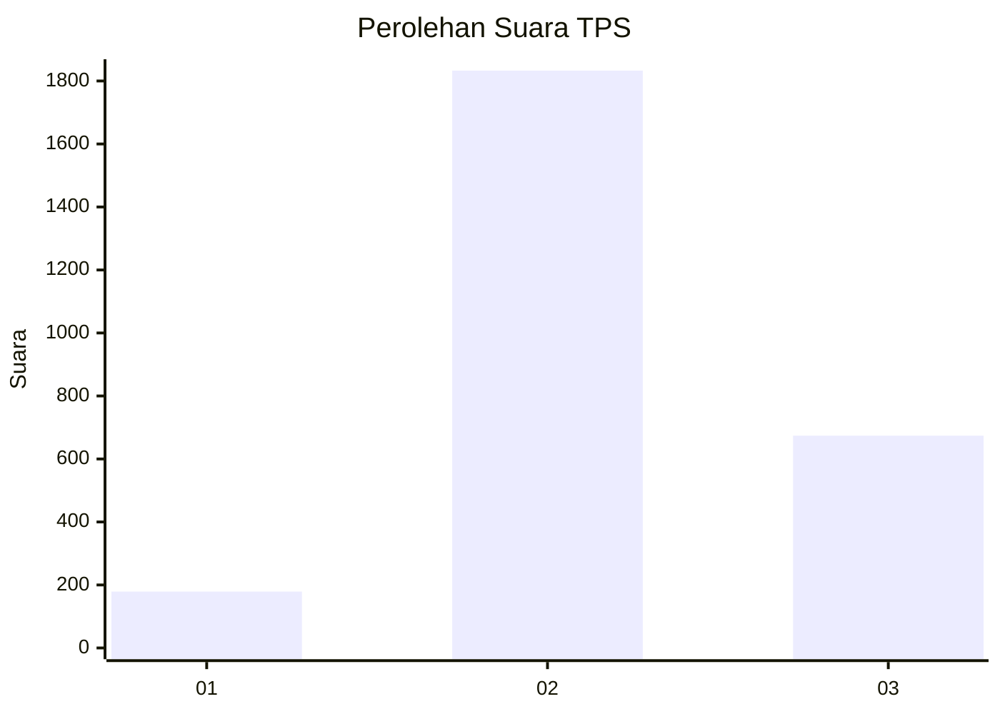
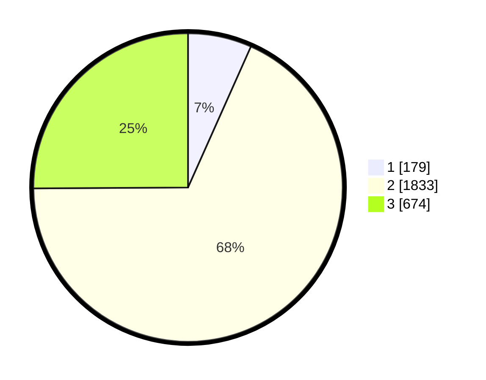

# Hasil

## Grafik

## Tabel

| No. | Nama Paslon    | Suara | Suara (raw) | Persentase |
|:--- |:-------------- | -----:| -----------:| ----------:|
| 1   | ANIES MUHAIMIN | 179   | [179][p-1]  | 6,66       |
| 2   | PRABOWO GIBRAN | 1.833 | [1833][p-2] | 68,24      |
| 3   | GANJAR MAHFUD  | 674   | [674][p-3]  | 25,09      |

[p-1]: https://github.com/gigit-pemilu/pemilu-2024-99-luar-negeri/blob/main/pilpres/hitung-suara/sub/99-luar-negeri/sub/49-hong-kong-republik-rakyat-tiongkok/sub/01-hong-kong-republik-rakyat-tiongkok/sub/0001-hong-kong-republik-rakyat-tiongkok/sub/007-pos-003/sub/paslon-1.txt
[p-2]: https://github.com/gigit-pemilu/pemilu-2024-99-luar-negeri/blob/main/pilpres/hitung-suara/sub/99-luar-negeri/sub/49-hong-kong-republik-rakyat-tiongkok/sub/01-hong-kong-republik-rakyat-tiongkok/sub/0001-hong-kong-republik-rakyat-tiongkok/sub/007-pos-003/sub/paslon-2.txt
[p-3]: https://github.com/gigit-pemilu/pemilu-2024-99-luar-negeri/blob/main/pilpres/hitung-suara/sub/99-luar-negeri/sub/49-hong-kong-republik-rakyat-tiongkok/sub/01-hong-kong-republik-rakyat-tiongkok/sub/0001-hong-kong-republik-rakyat-tiongkok/sub/007-pos-003/sub/paslon-3.txt

## Foto C Plano

https://sirekap-obj-formc.kpu.go.id/20d5/pemilu/ppwp/99/49/01/00/01/9949010001007-20240219-193331--b0940d7c-b168-4cb3-867a-3b3314d2758f.jpg

https://sirekap-obj-formc.kpu.go.id/20d5/pemilu/ppwp/99/49/01/00/01/9949010001007-20240219-212040--4afe9a7a-a4ca-4fd5-a704-07769d15a196.jpg

https://sirekap-obj-formc.kpu.go.id/20d5/pemilu/ppwp/99/49/01/00/01/9949010001007-20240219-194324--0d6def83-d55c-4ce0-a075-74d56ed1cf8a.jpg

## Metadata

| Key        | Value               |
| ---------- | ------------------- |
| Time Stamp | 2024-02-21 11:00:00 |

## DATA PEMILIH TETAP

Jumlah pemilih dalam DPT: **4503**.
 * L: **45**.
 * P: **4458**.

## DATA PENGGUNA HAK PILIH

Jumlah pengguna hak pilih dalam DPT: **2608**.
 * L: **6**.
 * P: **2602**.

Jumlah pengguna hak pilih dalam DPTb: **0**.
 * L: **0**.
 * P: **0**.

Jumlah pengguna hak pilih dalam DPK: **0**.
 * L: **0**.
 * P: **0**.

Jumlah pengguna hak pilih: **2608**.
 * L: **6**.
 * P: **2602**.

## JUMLAH SUARA SAH DAN TIDAK SAH

JUMLAH SELURUH SUARA SAH: **2686**.

JUMLAH SUARA TIDAK SAH: **164**.

JUMLAH SELURUH SUARA SAH DAN SUARA TIDAK SAH: **2850**.

