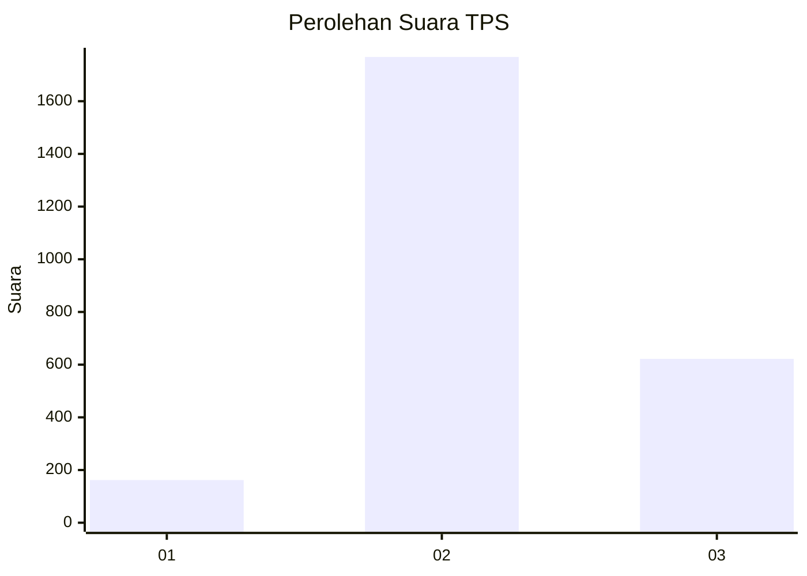
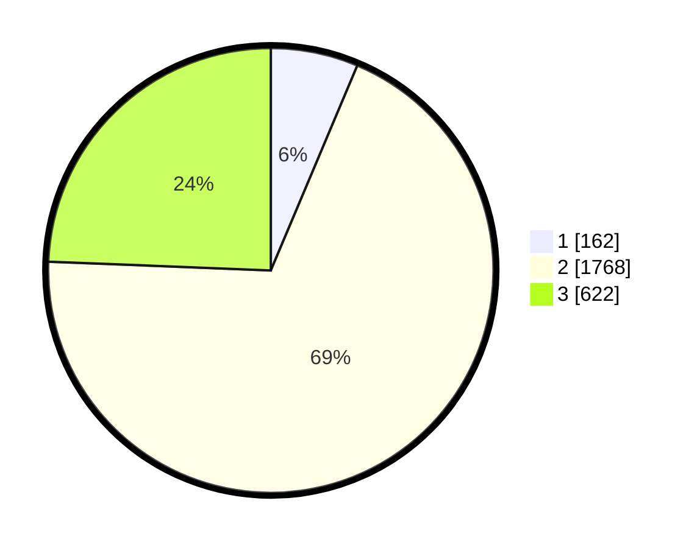

# Hasil

## Grafik

## Tabel

| No. | Nama Paslon    | Suara | Suara (raw) | Persentase |
|:--- |:-------------- | -----:| -----------:| ----------:|
| 1   | ANIES MUHAIMIN | 162   | [162][p-1]  | 6,35       |
| 2   | PRABOWO GIBRAN | 1.768 | [1768][p-2] | 69,28      |
| 3   | GANJAR MAHFUD  | 622   | [622][p-3]  | 24,37      |

[p-1]: https://github.com/gigit-pemilu/pemilu-2024-99-luar-negeri/blob/main/pilpres/hitung-suara/sub/99-luar-negeri/sub/49-hong-kong-republik-rakyat-tiongkok/sub/01-hong-kong-republik-rakyat-tiongkok/sub/0001-hong-kong-republik-rakyat-tiongkok/sub/008-pos-004/sub/paslon-1.txt
[p-2]: https://github.com/gigit-pemilu/pemilu-2024-99-luar-negeri/blob/main/pilpres/hitung-suara/sub/99-luar-negeri/sub/49-hong-kong-republik-rakyat-tiongkok/sub/01-hong-kong-republik-rakyat-tiongkok/sub/0001-hong-kong-republik-rakyat-tiongkok/sub/008-pos-004/sub/paslon-2.txt
[p-3]: https://github.com/gigit-pemilu/pemilu-2024-99-luar-negeri/blob/main/pilpres/hitung-suara/sub/99-luar-negeri/sub/49-hong-kong-republik-rakyat-tiongkok/sub/01-hong-kong-republik-rakyat-tiongkok/sub/0001-hong-kong-republik-rakyat-tiongkok/sub/008-pos-004/sub/paslon-3.txt

## Foto C Plano

https://sirekap-obj-formc.kpu.go.id/545e/pemilu/ppwp/99/49/01/00/01/9949010001008-20240219-193637--e72979a9-6995-430c-a7e3-71dd7221c7ee.jpg

https://sirekap-obj-formc.kpu.go.id/545e/pemilu/ppwp/99/49/01/00/01/9949010001008-20240219-194434--75af74ec-4213-43b4-b455-87ff31de8ffd.jpg

https://sirekap-obj-formc.kpu.go.id/545e/pemilu/ppwp/99/49/01/00/01/9949010001008-20240219-194803--d8f49f2b-593b-4111-89e2-b38cdfddb10c.jpg

## Metadata

| Key        | Value               |
| ---------- | ------------------- |
| Time Stamp | 2024-02-21 11:00:00 |

## DATA PEMILIH TETAP

Jumlah pemilih dalam DPT: **4504**.
 * L: **44**.
 * P: **4460**.

## DATA PENGGUNA HAK PILIH

Jumlah pengguna hak pilih dalam DPT: **2290**.
 * L: **5**.
 * P: **2285**.

Jumlah pengguna hak pilih dalam DPTb: **0**.
 * L: **0**.
 * P: **0**.

Jumlah pengguna hak pilih dalam DPK: **0**.
 * L: **0**.
 * P: **0**.

Jumlah pengguna hak pilih: **2290**.
 * L: **5**.
 * P: **2285**.

## JUMLAH SUARA SAH DAN TIDAK SAH

JUMLAH SELURUH SUARA SAH: **2552**.

JUMLAH SUARA TIDAK SAH: **178**.

JUMLAH SELURUH SUARA SAH DAN SUARA TIDAK SAH: **2730**.

