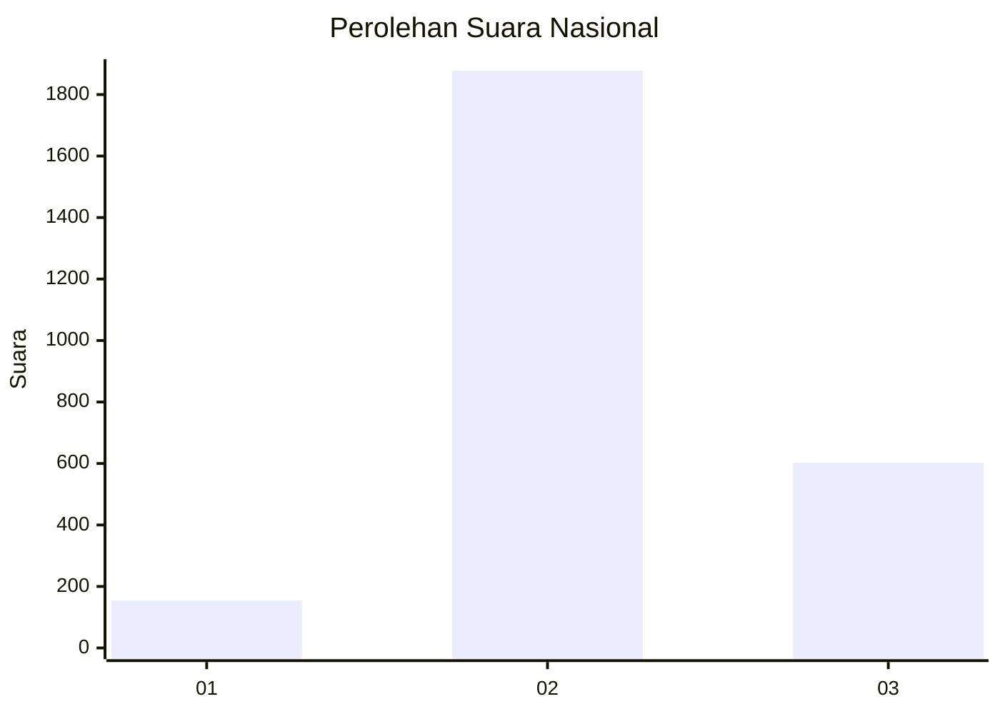
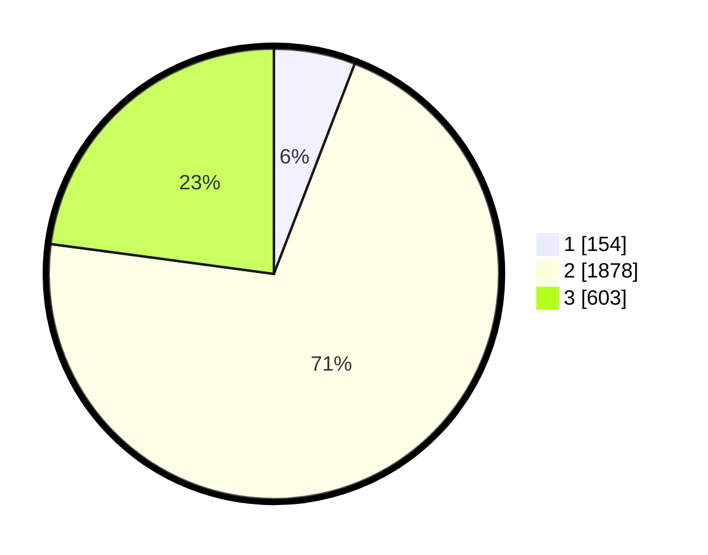

# Hasil

## Grafik

## Tabel

| No. | Nama Paslon    | Suara | Suara (raw) | Persentase |
|:--- |:-------------- | -----:| -----------:| ----------:|
| 1   | ANIES MUHAIMIN | 154   | [154][p-1]  | 5,84       |
| 2   | PRABOWO GIBRAN | 1.878 | [1878][p-2] | 71,27      |
| 3   | GANJAR MAHFUD  | 603   | [603][p-3]  | 22,88      |

[p-1]: https://github.com/gigit-pemilu/pemilu-2024/blob/main/pilpres/hitung-suara/sub/99-luar-negeri/sub/49-hong-kong-republik-rakyat-tiongkok/sub/01-hong-kong-republik-rakyat-tiongkok/sub/0001-hong-kong-republik-rakyat-tiongkok/sub/012-pos-008/sub/paslon-1.txt
[p-2]: https://github.com/gigit-pemilu/pemilu-2024/blob/main/pilpres/hitung-suara/sub/99-luar-negeri/sub/49-hong-kong-republik-rakyat-tiongkok/sub/01-hong-kong-republik-rakyat-tiongkok/sub/0001-hong-kong-republik-rakyat-tiongkok/sub/012-pos-008/sub/paslon-2.txt
[p-3]: https://github.com/gigit-pemilu/pemilu-2024/blob/main/pilpres/hitung-suara/sub/99-luar-negeri/sub/49-hong-kong-republik-rakyat-tiongkok/sub/01-hong-kong-republik-rakyat-tiongkok/sub/0001-hong-kong-republik-rakyat-tiongkok/sub/012-pos-008/sub/paslon-3.txt

## Foto C Plano

https://sirekap-obj-formc.kpu.go.id/7389/pemilu/ppwp/99/49/01/00/01/9949010001012-20240217-205852--de0667af-4d85-4b9c-8be9-abfff8fae76a.jpg

https://sirekap-obj-formc.kpu.go.id/7389/pemilu/ppwp/99/49/01/00/01/9949010001012-20240217-210837--1de11aea-30de-48c7-bacb-8d48b2d9eaf9.jpg

https://sirekap-obj-formc.kpu.go.id/7389/pemilu/ppwp/99/49/01/00/01/9949010001012-20240217-205702--6a34d9d6-5d01-4cee-bb1e-7b6c7652f748.jpg

## Metadata

| Key        | Value               |
| ---------- | ------------------- |
| Time Stamp | 2024-02-19 06:16:00 |

## DATA PEMILIH TETAP

Jumlah pemilih dalam DPT: **4504**.
 * L: **35**.
 * P: **4469**.

## DATA PENGGUNA HAK PILIH

Jumlah pengguna hak pilih dalam DPT: **2076**.
 * L: **0**.
 * P: **2076**.

Jumlah pengguna hak pilih dalam DPTb: **0**.
 * L: **0**.
 * P: **0**.

Jumlah pengguna hak pilih dalam DPK: **0**.
 * L: **0**.
 * P: **0**.

Jumlah pengguna hak pilih: **2076**.
 * L: **0**.
 * P: **2076**.

## JUMLAH SUARA SAH DAN TIDAK SAH

JUMLAH SELURUH SUARA SAH: **2635**.

JUMLAH SUARA TIDAK SAH: **99**.

JUMLAH SELURUH SUARA SAH DAN SUARA TIDAK SAH: **2734**.

