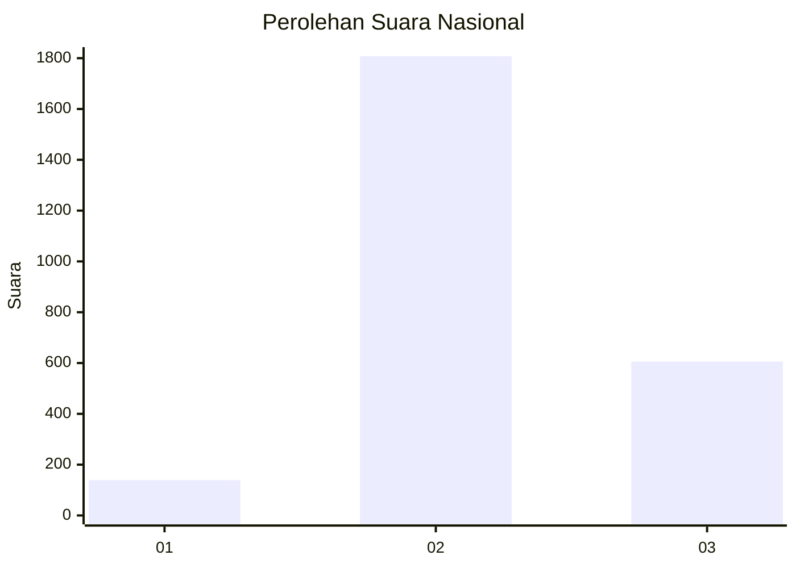
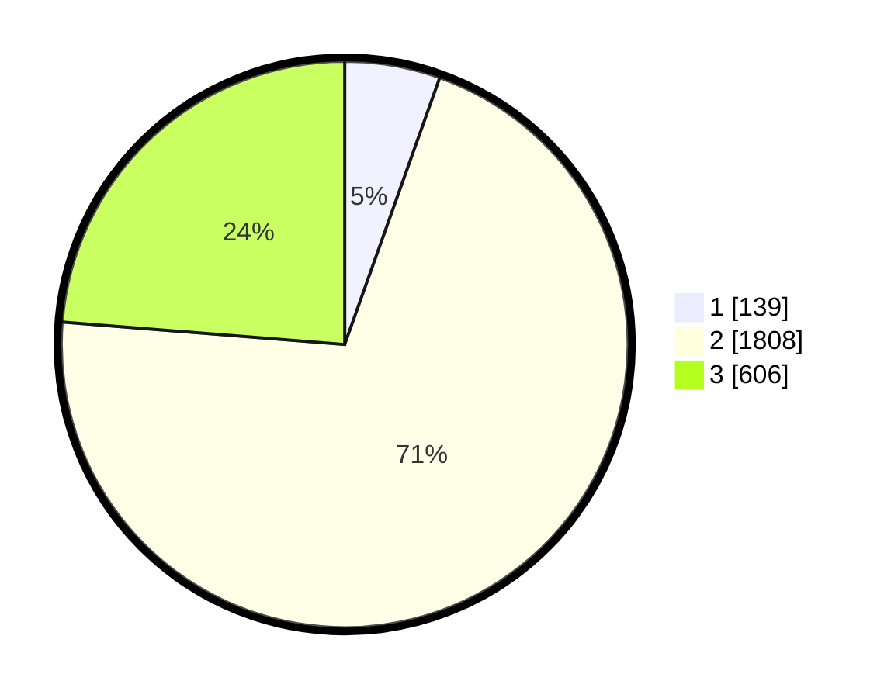

# Hasil

## Grafik

## Tabel

| No. | Nama Paslon    | Suara | Suara (raw) | Persentase |
|:--- |:-------------- | -----:| -----------:| ----------:|
| 1   | ANIES MUHAIMIN | 139   | [139][p-1]  | 5,44       |
| 2   | PRABOWO GIBRAN | 1.808 | [1808][p-2] | 70,82      |
| 3   | GANJAR MAHFUD  | 606   | [606][p-3]  | 23,74      |

[p-1]: https://github.com/gigit-pemilu/pemilu-2024/blob/main/pilpres/hitung-suara/sub/99-luar-negeri/sub/49-hong-kong-republik-rakyat-tiongkok/sub/01-hong-kong-republik-rakyat-tiongkok/sub/0001-hong-kong-republik-rakyat-tiongkok/sub/013-pos-009/sub/paslon-1.txt
[p-2]: https://github.com/gigit-pemilu/pemilu-2024/blob/main/pilpres/hitung-suara/sub/99-luar-negeri/sub/49-hong-kong-republik-rakyat-tiongkok/sub/01-hong-kong-republik-rakyat-tiongkok/sub/0001-hong-kong-republik-rakyat-tiongkok/sub/013-pos-009/sub/paslon-2.txt
[p-3]: https://github.com/gigit-pemilu/pemilu-2024/blob/main/pilpres/hitung-suara/sub/99-luar-negeri/sub/49-hong-kong-republik-rakyat-tiongkok/sub/01-hong-kong-republik-rakyat-tiongkok/sub/0001-hong-kong-republik-rakyat-tiongkok/sub/013-pos-009/sub/paslon-3.txt

## Foto C Plano

https://sirekap-obj-formc.kpu.go.id/608a/pemilu/ppwp/99/49/01/00/01/9949010001013-20240217-125510--286ab368-c221-4098-9789-df9ac834a10c.jpg

https://sirekap-obj-formc.kpu.go.id/608a/pemilu/ppwp/99/49/01/00/01/9949010001013-20240217-125741--2b1c2310-3913-46e5-9bb5-99d6cbe11a9f.jpg

https://sirekap-obj-formc.kpu.go.id/608a/pemilu/ppwp/99/49/01/00/01/9949010001013-20240217-134258--2912e235-109b-4465-9008-c12554718f93.jpg

## Metadata

| Key        | Value               |
| ---------- | ------------------- |
| Time Stamp | 2024-02-17 16:00:02 |

## DATA PEMILIH TETAP

Jumlah pemilih dalam DPT: **4511**.
 * L: **42**.
 * P: **4469**.

## DATA PENGGUNA HAK PILIH

Jumlah pengguna hak pilih dalam DPT: **2173**.
 * L: **2**.
 * P: **2171**.

Jumlah pengguna hak pilih dalam DPTb: **0**.
 * L: **0**.
 * P: **0**.

Jumlah pengguna hak pilih dalam DPK: **0**.
 * L: **0**.
 * P: **0**.

Jumlah pengguna hak pilih: **2173**.
 * L: **2**.
 * P: **2171**.

## JUMLAH SUARA SAH DAN TIDAK SAH

JUMLAH SELURUH SUARA SAH: **2553**.

JUMLAH SUARA TIDAK SAH: **168**.

JUMLAH SELURUH SUARA SAH DAN SUARA TIDAK SAH: **2721**.

