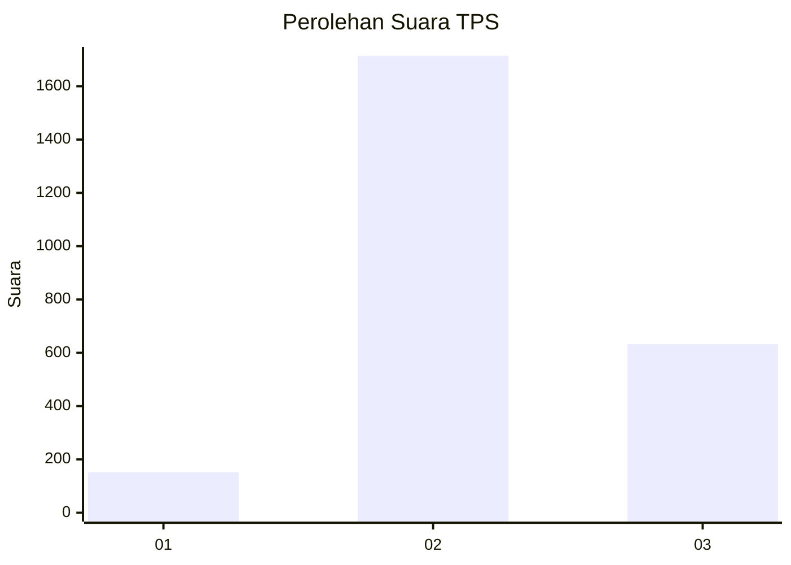
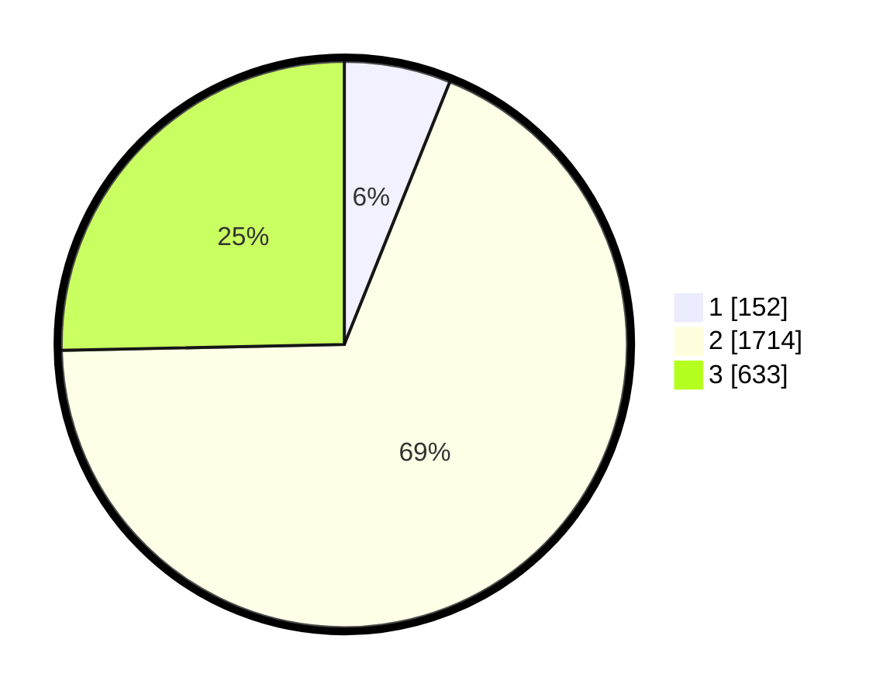

# Hasil

## Grafik

## Tabel

| No. | Nama Paslon    | Suara | Suara (raw) | Persentase |
|:--- |:-------------- | -----:| -----------:| ----------:|
| 1   | ANIES MUHAIMIN | 152   | [152][p-1]  | 6,08       |
| 2   | PRABOWO GIBRAN | 1.714 | [1714][p-2] | 68,59      |
| 3   | GANJAR MAHFUD  | 633   | [633][p-3]  | 25,33      |

[p-1]: https://github.com/gigit-pemilu/pemilu-2024-99-luar-negeri/blob/main/pilpres/hitung-suara/sub/99-luar-negeri/sub/49-hong-kong-republik-rakyat-tiongkok/sub/01-hong-kong-republik-rakyat-tiongkok/sub/0001-hong-kong-republik-rakyat-tiongkok/sub/014-pos-010/sub/paslon-1.txt
[p-2]: https://github.com/gigit-pemilu/pemilu-2024-99-luar-negeri/blob/main/pilpres/hitung-suara/sub/99-luar-negeri/sub/49-hong-kong-republik-rakyat-tiongkok/sub/01-hong-kong-republik-rakyat-tiongkok/sub/0001-hong-kong-republik-rakyat-tiongkok/sub/014-pos-010/sub/paslon-2.txt
[p-3]: https://github.com/gigit-pemilu/pemilu-2024-99-luar-negeri/blob/main/pilpres/hitung-suara/sub/99-luar-negeri/sub/49-hong-kong-republik-rakyat-tiongkok/sub/01-hong-kong-republik-rakyat-tiongkok/sub/0001-hong-kong-republik-rakyat-tiongkok/sub/014-pos-010/sub/paslon-3.txt

## Foto C Plano

https://sirekap-obj-formc.kpu.go.id/9c04/pemilu/ppwp/99/49/01/00/01/9949010001014-20240219-200257--158762af-b603-4b53-954a-152b00a5e134.jpg

https://sirekap-obj-formc.kpu.go.id/9c04/pemilu/ppwp/99/49/01/00/01/9949010001014-20240219-195500--85e8d09b-852f-4f7c-a9a5-07c7baa69b30.jpg

https://sirekap-obj-formc.kpu.go.id/9c04/pemilu/ppwp/99/49/01/00/01/9949010001014-20240219-200618--353fdd69-9756-4a98-a650-f0ec2a65b79f.jpg

## Metadata

| Key        | Value               |
| ---------- | ------------------- |
| Time Stamp | 2024-02-21 11:00:00 |

## DATA PEMILIH TETAP

Jumlah pemilih dalam DPT: **4515**.
 * L: **42**.
 * P: **4473**.

## DATA PENGGUNA HAK PILIH

Jumlah pengguna hak pilih dalam DPT: **2687**.
 * L: **0**.
 * P: **2687**.

Jumlah pengguna hak pilih dalam DPTb: **0**.
 * L: **0**.
 * P: **0**.

Jumlah pengguna hak pilih dalam DPK: **0**.
 * L: **0**.
 * P: **0**.

Jumlah pengguna hak pilih: **2687**.
 * L: **0**.
 * P: **2687**.

## JUMLAH SUARA SAH DAN TIDAK SAH

JUMLAH SELURUH SUARA SAH: **2499**.

JUMLAH SUARA TIDAK SAH: **188**.

JUMLAH SELURUH SUARA SAH DAN SUARA TIDAK SAH: **2687**.

