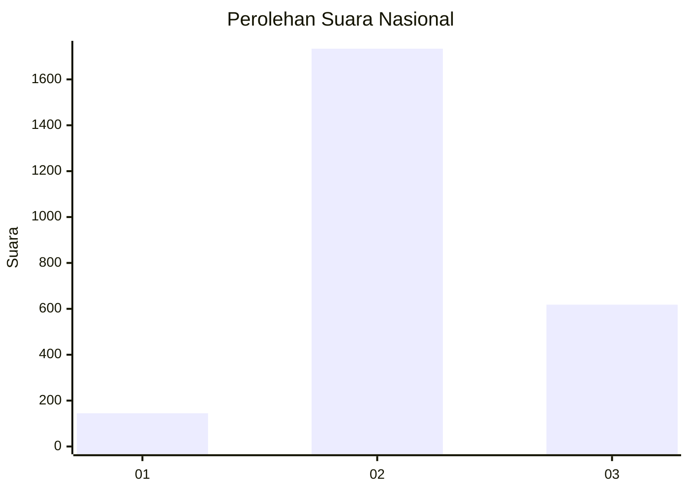
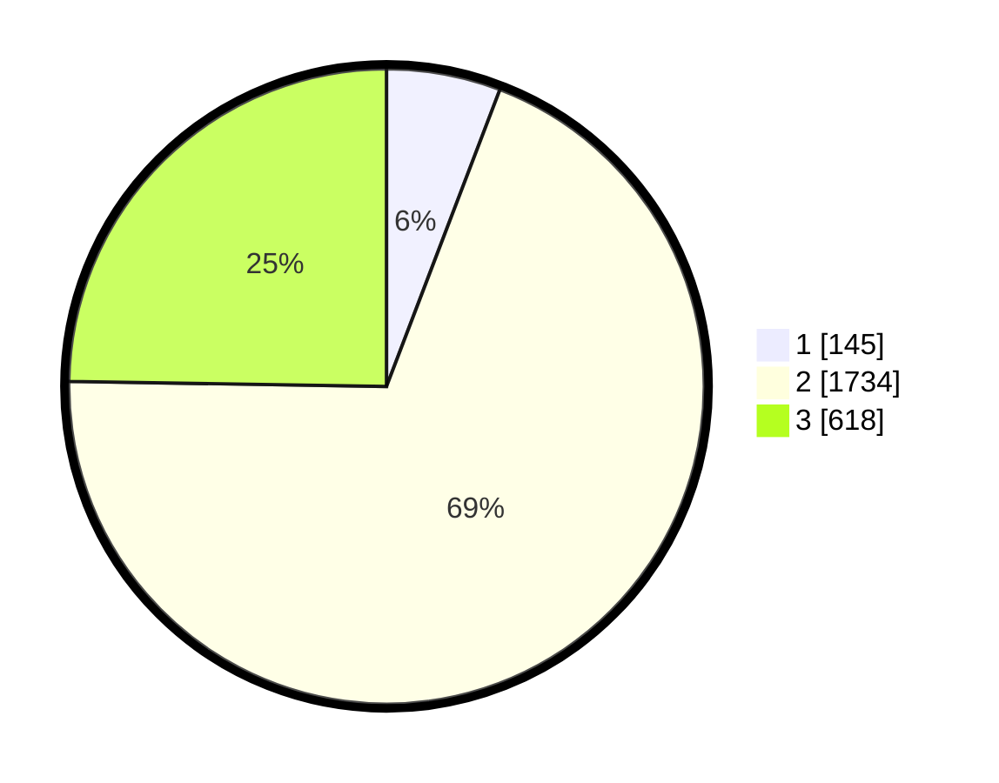

# Hasil

## Grafik

## Tabel

| No. | Nama Paslon    | Suara | Suara (raw) | Persentase |
|:--- |:-------------- | -----:| -----------:| ----------:|
| 1   | ANIES MUHAIMIN | 145   | [145][p-1]  | 5,81       |
| 2   | PRABOWO GIBRAN | 1.734 | [1734][p-2] | 69,44      |
| 3   | GANJAR MAHFUD  | 618   | [618][p-3]  | 24,75      |

[p-1]: https://github.com/gigit-pemilu/pemilu-2024/blob/main/pilpres/hitung-suara/sub/99-luar-negeri/sub/49-hong-kong-republik-rakyat-tiongkok/sub/01-hong-kong-republik-rakyat-tiongkok/sub/0001-hong-kong-republik-rakyat-tiongkok/sub/015-pos-011/sub/paslon-1.txt
[p-2]: https://github.com/gigit-pemilu/pemilu-2024/blob/main/pilpres/hitung-suara/sub/99-luar-negeri/sub/49-hong-kong-republik-rakyat-tiongkok/sub/01-hong-kong-republik-rakyat-tiongkok/sub/0001-hong-kong-republik-rakyat-tiongkok/sub/015-pos-011/sub/paslon-2.txt
[p-3]: https://github.com/gigit-pemilu/pemilu-2024/blob/main/pilpres/hitung-suara/sub/99-luar-negeri/sub/49-hong-kong-republik-rakyat-tiongkok/sub/01-hong-kong-republik-rakyat-tiongkok/sub/0001-hong-kong-republik-rakyat-tiongkok/sub/015-pos-011/sub/paslon-3.txt

## Foto C Plano

https://sirekap-obj-formc.kpu.go.id/5615/pemilu/ppwp/99/49/01/00/01/9949010001015-20240220-192002--ac799d7c-9bd3-4034-b664-9b50ff86da35.jpg

https://sirekap-obj-formc.kpu.go.id/5615/pemilu/ppwp/99/49/01/00/01/9949010001015-20240220-192543--83ef6b2b-c1d8-4f43-9ab7-6edabac9a0e2.jpg

https://sirekap-obj-formc.kpu.go.id/5615/pemilu/ppwp/99/49/01/00/01/9949010001015-20240220-192822--5db00241-c13b-4fd6-b321-18b4f77944e0.jpg

## Metadata

| Key        | Value               |
| ---------- | ------------------- |
| Time Stamp | 2024-02-20 20:00:00 |

## DATA PEMILIH TETAP

Jumlah pemilih dalam DPT: **4517**.
 * L: **48**.
 * P: **4469**.

## DATA PENGGUNA HAK PILIH

Jumlah pengguna hak pilih dalam DPT: **2359**.
 * L: **2**.
 * P: **2357**.

Jumlah pengguna hak pilih dalam DPTb: **0**.
 * L: **0**.
 * P: **0**.

Jumlah pengguna hak pilih dalam DPK: **0**.
 * L: **0**.
 * P: **0**.

Jumlah pengguna hak pilih: **2359**.
 * L: **2**.
 * P: **2357**.

## JUMLAH SUARA SAH DAN TIDAK SAH

JUMLAH SELURUH SUARA SAH: **2497**.

JUMLAH SUARA TIDAK SAH: **221**.

JUMLAH SELURUH SUARA SAH DAN SUARA TIDAK SAH: **2718**.

