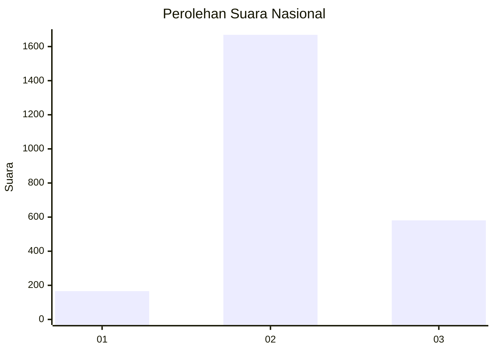
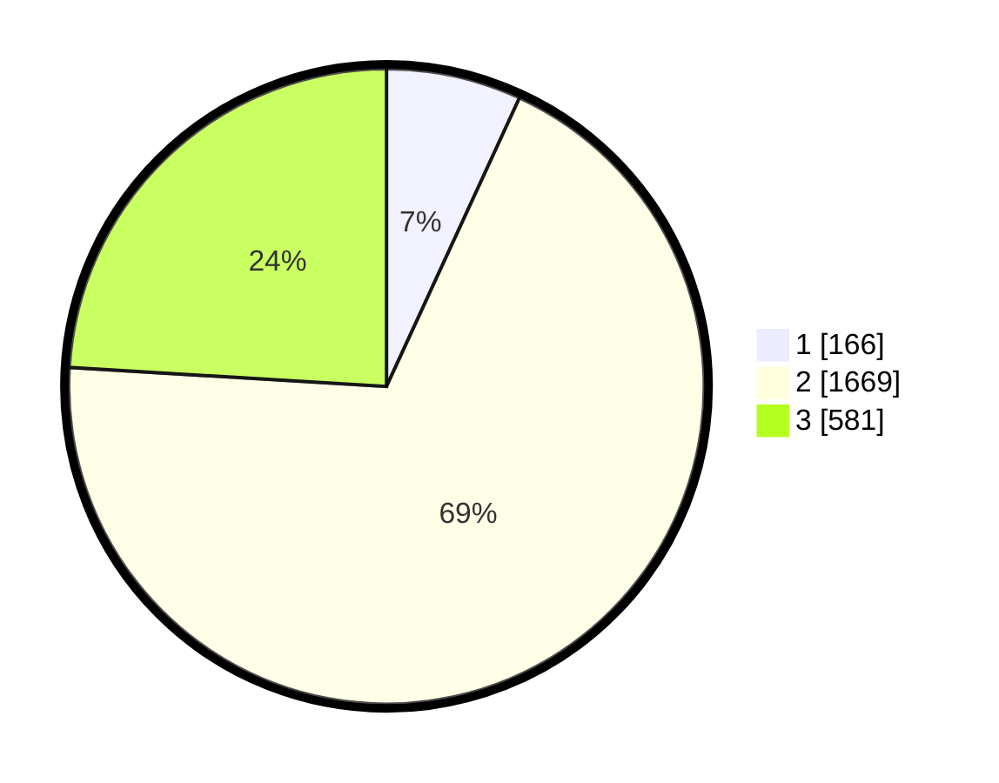

# Hasil

## Grafik

## Tabel

| No. | Nama Paslon    | Suara | Suara (raw) | Persentase |
|:--- |:-------------- | -----:| -----------:| ----------:|
| 1   | ANIES MUHAIMIN | 166   | [166][p-1]  | 6,87       |
| 2   | PRABOWO GIBRAN | 1.669 | [1669][p-2] | 69,08      |
| 3   | GANJAR MAHFUD  | 581   | [581][p-3]  | 24,05      |

[p-1]: https://github.com/gigit-pemilu/pemilu-2024/blob/main/pilpres/hitung-suara/sub/99-luar-negeri/sub/49-hong-kong-republik-rakyat-tiongkok/sub/01-hong-kong-republik-rakyat-tiongkok/sub/0001-hong-kong-republik-rakyat-tiongkok/sub/016-pos-012/sub/paslon-1.txt
[p-2]: https://github.com/gigit-pemilu/pemilu-2024/blob/main/pilpres/hitung-suara/sub/99-luar-negeri/sub/49-hong-kong-republik-rakyat-tiongkok/sub/01-hong-kong-republik-rakyat-tiongkok/sub/0001-hong-kong-republik-rakyat-tiongkok/sub/016-pos-012/sub/paslon-2.txt
[p-3]: https://github.com/gigit-pemilu/pemilu-2024/blob/main/pilpres/hitung-suara/sub/99-luar-negeri/sub/49-hong-kong-republik-rakyat-tiongkok/sub/01-hong-kong-republik-rakyat-tiongkok/sub/0001-hong-kong-republik-rakyat-tiongkok/sub/016-pos-012/sub/paslon-3.txt

## Foto C Plano

https://sirekap-obj-formc.kpu.go.id/0373/pemilu/ppwp/99/49/01/00/01/9949010001016-20240219-201014--ae73f563-5294-4827-8c31-690b551303d5.jpg

https://sirekap-obj-formc.kpu.go.id/0373/pemilu/ppwp/99/49/01/00/01/9949010001016-20240219-201421--41077716-30dc-4f95-a972-488360196f75.jpg

https://sirekap-obj-formc.kpu.go.id/0373/pemilu/ppwp/99/49/01/00/01/9949010001016-20240219-201847--51dbdac6-8ebb-48ad-96ae-a666e9fe4dff.jpg

## Metadata

| Key        | Value               |
| ---------- | ------------------- |
| Time Stamp | 2024-02-19 21:00:00 |

## DATA PEMILIH TETAP

Jumlah pemilih dalam DPT: **4517**.
 * L: **39**.
 * P: **4478**.

## DATA PENGGUNA HAK PILIH

Jumlah pengguna hak pilih dalam DPT: **2135**.
 * L: **2**.
 * P: **2133**.

Jumlah pengguna hak pilih dalam DPTb: **0**.
 * L: **0**.
 * P: **0**.

Jumlah pengguna hak pilih dalam DPK: **0**.
 * L: **0**.
 * P: **0**.

Jumlah pengguna hak pilih: **2135**.
 * L: **2**.
 * P: **2133**.

## JUMLAH SUARA SAH DAN TIDAK SAH

JUMLAH SELURUH SUARA SAH: **2416**.

JUMLAH SUARA TIDAK SAH: **204**.

JUMLAH SELURUH SUARA SAH DAN SUARA TIDAK SAH: **2620**.

