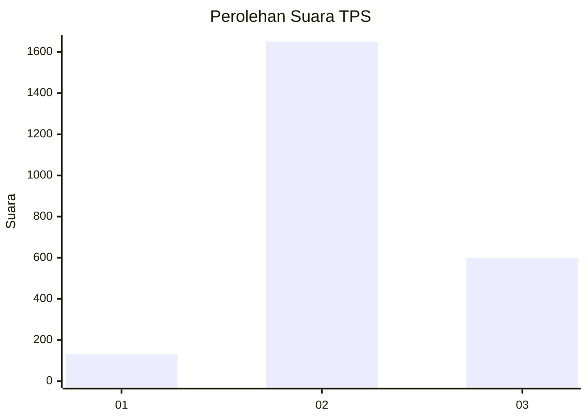
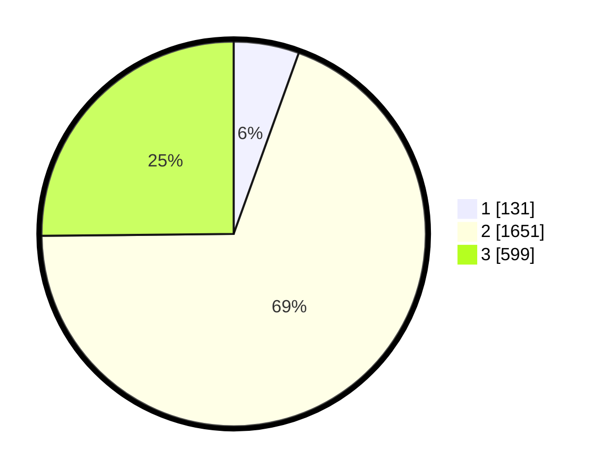

# Hasil

## Grafik

## Tabel

| No. | Nama Paslon    | Suara | Suara (raw) | Persentase |
|:--- |:-------------- | -----:| -----------:| ----------:|
| 1   | ANIES MUHAIMIN | 131   | [131][p-1]  | 5,50       |
| 2   | PRABOWO GIBRAN | 1.651 | [1651][p-2] | 69,34      |
| 3   | GANJAR MAHFUD  | 599   | [599][p-3]  | 25,16      |

[p-1]: https://github.com/gigit-pemilu/pemilu-2024-99-luar-negeri/blob/main/pilpres/hitung-suara/sub/99-luar-negeri/sub/49-hong-kong-republik-rakyat-tiongkok/sub/01-hong-kong-republik-rakyat-tiongkok/sub/0001-hong-kong-republik-rakyat-tiongkok/sub/017-pos-013/sub/paslon-1.txt
[p-2]: https://github.com/gigit-pemilu/pemilu-2024-99-luar-negeri/blob/main/pilpres/hitung-suara/sub/99-luar-negeri/sub/49-hong-kong-republik-rakyat-tiongkok/sub/01-hong-kong-republik-rakyat-tiongkok/sub/0001-hong-kong-republik-rakyat-tiongkok/sub/017-pos-013/sub/paslon-2.txt
[p-3]: https://github.com/gigit-pemilu/pemilu-2024-99-luar-negeri/blob/main/pilpres/hitung-suara/sub/99-luar-negeri/sub/49-hong-kong-republik-rakyat-tiongkok/sub/01-hong-kong-republik-rakyat-tiongkok/sub/0001-hong-kong-republik-rakyat-tiongkok/sub/017-pos-013/sub/paslon-3.txt

## Foto C Plano

https://sirekap-obj-formc.kpu.go.id/9328/pemilu/ppwp/99/49/01/00/01/9949010001017-20240219-201050--0e25c916-df27-4978-9c7f-0100c21c9647.jpg

https://sirekap-obj-formc.kpu.go.id/9328/pemilu/ppwp/99/49/01/00/01/9949010001017-20240219-201755--fb5d01b5-507b-407f-b154-00189286f3de.jpg

https://sirekap-obj-formc.kpu.go.id/9328/pemilu/ppwp/99/49/01/00/01/9949010001017-20240219-202258--6056072d-59bd-425d-9315-9c55a636772d.jpg

## Metadata

| Key        | Value               |
| ---------- | ------------------- |
| Time Stamp | 2024-02-21 11:00:00 |

## DATA PEMILIH TETAP

Jumlah pemilih dalam DPT: **4495**.
 * L: **44**.
 * P: **4451**.

## DATA PENGGUNA HAK PILIH

Jumlah pengguna hak pilih dalam DPT: **2200**.
 * L: **2**.
 * P: **2198**.

Jumlah pengguna hak pilih dalam DPTb: **0**.
 * L: **0**.
 * P: **0**.

Jumlah pengguna hak pilih dalam DPK: **0**.
 * L: **0**.
 * P: **0**.

Jumlah pengguna hak pilih: **2200**.
 * L: **2**.
 * P: **2198**.

## JUMLAH SUARA SAH DAN TIDAK SAH

JUMLAH SELURUH SUARA SAH: **2381**.

JUMLAH SUARA TIDAK SAH: **133**.

JUMLAH SELURUH SUARA SAH DAN SUARA TIDAK SAH: **2514**.

