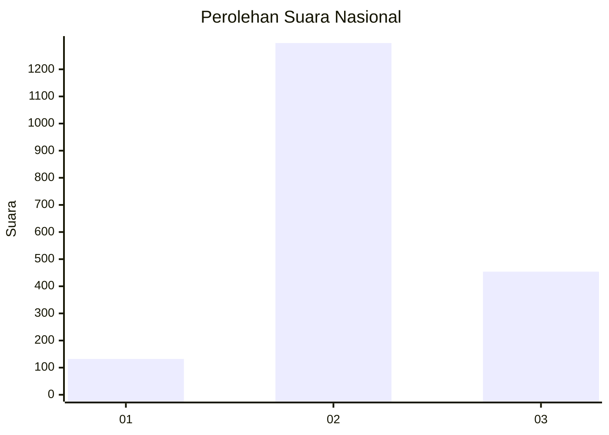
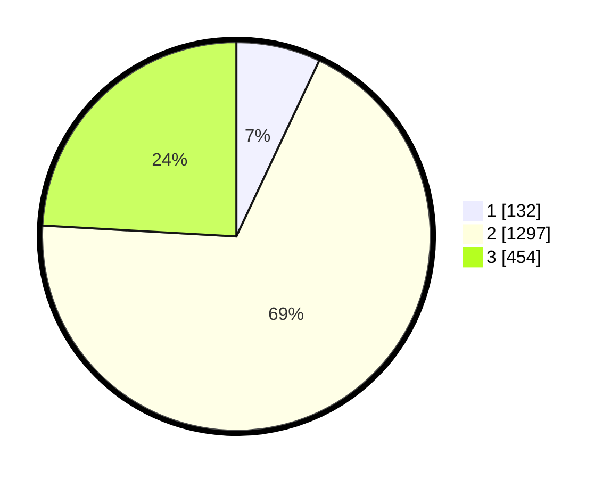

# Hasil

## Grafik

## Tabel

| No. | Nama Paslon    | Suara | Suara (raw) | Persentase |
|:--- |:-------------- | -----:| -----------:| ----------:|
| 1   | ANIES MUHAIMIN | 132   | [132][p-1]  | 7,01       |
| 2   | PRABOWO GIBRAN | 1.297 | [1297][p-2] | 68,88      |
| 3   | GANJAR MAHFUD  | 454   | [454][p-3]  | 24,11      |

[p-1]: https://github.com/gigit-pemilu/pemilu-2024/blob/main/pilpres/hitung-suara/sub/99-luar-negeri/sub/49-hong-kong-republik-rakyat-tiongkok/sub/01-hong-kong-republik-rakyat-tiongkok/sub/0001-hong-kong-republik-rakyat-tiongkok/sub/021-pos-017/sub/paslon-1.txt
[p-2]: https://github.com/gigit-pemilu/pemilu-2024/blob/main/pilpres/hitung-suara/sub/99-luar-negeri/sub/49-hong-kong-republik-rakyat-tiongkok/sub/01-hong-kong-republik-rakyat-tiongkok/sub/0001-hong-kong-republik-rakyat-tiongkok/sub/021-pos-017/sub/paslon-2.txt
[p-3]: https://github.com/gigit-pemilu/pemilu-2024/blob/main/pilpres/hitung-suara/sub/99-luar-negeri/sub/49-hong-kong-republik-rakyat-tiongkok/sub/01-hong-kong-republik-rakyat-tiongkok/sub/0001-hong-kong-republik-rakyat-tiongkok/sub/021-pos-017/sub/paslon-3.txt

## Foto C Plano

https://sirekap-obj-formc.kpu.go.id/3b32/pemilu/ppwp/99/49/01/00/01/9949010001021-20240220-184454--30bccd75-4d24-4ad6-94a9-2d051a3cdde4.jpg

https://sirekap-obj-formc.kpu.go.id/3b32/pemilu/ppwp/99/49/01/00/01/9949010001021-20240220-184915--37b6b4ca-234c-4666-911c-732755aeafd5.jpg

https://sirekap-obj-formc.kpu.go.id/3b32/pemilu/ppwp/99/49/01/00/01/9949010001021-20240220-184620--64d6e17a-0235-4d6c-9b17-48df62d711b8.jpg

## Metadata

| Key        | Value               |
| ---------- | ------------------- |
| Time Stamp | 2024-02-20 19:00:00 |

## DATA PEMILIH TETAP

Jumlah pemilih dalam DPT: **4508**.
 * L: **42**.
 * P: **4466**.

## DATA PENGGUNA HAK PILIH

Jumlah pengguna hak pilih dalam DPT: **1611**.
 * L: **0**.
 * P: **1611**.

Jumlah pengguna hak pilih dalam DPTb: **0**.
 * L: **0**.
 * P: **0**.

Jumlah pengguna hak pilih dalam DPK: **0**.
 * L: **0**.
 * P: **0**.

Jumlah pengguna hak pilih: **1611**.
 * L: **0**.
 * P: **1611**.

## JUMLAH SUARA SAH DAN TIDAK SAH

JUMLAH SELURUH SUARA SAH: **1883**.

JUMLAH SUARA TIDAK SAH: **119**.

JUMLAH SELURUH SUARA SAH DAN SUARA TIDAK SAH: **2002**.

