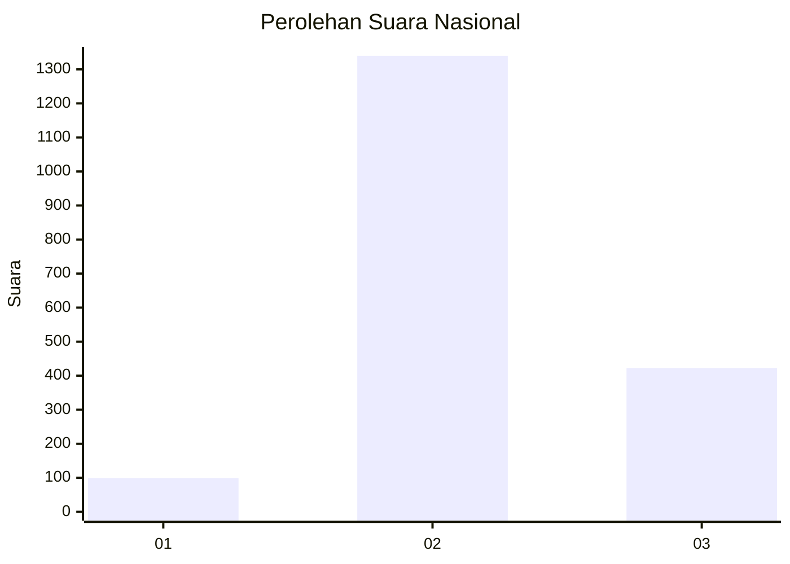
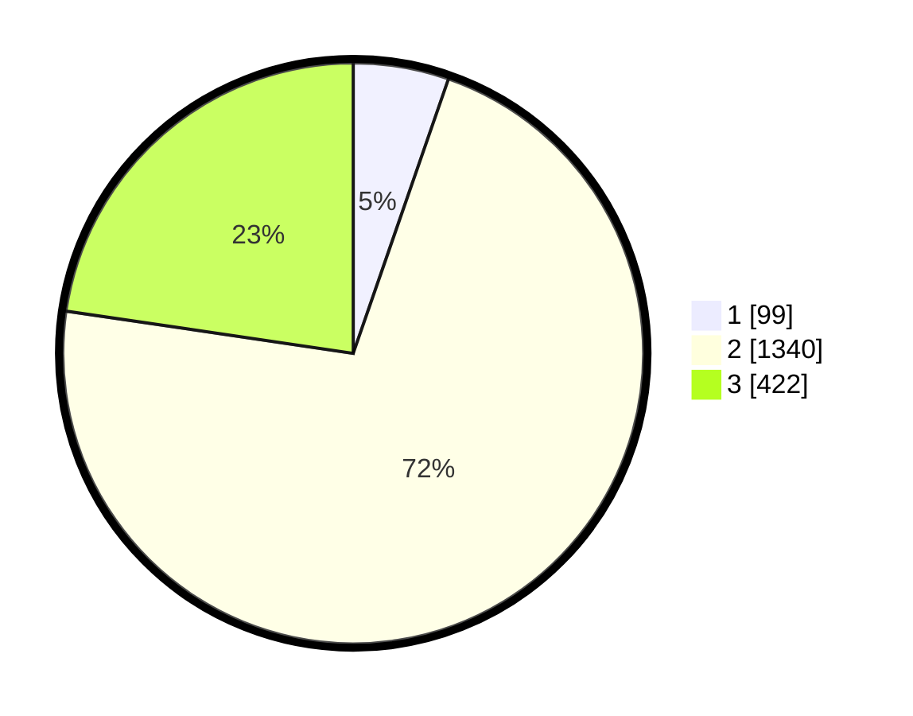

# Hasil

## Grafik

## Tabel

| No. | Nama Paslon    | Suara | Suara (raw) | Persentase |
|:--- |:-------------- | -----:| -----------:| ----------:|
| 1   | ANIES MUHAIMIN | 99    | [99][p-1]   | 5,32       |
| 2   | PRABOWO GIBRAN | 1.340 | [1340][p-2] | 72,00      |
| 3   | GANJAR MAHFUD  | 422   | [422][p-3]  | 22,68      |

[p-1]: https://github.com/gigit-pemilu/pemilu-2024/blob/main/pilpres/hitung-suara/sub/99-luar-negeri/sub/49-hong-kong-republik-rakyat-tiongkok/sub/01-hong-kong-republik-rakyat-tiongkok/sub/0001-hong-kong-republik-rakyat-tiongkok/sub/024-pos-020/sub/paslon-1.txt
[p-2]: https://github.com/gigit-pemilu/pemilu-2024/blob/main/pilpres/hitung-suara/sub/99-luar-negeri/sub/49-hong-kong-republik-rakyat-tiongkok/sub/01-hong-kong-republik-rakyat-tiongkok/sub/0001-hong-kong-republik-rakyat-tiongkok/sub/024-pos-020/sub/paslon-2.txt
[p-3]: https://github.com/gigit-pemilu/pemilu-2024/blob/main/pilpres/hitung-suara/sub/99-luar-negeri/sub/49-hong-kong-republik-rakyat-tiongkok/sub/01-hong-kong-republik-rakyat-tiongkok/sub/0001-hong-kong-republik-rakyat-tiongkok/sub/024-pos-020/sub/paslon-3.txt

## Foto C Plano

https://sirekap-obj-formc.kpu.go.id/b9d1/pemilu/ppwp/99/49/01/00/01/9949010001024-20240219-205616--2adfe9db-98b4-4851-bdd4-b1ad494fd589.jpg

https://sirekap-obj-formc.kpu.go.id/b9d1/pemilu/ppwp/99/49/01/00/01/9949010001024-20240219-210613--f05b4b87-3073-4c61-aa8d-e5121f602d65.jpg

https://sirekap-obj-formc.kpu.go.id/b9d1/pemilu/ppwp/99/49/01/00/01/9949010001024-20240219-210429--11c5d868-b644-4f24-b180-cc1218e91fb0.jpg

## Metadata

| Key        | Value               |
| ---------- | ------------------- |
| Time Stamp | 2024-02-19 22:00:00 |

## DATA PEMILIH TETAP

Jumlah pemilih dalam DPT: **4510**.
 * L: **40**.
 * P: **4470**.

## DATA PENGGUNA HAK PILIH

Jumlah pengguna hak pilih dalam DPT: **1978**.
 * L: **3**.
 * P: **1975**.

Jumlah pengguna hak pilih dalam DPTb: **0**.
 * L: **0**.
 * P: **0**.

Jumlah pengguna hak pilih dalam DPK: **0**.
 * L: **0**.
 * P: **0**.

Jumlah pengguna hak pilih: **1978**.
 * L: **3**.
 * P: **1975**.

## JUMLAH SUARA SAH DAN TIDAK SAH

JUMLAH SELURUH SUARA SAH: **1861**.

JUMLAH SUARA TIDAK SAH: **117**.

JUMLAH SELURUH SUARA SAH DAN SUARA TIDAK SAH: **1978**.

