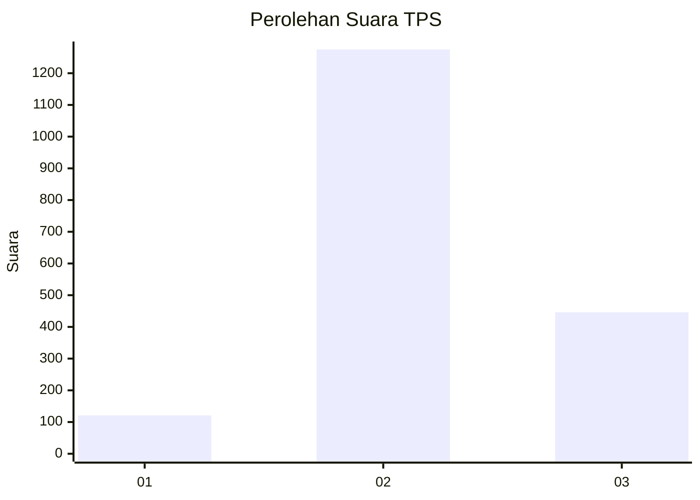
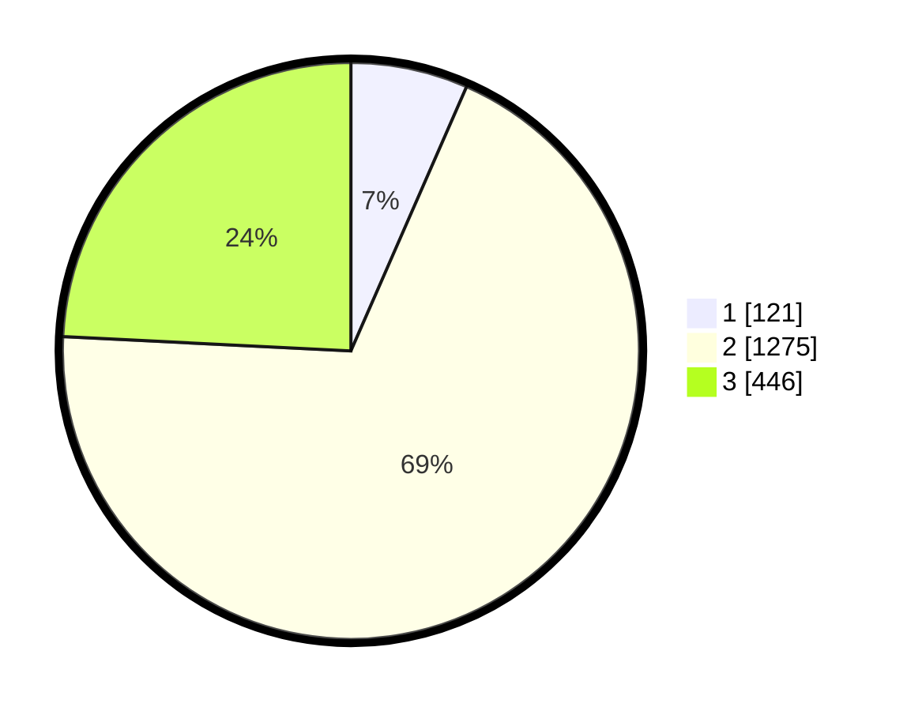

# Hasil

## Grafik

## Tabel

| No. | Nama Paslon    | Suara | Suara (raw) | Persentase |
|:--- |:-------------- | -----:| -----------:| ----------:|
| 1   | ANIES MUHAIMIN | 121   | [121][p-1]  | 6,57       |
| 2   | PRABOWO GIBRAN | 1.275 | [1275][p-2] | 69,22      |
| 3   | GANJAR MAHFUD  | 446   | [446][p-3]  | 24,21      |

[p-1]: https://github.com/gigit-pemilu/pemilu-2024-99-luar-negeri/blob/main/pilpres/hitung-suara/sub/99-luar-negeri/sub/49-hong-kong-republik-rakyat-tiongkok/sub/01-hong-kong-republik-rakyat-tiongkok/sub/0001-hong-kong-republik-rakyat-tiongkok/sub/025-pos-021/sub/paslon-1.txt
[p-2]: https://github.com/gigit-pemilu/pemilu-2024-99-luar-negeri/blob/main/pilpres/hitung-suara/sub/99-luar-negeri/sub/49-hong-kong-republik-rakyat-tiongkok/sub/01-hong-kong-republik-rakyat-tiongkok/sub/0001-hong-kong-republik-rakyat-tiongkok/sub/025-pos-021/sub/paslon-2.txt
[p-3]: https://github.com/gigit-pemilu/pemilu-2024-99-luar-negeri/blob/main/pilpres/hitung-suara/sub/99-luar-negeri/sub/49-hong-kong-republik-rakyat-tiongkok/sub/01-hong-kong-republik-rakyat-tiongkok/sub/0001-hong-kong-republik-rakyat-tiongkok/sub/025-pos-021/sub/paslon-3.txt

## Foto C Plano

https://sirekap-obj-formc.kpu.go.id/862a/pemilu/ppwp/99/49/01/00/01/9949010001025-20240219-200713--2c48869a-241a-4388-8b9d-b306b7fa70af.jpg

https://sirekap-obj-formc.kpu.go.id/862a/pemilu/ppwp/99/49/01/00/01/9949010001025-20240219-200817--48a25165-ab43-49f5-b603-4dca7d1e8924.jpg

https://sirekap-obj-formc.kpu.go.id/862a/pemilu/ppwp/99/49/01/00/01/9949010001025-20240219-202323--cfe841da-b71e-4b26-baa3-6d68470f3991.jpg

## Metadata

| Key        | Value               |
| ---------- | ------------------- |
| Time Stamp | 2024-02-21 11:00:00 |

## DATA PEMILIH TETAP

Jumlah pemilih dalam DPT: **4512**.
 * L: **27**.
 * P: **4485**.

## DATA PENGGUNA HAK PILIH

Jumlah pengguna hak pilih dalam DPT: **1922**.
 * L: **3**.
 * P: **1919**.

Jumlah pengguna hak pilih dalam DPTb: **0**.
 * L: **0**.
 * P: **0**.

Jumlah pengguna hak pilih dalam DPK: **0**.
 * L: **0**.
 * P: **0**.

Jumlah pengguna hak pilih: **1922**.
 * L: **3**.
 * P: **1919**.

## JUMLAH SUARA SAH DAN TIDAK SAH

JUMLAH SELURUH SUARA SAH: **1842**.

JUMLAH SUARA TIDAK SAH: **123**.

JUMLAH SELURUH SUARA SAH DAN SUARA TIDAK SAH: **1965**.

