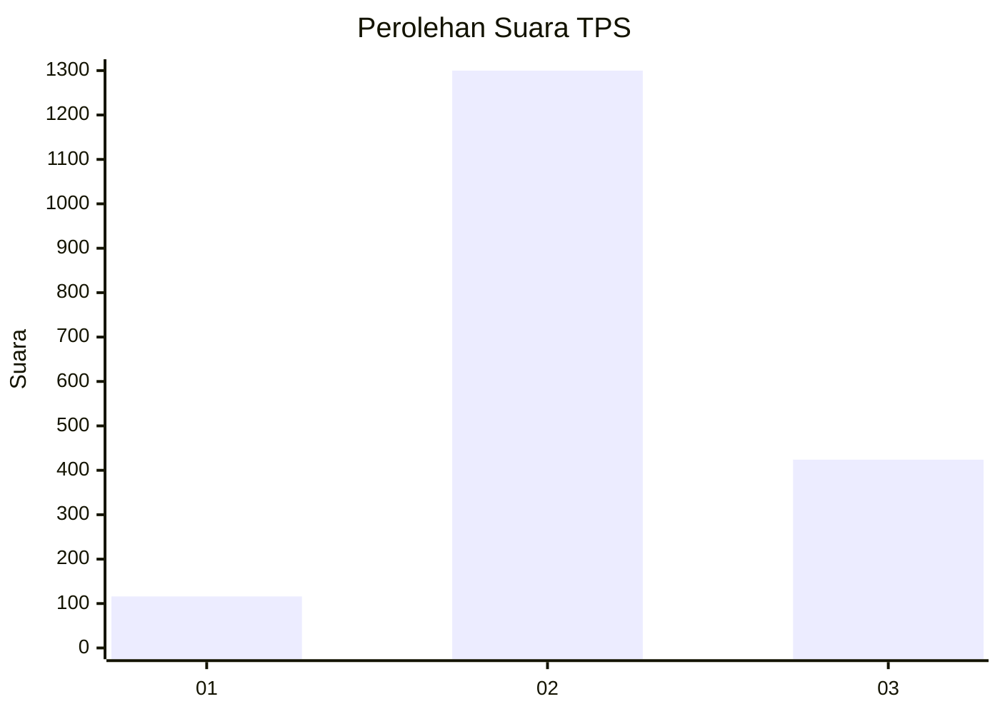
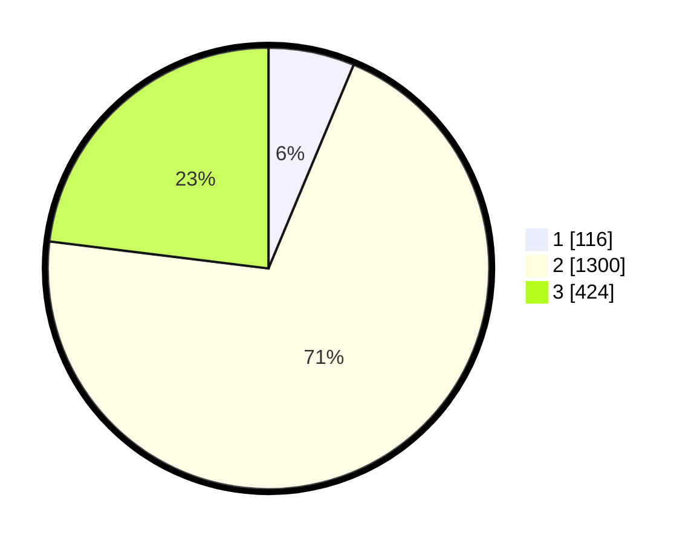

# Hasil

## Grafik

## Tabel

| No. | Nama Paslon    | Suara | Suara (raw) | Persentase |
|:--- |:-------------- | -----:| -----------:| ----------:|
| 1   | ANIES MUHAIMIN | 116   | [116][p-1]  | 6,30       |
| 2   | PRABOWO GIBRAN | 1.300 | [1300][p-2] | 70,65      |
| 3   | GANJAR MAHFUD  | 424   | [424][p-3]  | 23,04      |

[p-1]: https://github.com/gigit-pemilu/pemilu-2024-99-luar-negeri/blob/main/pilpres/hitung-suara/sub/99-luar-negeri/sub/49-hong-kong-republik-rakyat-tiongkok/sub/01-hong-kong-republik-rakyat-tiongkok/sub/0001-hong-kong-republik-rakyat-tiongkok/sub/026-pos-022/sub/paslon-1.txt
[p-2]: https://github.com/gigit-pemilu/pemilu-2024-99-luar-negeri/blob/main/pilpres/hitung-suara/sub/99-luar-negeri/sub/49-hong-kong-republik-rakyat-tiongkok/sub/01-hong-kong-republik-rakyat-tiongkok/sub/0001-hong-kong-republik-rakyat-tiongkok/sub/026-pos-022/sub/paslon-2.txt
[p-3]: https://github.com/gigit-pemilu/pemilu-2024-99-luar-negeri/blob/main/pilpres/hitung-suara/sub/99-luar-negeri/sub/49-hong-kong-republik-rakyat-tiongkok/sub/01-hong-kong-republik-rakyat-tiongkok/sub/0001-hong-kong-republik-rakyat-tiongkok/sub/026-pos-022/sub/paslon-3.txt

## Foto C Plano

https://sirekap-obj-formc.kpu.go.id/4a7f/pemilu/ppwp/99/49/01/00/01/9949010001026-20240219-201502--e5a94227-8d72-4d0e-877d-1bc72ce56e95.jpg

https://sirekap-obj-formc.kpu.go.id/4a7f/pemilu/ppwp/99/49/01/00/01/9949010001026-20240219-200303--93fedf21-e201-4214-8a80-054d07738b2f.jpg

https://sirekap-obj-formc.kpu.go.id/4a7f/pemilu/ppwp/99/49/01/00/01/9949010001026-20240219-200426--b39d508f-1ab8-4236-a90b-717ccdcdae2d.jpg

## Metadata

| Key        | Value               |
| ---------- | ------------------- |
| Time Stamp | 2024-02-21 11:00:00 |

## DATA PEMILIH TETAP

Jumlah pemilih dalam DPT: **4501**.
 * L: **48**.
 * P: **4453**.

## DATA PENGGUNA HAK PILIH

Jumlah pengguna hak pilih dalam DPT: **1592**.
 * L: **2**.
 * P: **1590**.

Jumlah pengguna hak pilih dalam DPTb: **0**.
 * L: **0**.
 * P: **0**.

Jumlah pengguna hak pilih dalam DPK: **0**.
 * L: **0**.
 * P: **0**.

Jumlah pengguna hak pilih: **1592**.
 * L: **2**.
 * P: **1590**.

## JUMLAH SUARA SAH DAN TIDAK SAH

JUMLAH SELURUH SUARA SAH: **1840**.

JUMLAH SUARA TIDAK SAH: **107**.

JUMLAH SELURUH SUARA SAH DAN SUARA TIDAK SAH: **1947**.

