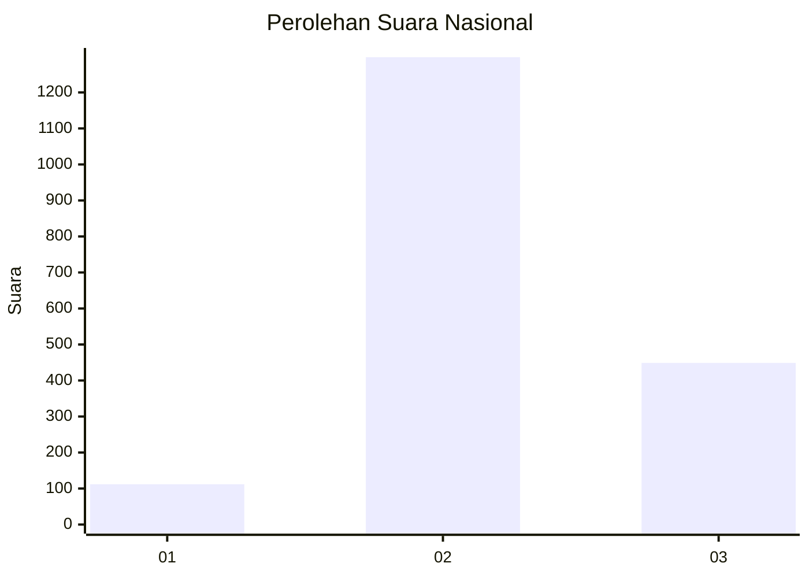
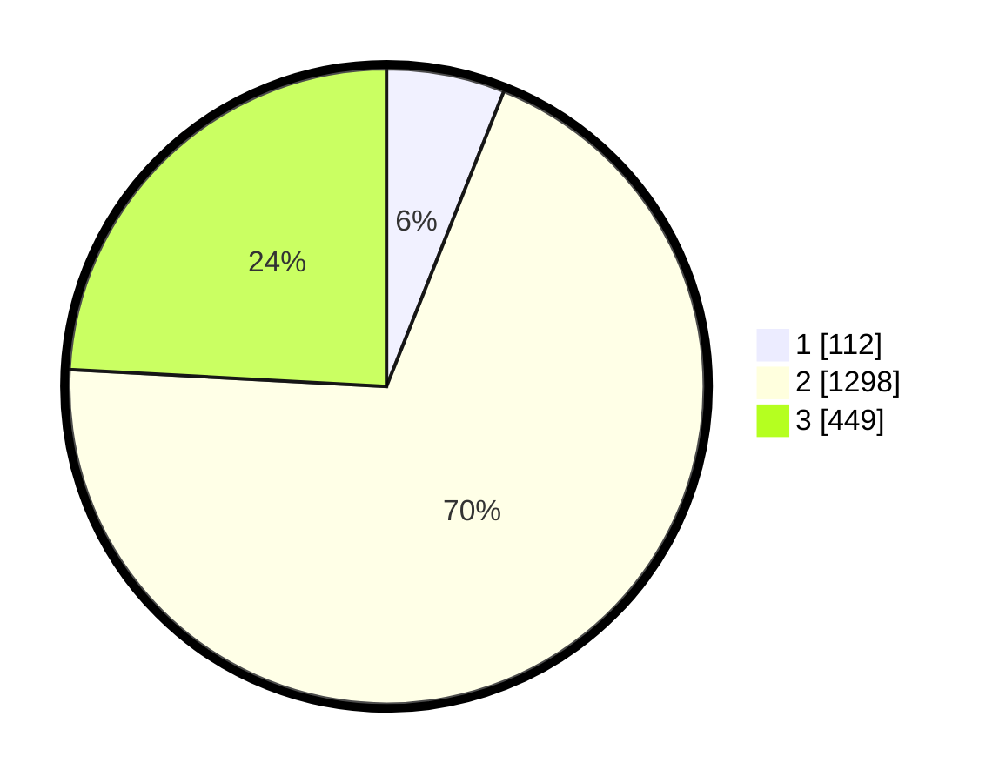

# Hasil

## Grafik

## Tabel

| No. | Nama Paslon    | Suara | Suara (raw) | Persentase |
|:--- |:-------------- | -----:| -----------:| ----------:|
| 1   | ANIES MUHAIMIN | 112   | [112][p-1]  | 6,02       |
| 2   | PRABOWO GIBRAN | 1.298 | [1298][p-2] | 69,82      |
| 3   | GANJAR MAHFUD  | 449   | [449][p-3]  | 24,15      |

[p-1]: https://github.com/gigit-pemilu/pemilu-2024/blob/main/pilpres/hitung-suara/sub/99-luar-negeri/sub/49-hong-kong-republik-rakyat-tiongkok/sub/01-hong-kong-republik-rakyat-tiongkok/sub/0001-hong-kong-republik-rakyat-tiongkok/sub/028-pos-024/sub/paslon-1.txt
[p-2]: https://github.com/gigit-pemilu/pemilu-2024/blob/main/pilpres/hitung-suara/sub/99-luar-negeri/sub/49-hong-kong-republik-rakyat-tiongkok/sub/01-hong-kong-republik-rakyat-tiongkok/sub/0001-hong-kong-republik-rakyat-tiongkok/sub/028-pos-024/sub/paslon-2.txt
[p-3]: https://github.com/gigit-pemilu/pemilu-2024/blob/main/pilpres/hitung-suara/sub/99-luar-negeri/sub/49-hong-kong-republik-rakyat-tiongkok/sub/01-hong-kong-republik-rakyat-tiongkok/sub/0001-hong-kong-republik-rakyat-tiongkok/sub/028-pos-024/sub/paslon-3.txt

## Foto C Plano

https://sirekap-obj-formc.kpu.go.id/308e/pemilu/ppwp/99/49/01/00/01/9949010001028-20240221-182258--dccb14df-4005-4f5f-a0e3-e90374ae53c7.jpg

https://sirekap-obj-formc.kpu.go.id/308e/pemilu/ppwp/99/49/01/00/01/9949010001028-20240221-182540--c82c3a14-efb5-409b-a083-6addee304a50.jpg

https://sirekap-obj-formc.kpu.go.id/308e/pemilu/ppwp/99/49/01/00/01/9949010001028-20240221-182637--ffd7371b-ae64-435a-85c6-035f8a7b2046.jpg

## Metadata

| Key        | Value               |
| ---------- | ------------------- |
| Time Stamp | 2024-02-21 19:00:00 |

## DATA PEMILIH TETAP

Jumlah pemilih dalam DPT: **4508**.
 * L: **31**.
 * P: **4477**.

## DATA PENGGUNA HAK PILIH

Jumlah pengguna hak pilih dalam DPT: **1423**.
 * L: **1**.
 * P: **1422**.

Jumlah pengguna hak pilih dalam DPTb: **0**.
 * L: **0**.
 * P: **0**.

Jumlah pengguna hak pilih dalam DPK: **0**.
 * L: **0**.
 * P: **0**.

Jumlah pengguna hak pilih: **1423**.
 * L: **1**.
 * P: **1422**.

## JUMLAH SUARA SAH DAN TIDAK SAH

JUMLAH SELURUH SUARA SAH: **1859**.

JUMLAH SUARA TIDAK SAH: **103**.

JUMLAH SELURUH SUARA SAH DAN SUARA TIDAK SAH: **1962**.

