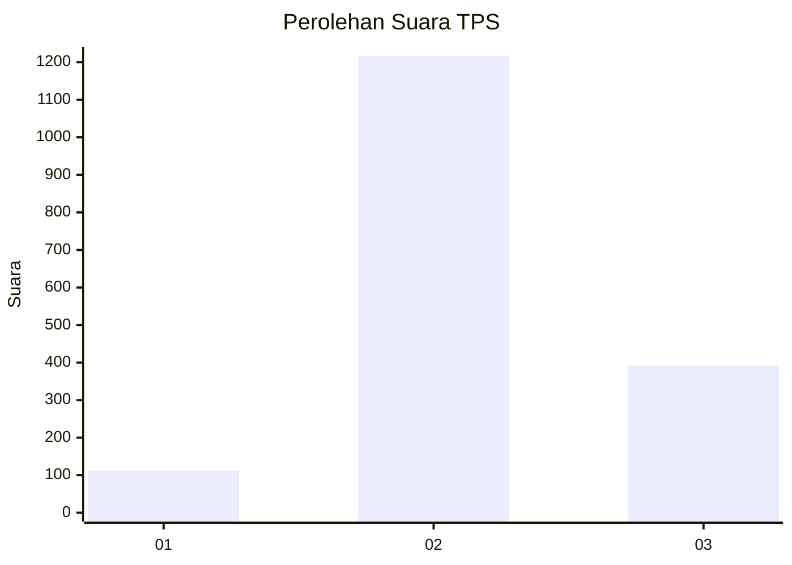
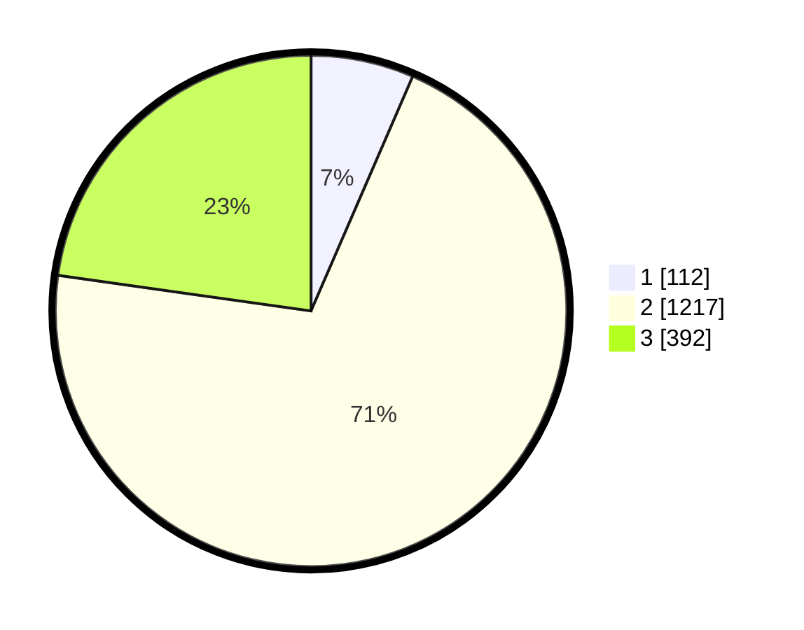

# Hasil

## Grafik

## Tabel

| No. | Nama Paslon    | Suara | Suara (raw) | Persentase |
|:--- |:-------------- | -----:| -----------:| ----------:|
| 1   | ANIES MUHAIMIN | 112   | [112][p-1]  | 6,51       |
| 2   | PRABOWO GIBRAN | 1.217 | [1217][p-2] | 70,71      |
| 3   | GANJAR MAHFUD  | 392   | [392][p-3]  | 22,78      |

[p-1]: https://github.com/gigit-pemilu/pemilu-2024-99-luar-negeri/blob/main/pilpres/hitung-suara/sub/99-luar-negeri/sub/49-hong-kong-republik-rakyat-tiongkok/sub/01-hong-kong-republik-rakyat-tiongkok/sub/0001-hong-kong-republik-rakyat-tiongkok/sub/031-pos-027/sub/paslon-1.txt
[p-2]: https://github.com/gigit-pemilu/pemilu-2024-99-luar-negeri/blob/main/pilpres/hitung-suara/sub/99-luar-negeri/sub/49-hong-kong-republik-rakyat-tiongkok/sub/01-hong-kong-republik-rakyat-tiongkok/sub/0001-hong-kong-republik-rakyat-tiongkok/sub/031-pos-027/sub/paslon-2.txt
[p-3]: https://github.com/gigit-pemilu/pemilu-2024-99-luar-negeri/blob/main/pilpres/hitung-suara/sub/99-luar-negeri/sub/49-hong-kong-republik-rakyat-tiongkok/sub/01-hong-kong-republik-rakyat-tiongkok/sub/0001-hong-kong-republik-rakyat-tiongkok/sub/031-pos-027/sub/paslon-3.txt

## Foto C Plano

https://sirekap-obj-formc.kpu.go.id/96c8/pemilu/ppwp/99/49/01/00/01/9949010001031-20240217-174955--f5f4b340-6591-4cc6-8747-13d942d4b002.jpg

https://sirekap-obj-formc.kpu.go.id/96c8/pemilu/ppwp/99/49/01/00/01/9949010001031-20240217-174623--d0290e61-92de-4be0-8b62-c2868c4f8ed6.jpg

https://sirekap-obj-formc.kpu.go.id/96c8/pemilu/ppwp/99/49/01/00/01/9949010001031-20240217-175332--19476783-dc5f-430e-ac91-b3bf9885d16c.jpg

## Metadata

| Key        | Value               |
| ---------- | ------------------- |
| Time Stamp | 2024-02-21 13:00:00 |

## DATA PEMILIH TETAP

Jumlah pemilih dalam DPT: **4505**.
 * L: **44**.
 * P: **4461**.

## DATA PENGGUNA HAK PILIH

Jumlah pengguna hak pilih dalam DPT: **1529**.
 * L: **0**.
 * P: **1529**.

Jumlah pengguna hak pilih dalam DPTb: **0**.
 * L: **0**.
 * P: **0**.

Jumlah pengguna hak pilih dalam DPK: **0**.
 * L: **0**.
 * P: **0**.

Jumlah pengguna hak pilih: **1529**.
 * L: **0**.
 * P: **1529**.

## JUMLAH SUARA SAH DAN TIDAK SAH

JUMLAH SELURUH SUARA SAH: **1721**.

JUMLAH SUARA TIDAK SAH: **112**.

JUMLAH SELURUH SUARA SAH DAN SUARA TIDAK SAH: **1833**.

