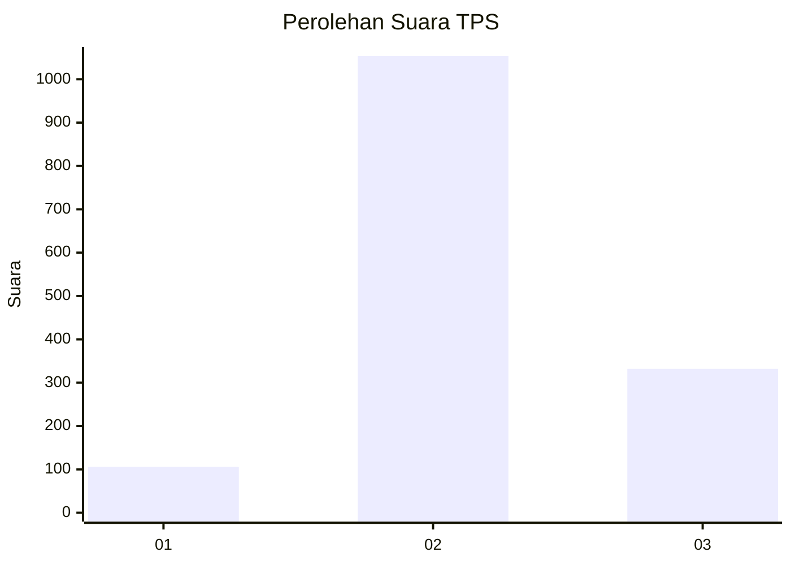
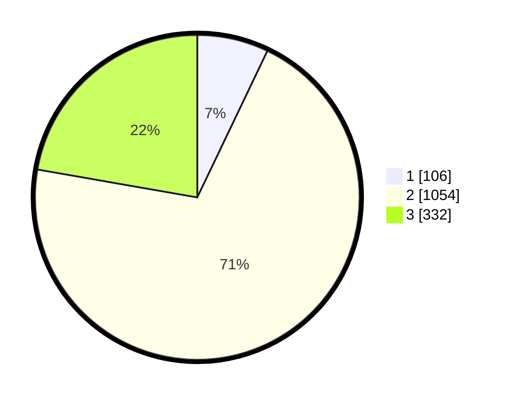

# Hasil

## Grafik

## Tabel

| No. | Nama Paslon    | Suara | Suara (raw) | Persentase |
|:--- |:-------------- | -----:| -----------:| ----------:|
| 1   | ANIES MUHAIMIN | 106   | [106][p-1]  | 7,10       |
| 2   | PRABOWO GIBRAN | 1.054 | [1054][p-2] | 70,64      |
| 3   | GANJAR MAHFUD  | 332   | [332][p-3]  | 22,25      |

[p-1]: https://github.com/gigit-pemilu/pemilu-2024-99-luar-negeri/blob/main/pilpres/hitung-suara/sub/99-luar-negeri/sub/49-hong-kong-republik-rakyat-tiongkok/sub/01-hong-kong-republik-rakyat-tiongkok/sub/0001-hong-kong-republik-rakyat-tiongkok/sub/032-pos-028/sub/paslon-1.txt
[p-2]: https://github.com/gigit-pemilu/pemilu-2024-99-luar-negeri/blob/main/pilpres/hitung-suara/sub/99-luar-negeri/sub/49-hong-kong-republik-rakyat-tiongkok/sub/01-hong-kong-republik-rakyat-tiongkok/sub/0001-hong-kong-republik-rakyat-tiongkok/sub/032-pos-028/sub/paslon-2.txt
[p-3]: https://github.com/gigit-pemilu/pemilu-2024-99-luar-negeri/blob/main/pilpres/hitung-suara/sub/99-luar-negeri/sub/49-hong-kong-republik-rakyat-tiongkok/sub/01-hong-kong-republik-rakyat-tiongkok/sub/0001-hong-kong-republik-rakyat-tiongkok/sub/032-pos-028/sub/paslon-3.txt

## Foto C Plano

https://sirekap-obj-formc.kpu.go.id/a192/pemilu/ppwp/99/49/01/00/01/9949010001032-20240220-205805--b8f65048-0f4f-4785-a1ed-efde9e135ce2.jpg

https://sirekap-obj-formc.kpu.go.id/a192/pemilu/ppwp/99/49/01/00/01/9949010001032-20240220-174201--20dd789b-a656-491d-93ea-61be0f19a91d.jpg

https://sirekap-obj-formc.kpu.go.id/a192/pemilu/ppwp/99/49/01/00/01/9949010001032-20240220-174411--2c5e9acf-6b9f-42b5-9976-0fa41ee502bc.jpg

## Metadata

| Key        | Value               |
| ---------- | ------------------- |
| Time Stamp | 2024-02-20 21:00:00 |

## DATA PEMILIH TETAP

Jumlah pemilih dalam DPT: **4502**.
 * L: **39**.
 * P: **4463**.

## DATA PENGGUNA HAK PILIH

Jumlah pengguna hak pilih dalam DPT: **1372**.
 * L: **2**.
 * P: **1370**.

Jumlah pengguna hak pilih dalam DPTb: **0**.
 * L: **0**.
 * P: **0**.

Jumlah pengguna hak pilih dalam DPK: **0**.
 * L: **0**.
 * P: **0**.

Jumlah pengguna hak pilih: **1372**.
 * L: **2**.
 * P: **1370**.

## JUMLAH SUARA SAH DAN TIDAK SAH

JUMLAH SELURUH SUARA SAH: **1492**.

JUMLAH SUARA TIDAK SAH: **108**.

JUMLAH SELURUH SUARA SAH DAN SUARA TIDAK SAH: **1600**.

