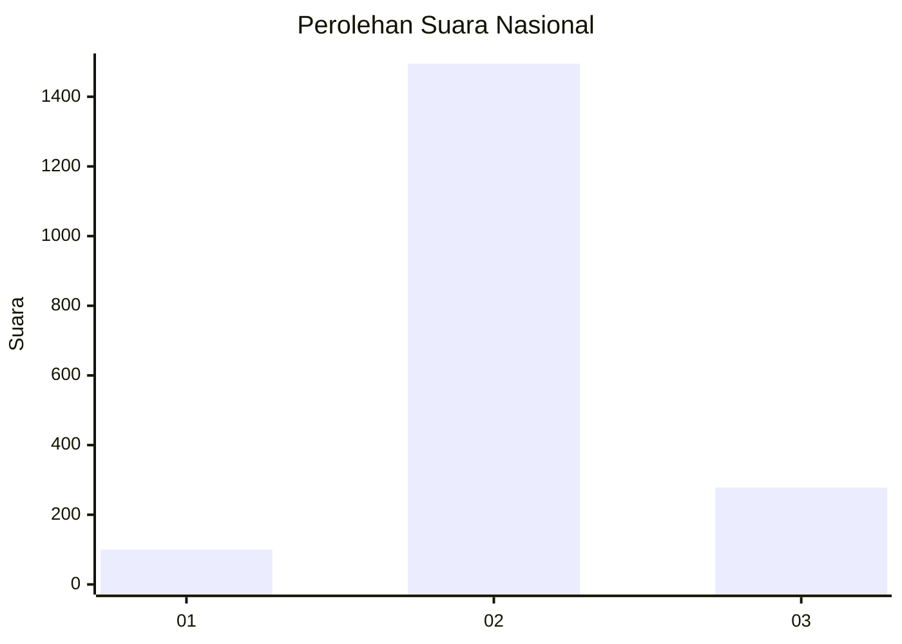
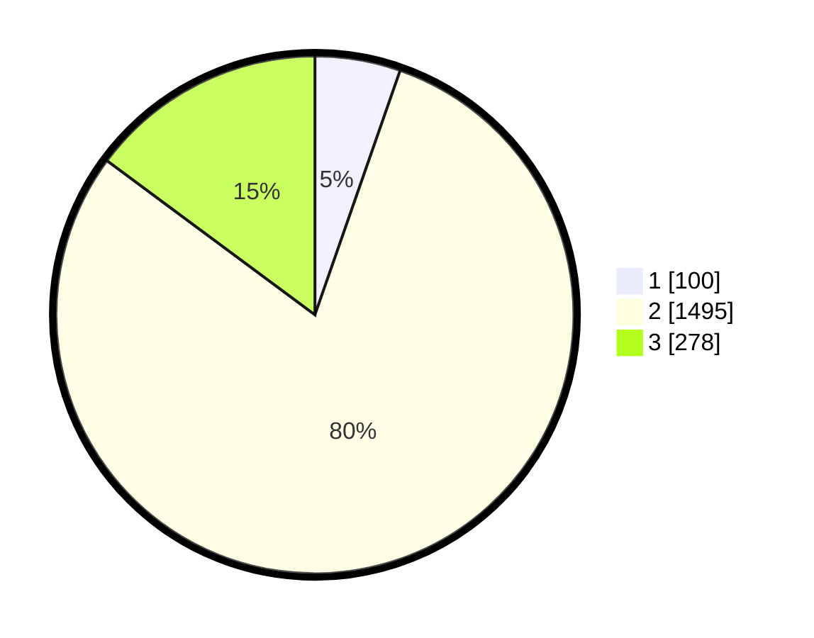

# Hasil

## Grafik

## Tabel

| No. | Nama Paslon    | Suara | Suara (raw) | Persentase |
|:--- |:-------------- | -----:| -----------:| ----------:|
| 1   | ANIES MUHAIMIN | 100   | [100][p-1]  | 5,34       |
| 2   | PRABOWO GIBRAN | 1.495 | [1495][p-2] | 79,82      |
| 3   | GANJAR MAHFUD  | 278   | [278][p-3]  | 14,84      |

[p-1]: https://github.com/gigit-pemilu/pemilu-2024/blob/main/pilpres/hitung-suara/sub/99-luar-negeri/sub/49-hong-kong-republik-rakyat-tiongkok/sub/01-hong-kong-republik-rakyat-tiongkok/sub/0001-hong-kong-republik-rakyat-tiongkok/sub/035-pos-031/sub/paslon-1.txt
[p-2]: https://github.com/gigit-pemilu/pemilu-2024/blob/main/pilpres/hitung-suara/sub/99-luar-negeri/sub/49-hong-kong-republik-rakyat-tiongkok/sub/01-hong-kong-republik-rakyat-tiongkok/sub/0001-hong-kong-republik-rakyat-tiongkok/sub/035-pos-031/sub/paslon-2.txt
[p-3]: https://github.com/gigit-pemilu/pemilu-2024/blob/main/pilpres/hitung-suara/sub/99-luar-negeri/sub/49-hong-kong-republik-rakyat-tiongkok/sub/01-hong-kong-republik-rakyat-tiongkok/sub/0001-hong-kong-republik-rakyat-tiongkok/sub/035-pos-031/sub/paslon-3.txt

## Foto C Plano

https://sirekap-obj-formc.kpu.go.id/1339/pemilu/ppwp/99/49/01/00/01/9949010001035-20240219-195658--7b3f9f95-8b90-4fbd-bb56-712972d99c67.jpg

https://sirekap-obj-formc.kpu.go.id/1339/pemilu/ppwp/99/49/01/00/01/9949010001035-20240218-050459--9e942900-b6d4-4204-b4d8-b521bded9506.jpg

https://sirekap-obj-formc.kpu.go.id/1339/pemilu/ppwp/99/49/01/00/01/9949010001035-20240218-045046--4bb31547-99e1-4a0c-886d-07cb69f63f7a.jpg

## Metadata

| Key        | Value               |
| ---------- | ------------------- |
| Time Stamp | 2024-02-21 11:00:00 |

## DATA PEMILIH TETAP

Jumlah pemilih dalam DPT: **4503**.
 * L: **43**.
 * P: **4460**.

## DATA PENGGUNA HAK PILIH

Jumlah pengguna hak pilih dalam DPT: **1794**.
 * L: **4**.
 * P: **1790**.

Jumlah pengguna hak pilih dalam DPTb: **0**.
 * L: **0**.
 * P: **0**.

Jumlah pengguna hak pilih dalam DPK: **0**.
 * L: **0**.
 * P: **0**.

Jumlah pengguna hak pilih: **1794**.
 * L: **4**.
 * P: **1790**.

## JUMLAH SUARA SAH DAN TIDAK SAH

JUMLAH SELURUH SUARA SAH: **1873**.

JUMLAH SUARA TIDAK SAH: **302**.

JUMLAH SELURUH SUARA SAH DAN SUARA TIDAK SAH: **2175**.

